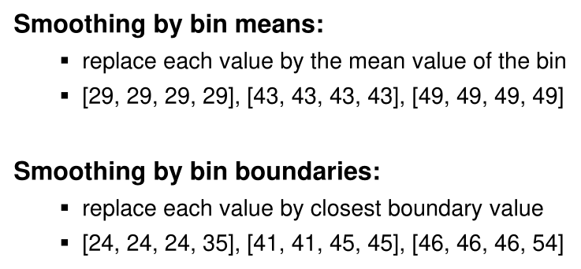
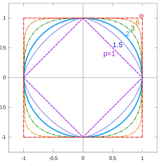

# Basics

> Machine Learning (ML) is a branch of artificial intelligence (AI) devoted to developing and understanding methods that “learn”, that is, leverage data to make predictions or decisions (act like humans) without being explicitly programmed to do so (Wikipedia, Arthur Samuel).

## Unsupervised Machine Learning: Clustering

Clustering describes the process of grouping objects in sets where grouped objects are more similar (in some sense) then objects in other groups. Importantly, an unsupervised machine learning algorithm doesn't get the expected result, just the inputs, like with clustering or dimensonality reduction.

## Supervised Machine Learning

When using supervised machine learning, there are labels (or output) along with the data. The machine is then trained to output a label when an input is processed. During the training, the machine is adjusted to output the correct data.

After the training the machine can process never-before seen data and result a mostly correct result.

## Reinforcement Learning

Instead of the machine being told at every step if it was successful, the agent solves the whole exercises and afterwards it is rewarded accordingly.

## Binning

Data can either be binned by equal-width-bins (all bins have the same width $w = \frac{min - max} N$) or equal-depth-bins (all bins have the same number of samples)

The values of a bin can be either replaced by the mean/average value of the bin. Another approach is to replace a value by the closest boundary value of the bin.

## Similarities

### Cosine Similarity

The cosine similarity only considers the angle between two vectors by using the following formula.
$$
cos(\theta)=\frac{\vec A \cdot \vec B}{||\vec A|| \cdot ||\vec B||}
$$

### Distance

$$
||x||_p=(|x_1|^p+|x_2|^p+...+|x_n|^p)^{\frac 1 p}
$$

In the following diagram, the unit circle (the circle where all points have the distance $1$) is drawn for different $p$.

