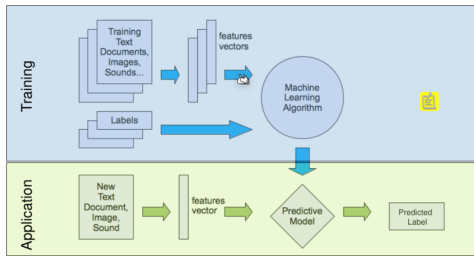
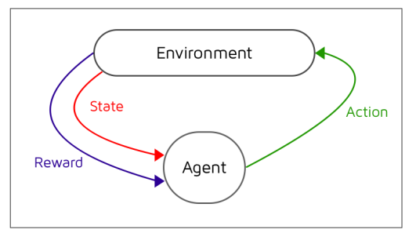
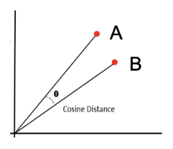
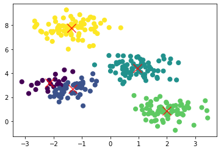
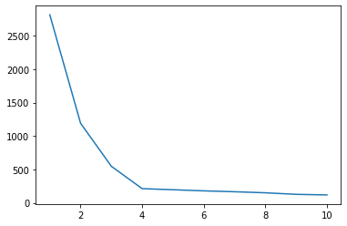
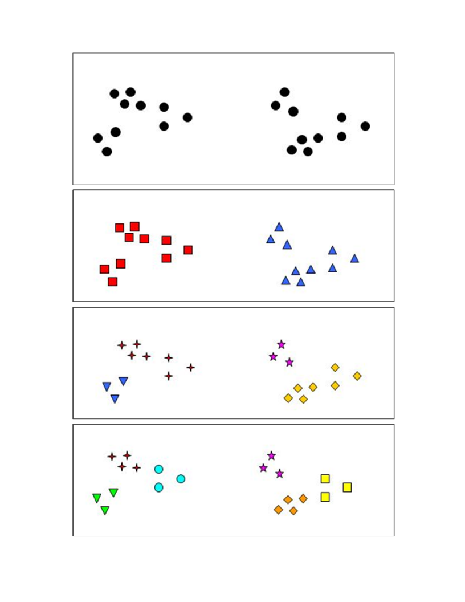

# Basics

> Machine Learning (ML) is a branch of artificial intelligence (AI) devoted to developing and understanding methods that “learn”, that is, leverage data to make predictions or decisions (act like humans) without being explicitly programmed to do so (Wikipedia, Arthur Samuel).

## Unsupervised Machine Learning: Clustering

Clustering describes the process of grouping objects in sets where grouped objects are more similar (in some sense) then objects in other groups.

## Supervised Machine Learning

When using supervised machine learning, there are labels (or output) along with the data. The machine is then trained to output a label when an input is processed. During the training, the machine is adjusted to output the correct data.

After the training the machine can process never-before seen data and result a mostly correct result.



## Reinforcement Learning



Instead of the machine being told at every step if it was successful, the agent solves the whole exercises and afterwards it is rewarded accordingly.

## Normalization

### Min-Max Normalizaton

### TODO ...

## Similarities

### Cosine Similarity

The cosine similarity only considers the angle between two vectors by using the following formula.
$$
cos(\theta)=\frac{\vec A \cdot \vec B}{||\vec A|| \cdot ||\vec B||}
$$




## Clustering

### K-Mean Clustering



The K-Mean algorithm can be used to create clusters from a set of data points.

The following pseudo-code implements the k-mean algorithm:

```java
List<DataPoint> data = ...;
// the initial centroids can be chosen randomly
List<Centroid> centroids = getInitialCentroids();

do {
    // each data point is assigned to the closest centroid
    assignDataToClosestCentroid(data, centroid);
    
    for(Centroid centroid : centroids) {
        List<DataPoint> dataPointsOfCentroid = centroid.getDataPoints();
        DataPoint mean = calculateMean(dataPointsOfCentroid);
        centroid.setPosition(mean);
    }
} while(isStopCriterionIsMet());
```

To calculate the distance, the Pythagorean theorem can be used.

As the stop criteria, multiple implementation can be used:

* Stop when the coordinates of the centroids change very little
* Stop when only a small amount of data points are reassigned
* Stop after a fixed number of iteration
* Stop after a certain time for the entire computation

Because the k-mean algorithm uses chance, the result can very depending on the initial position of the centroids. To elevate this, the algorithm is run multiple times and the best result is used. To calculate the best, the quadratic distance to the closest centroid can be calculated for each data point and then summed up. 

The function $\Phi(C, X)$, where $C$ is a set of centroids and $X$ is a set of data points, calculates the squared distance of a clustering. 
$$
\Phi(C, X) = \sum^m_{i=1} \min_{c\in C} d(x_i, c)^2\\
$$
The runtime complexity of the k-mean algorithm is $O(Lknm)$, where 

* $L$ is the number of iteration
* $k$ is the amount of clusters
* $m$ is the amount of data points with $n$ features

#### Elbow Method

To choose the appropriate number of clusters, the elbow method can be used. For this, the k-mean algorithm is run with different $k$s and $\Phi(C, X)$ is calculated for each clustering. The appropriate number of clusters is where the plot flattens, where the elbow of an imaginary arm would be. 

In the example below $4$.

  

### DB-SCAN

DB-SCAN categorizes each point as:

* **Core Point**
  A point with at least $minPts$ within the distance $\varepsilon$ from itself

* **Border Point**

  A point with at least one core point within the distance $\varepsilon$ of itself

* **Noise Point**
  A point which is neither a core point or border point

The algorithm does the following steps:

1. Select an unprocessed data point $P$ and retreive all points within $\varepsilon$
2. If the amount of points found is grater or equal to $minPts$, then
   1. then mark as core point
   2. 


* A smaller $\varepsilon$ leads to more points marked as noise
* A smaller $minPts$ leads to more clusters 

The runtime complexity is $O(m \cdot \log m)\approx O(m^2)$.

* Advantages
  * No need to specify the number of cluster in advance
  * Able to find arbitrarily shaped cluster
  * Is able to detect noise
* Disadvantages
  * Cannot cluster data sets well large differences in densities as the $\varepsilon$ and $minPts$ would have to change for each densitiy reagion. (An improved version, which addresses this issue, is named OPTICS)