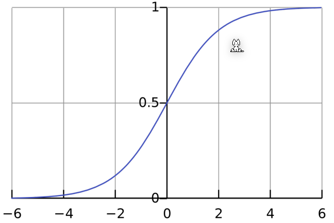

# Classification

## Logistic Regression

The logistic regression can be used for discrete data. 

The logistic function is defined as:
$$
g(z)=\frac 1 {1+e^{-z}}
$$
In this formula, $h(\theta)$ can be plugged in ($g(h(\theta))$) and used as a new theses. The cost function needs to be adjusted to:
$$
Cost(h_\theta(x), y)=
\begin{cases}
-\log(h_\theta(x)) & \text{if } y=1 \\
-\log(1- h_\theta(x)) & \text{if } y=0 \\
\end{cases}\\
J(\theta)=\frac 1 m \sum ^m_{i=1} Cost(h_\theta(x_i), y_i)
$$
This can reformulated to 
