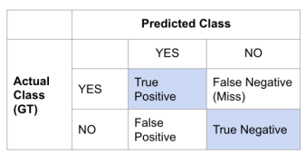
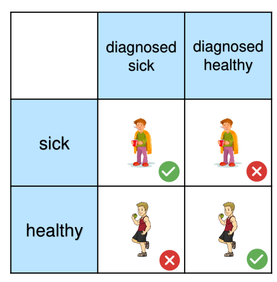
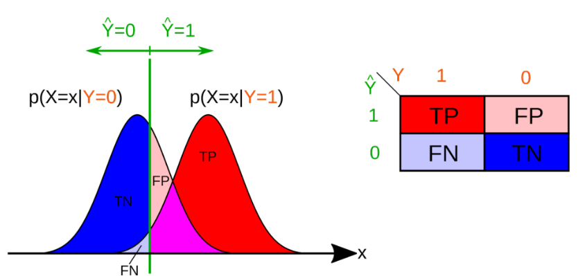
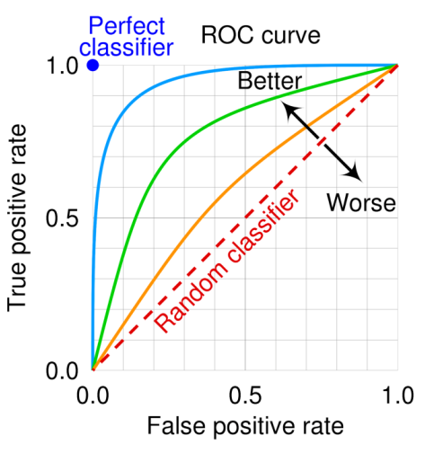
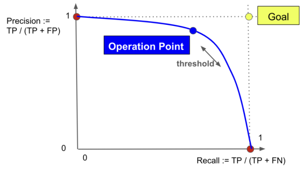
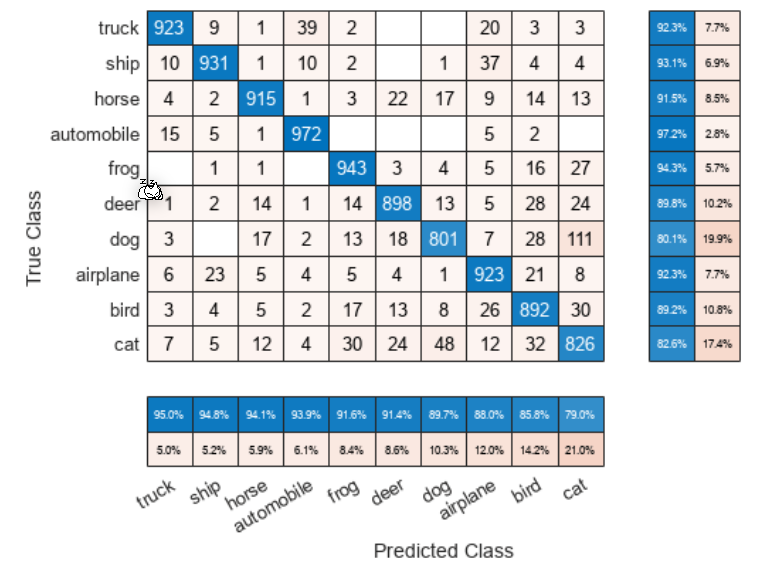
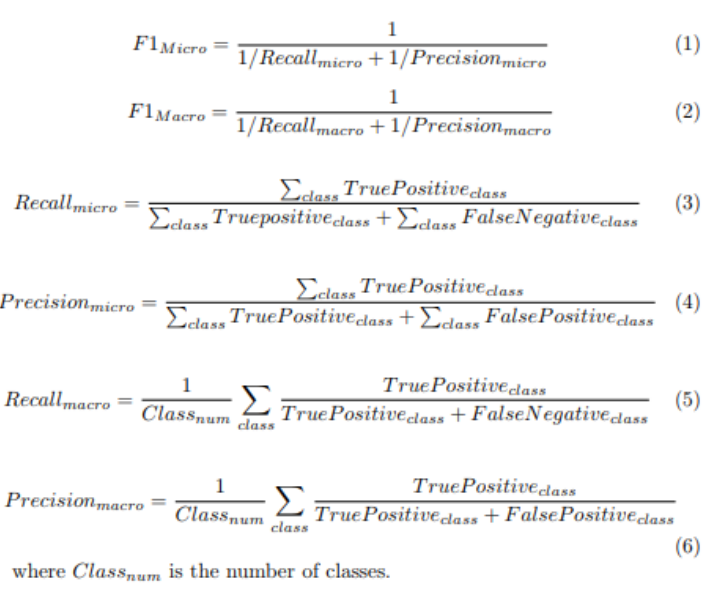
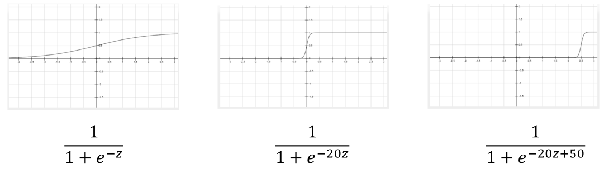
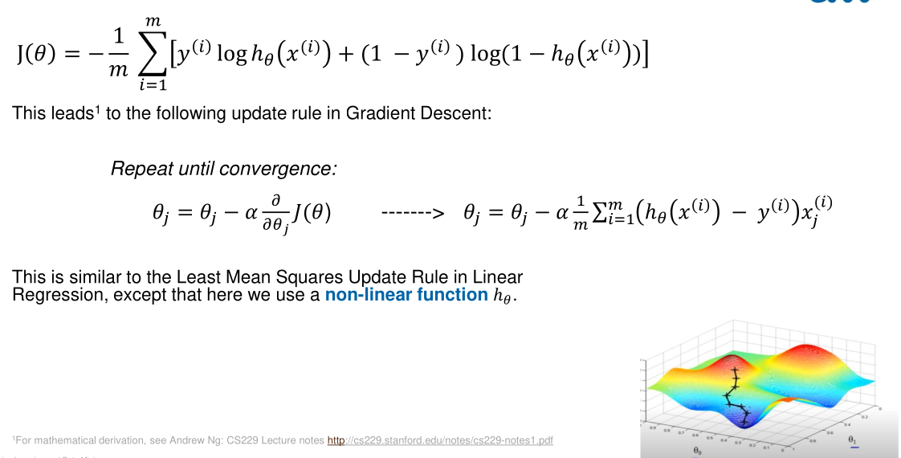

# Classification

## Metrics

The are multiple metrics to test how well a classification algorithm works:



* $Accuracy=\frac{TP+TN}{TP+FN+FP+TN}$

* $Error=1-Accuracy$

* True Positive Rate/Recall: $TPR=\frac{TP}{TP+FN}$
  *Answers how many relevant samples were correctly classified.*

* True Negative Rate/Specificity: $TNR = \frac{TN}{FN + FP}$

* False Positive Rate: $FPR = 1 - TNR = \frac{FP}{TN + FP}$

* $Precision = \frac{TP}{TP + FP}$

  *Answers how many detected samples are relevant.*

* F-Score: $FScore_\beta=(1+\beta^2)\cdot\frac{Precision\cdot Recall}{(\beta^2 \cdot Precision)+Recall}$
  *Answers if both the precision and recall value are high, or one of them (or both) are low.* A smaller $\beta$ (like 0.5) parameter gives more weight to the precision and less to the recall. For a higher $\beta$ value (like 2), the f-score will give less weight to the precision and more the recall.

An example table would look like 



One cannot optimise for all metrics, the true positive rate and true negative rate cannot both be high.



### Receiver Operating Curve (ROC-Cuve)



A ROC Curve has the recall on the y-axis and the false positive rate on the x-axis. A random classifier would be a linear plot.

### Precision-Recall Curve (PR-Curve)




## Multi-Class Confusion Matrix



In a multi-class confusion matrix, the diagonal contains all true positives. 

To deal with multi-class confusion matrix, we need additional metrics:



The formula for $F1_{macro}$ is wrong above:  

* $F1_{macro}=\frac 1 {class_{num}}\sum_{class} F1_{class}$
* $F1_{micro=}\frac{2}{1/Recall_{micro}+1/Precision_{micro}}$
  But this corresponds to the accuracy and, because of this, it is rarely used

The micro variants are used to see if there are general problems that affect all classes. The macro variants can be used to check if there are problems with individual classes, as this score is more affected by outliers.

## Logistic Regression



The logistic regression can be used for discrete data. 

The logistic function is defined as:
$$
g(z)=\frac 1 {1+e^{-z}}
$$


```python
def logistic(g): return 1/(1+exp(-g))
```


In this formula, $h(\theta)$ can be plugged in ($g(h(\theta))$) and used as a new theses. The cost function needs to be adjusted to:
$$
Cost(h_\theta(x), y)=
\begin{cases}
-\log(h_\theta(x)) & \text{if } y=1 \\
-\log(1- h_\theta(x)) & \text{if } y=0 \\
\end{cases}\\
J(\theta)=\frac 1 m \sum ^m_{i=1} Cost(h_\theta(x_i), y_i)
$$
This can reformulated to:
$$
Cost(h_\theta(x), y) = -y_i\log (h_\theta(x_i))-(1-y_i)\cdot \log(1-y_i)\log(1-h_\theta(x_i))
$$

This formula is also called log-likelihood.

### Gradient Descent with Logistic Regression



## Multi-class Classification

One approach is to do **one-vs-all**, where 


