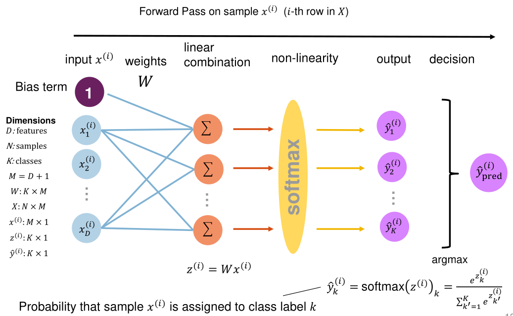
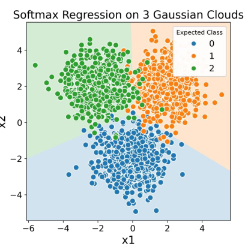

# Multi-Class Classification: Softmax Regression

Softmax is an extension to linear regression to not only do binary classification but rather classify an input in multiple classes.

For this, there is a linear combination of the input $x$ and weights for each class. Afterwards the $softmax(...)$ function is applied to all $z$. The $softmax$-function uses all $z$ to calculate a weight for one class. The softmax function normalises the sums in such a way that all outputs summed together equals $1$, meaning that the individual outputs represent a percentage.

One drawback of softmax is, that is still can only create linear decision bounderies.

