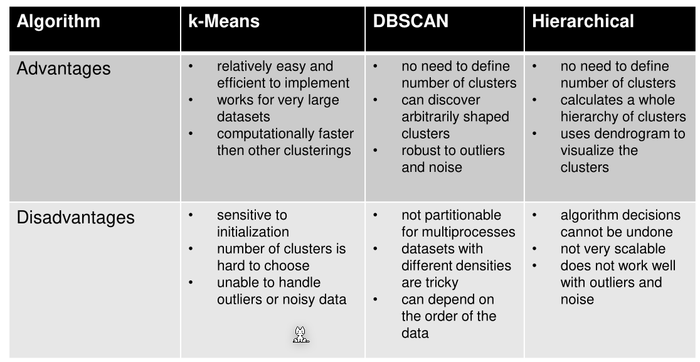
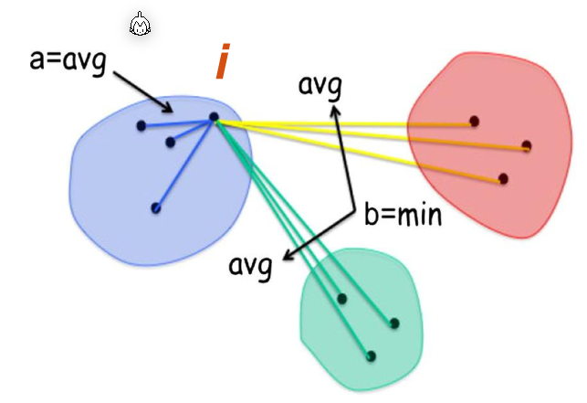
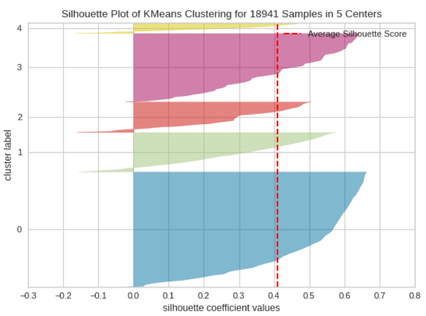
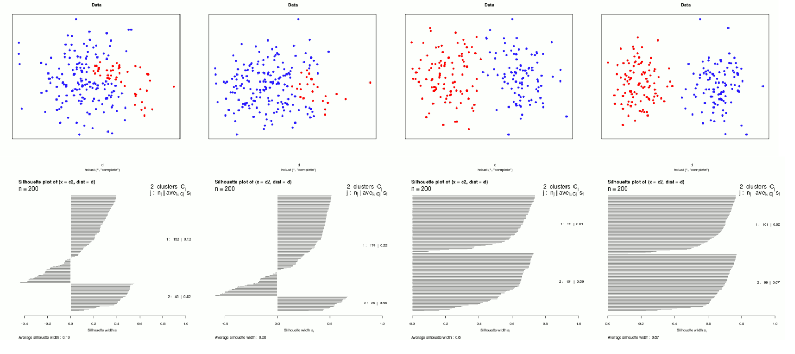
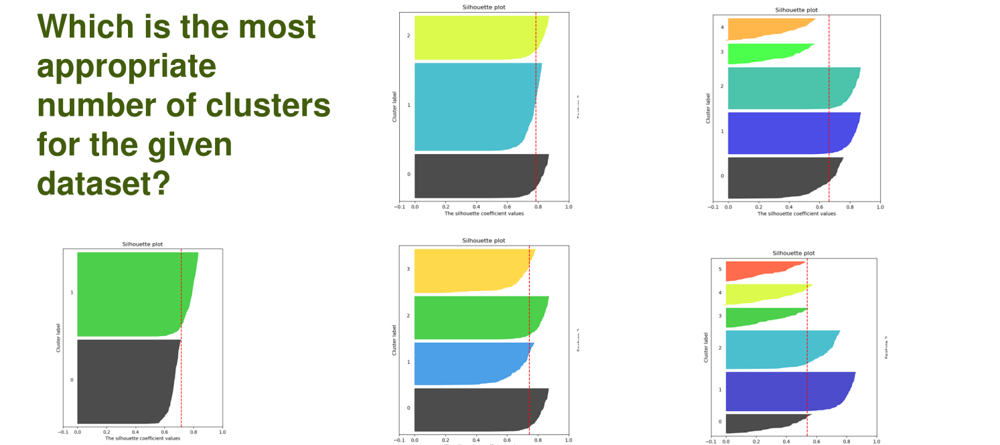

# Clustering

The following table compares different algorithms:

## Silhouette Coefficient

In the following definition $i$ and $j$ are data points and $C_I$ and $C_J$ are the respective clusters of the data points $i$ and $j$. $d(i, j)$ is the distance between $i$ and $j$.
$$
\begin{align}
a(i)&=\frac 1 {|C_I|-1} \sum_{j\in C_J,i\neq j} d(i,j)\\
b(i)&=\min_{J\neq I} \frac 1 {|C_J|} \sum_{j\in C_J} d(i, j)\\
s(i)&=\frac{b(i) - a(i)}{\max(a(i), b(i))} &\text{if } |C_I| > 1\\
s(i)&=0 & \text{if } |C_I| = 1
\end{align}
$$
$a(i)$ is the average distance to all points in the same clusters as $i$, while $b(i)$ is the average distance to all points of the closest neighbouring cluster.

The silhouette coefficient can be plotted into a following diagram. The red line is the overall silhouette coefficient average.

If the silhouette coefficient is less then zero then this point might be wrongly classified.

In the following graphs $k=3$ or $k=4$ is best, since they have a height average silhouette coefficient. $k=4$ has more equally sized clusters which can be a benefit.

