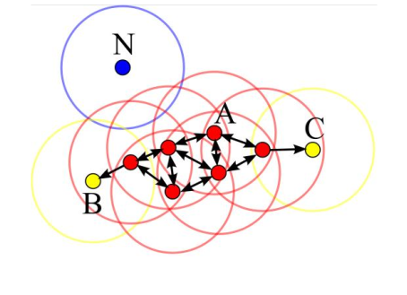
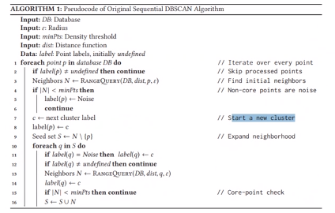

### DB-SCAN

DB-SCAN categorizes each point as:

* **Core Point**
  A point with at least $minPts$ within the distance $\varepsilon$ from itself

* **Border Point**
  A point with at least one core point within the distance $\varepsilon$ of itself
  
* **Noise Point**
  A point which is neither a core point or border point

The algorithm does the following steps:

1. Select an unprocessed data point $P$ and retrieve all points within $\varepsilon$
2. Mark $P$ as processed
3. If the amount of points found is greater or equal to $minPts$, then
   1. then mark as core point
   1. Mark all non-core points within $\varepsilon$ as border points (and may override noise) and assign them to the cluster of $P$
4. Else, if there are no core point or not $minPts$ within $\varepsilon$ mark it as noise

* A smaller $\varepsilon$ leads to more points marked as noise
* A smaller $minPts$ leads to more clusters 

The runtime complexity is $O(m \cdot \log m)\approx O(m^2)$.

* Advantages
  * No need to specify the number of cluster in advance
  * Able to find arbitrarily shaped cluster
  * Is able to detect noise
* Disadvantages
  * Cannot cluster data sets well large differences in densities as the $\varepsilon$ and $minPts$ would have to change for each densitiy reagion. (An improved version, which addresses this issue, is named OPTICS)

An visualisation can be viewed at https://educlust.dbvis.de/#