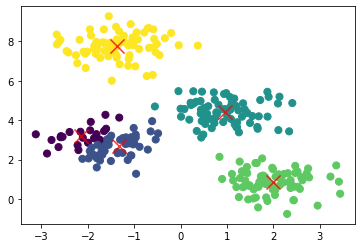

# K-Mean Clustering



The K-Mean algorithm can be used to create clusters from a set of data points.

The following pseudo-code implements the k-mean algorithm:

```java
List<DataPoint> data = ...;
// the initial centroids can be chosen randomly
List<Centroid> centroids = getInitialCentroids();

do {
    // each data point is assigned to the closest centroid
    assignDataToClosestCentroid(data, centroid);
    
    for(Centroid centroid : centroids) {
        List<DataPoint> dataPointsOfCentroid = centroid.getDataPoints();
        DataPoint mean = calculateMean(dataPointsOfCentroid);
        centroid.setPosition(mean);
    }
} while(isStopCriterionIsMet());
```

To calculate the distance, the Pythagorean theorem can be used.

As the stop criteria, multiple implementation can be used:

* Stop when the coordinates of the centroids change very little
* Stop when only a small amount of data points are reassigned
* Stop after a fixed number of iteration
* Stop after a certain time for the entire computation

Because the k-mean algorithm uses chance, the result can very depending on the initial position of the centroids. To elevate this, the algorithm is run multiple times and the best result is used. To calculate the best, the quadratic distance to the closest centroid can be calculated for each data point and then summed up. 

The function $\Phi(C, X)$, where $C$ is a set of centroids and $X$ is a set of data points, calculates the squared distance of a clustering. 
$$
\Phi(C, X) = \sum^m_{i=1} \min_{c\in C} d(x_i, c)^2\\
$$
The runtime complexity of the k-mean algorithm is $O(Lknm)$, where 

* $L$ is the number of iteration
* $k$ is the amount of clusters
* $m$ is the amount of data points with $n$ features

## Elbow Method

To choose the appropriate number of clusters, the elbow method can be used. For this, the k-mean algorithm is run with different $k$s and $\Phi(C, X)$ is calculated for each clustering. The appropriate number of clusters is where the plot flattens, where the elbow of an imaginary arm would be. 

In the example below $4$.

  