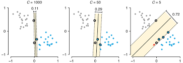

# Support Vector Machine (SVM)

*A side node: the negative label is usually $-1$, and the positive label is usually $1$ for mathematical reasons.*

A SVM categorises data points by drawing a hyperplane.  A hyperplane is a line in 2d or a plane in 3d.

The goal of the SVM is to maximise for the margin between points:

The following explains all the variables associated with SVM:

## Width of Margin

With the following formula, one can calculate the distance between two hyperplanes.

(*Correction: $b_1=b_2$; The subscript is incorrect*)

Additionally, every sample needs to be on correct side of the hyperplane. This condition is encoded in the following inequations:

## Optimisation Problem

SVM optimise for the widest margin $D=\frac{2}{||w||}$. This is equivalent to minimising $||w||$ or $\frac 1 2 ||w||^2$.

## Soft-Margin SVMs

Training samples can be mislabelled or noise. To deal with this, we can allow some samples to be on the "wrong" side, with a penalty, to archive a wider margin.

The parameter $C$ controls what the penalty of miss-classification is. A large $C$ would result in almost no miss-classified points and a small $C$ would result in a large amount of miss-classified points.

The following explains all the variables associated with SVM:

In the cost function every miss-classified sample is summed:
$$
\frac 1 2 ||w||^2 + C \sum^m_{i=1}\xi_i\\
y_i(w^Tx_i+b)\ge 1 - \xi_i
$$
$\xi$ expresses how much a sample is missclassified. If $\xi \in ]1;\infty[$, then the sample is on the wrong side and missclassified. If $\xi \in ]0; 1]$, then the sample is in the margin and is a margin  If $\xi = 0$, then the sample is on the correct side.

## Kernel Trick

Sometimes data can't be separated by a hyperplane. In those cases an additional dimension can be added with a mapping function (e.g. $z = x^2 + y^2$).

The following functions are common kernel functions:

## RBF-Kernel

$$
\gamma=\frac 1 {2\sigma^2}
$$

If $\gamma$ is small, then the variance $\sigma$ gets large and support vectors "see" far. If $\gamma$ is big, then the variance $\sigma$ becomes small and the support vectors "see" only a short distance. $\gamma$ can also be seen to influence how flexible the model is. The bigger it is, the more flexible the model is.

## Multi-Class

### One vs Rest

For every class, the margin for the class against all other classes is calculated.

### One vs One

A margin is created for every combination of two classes.