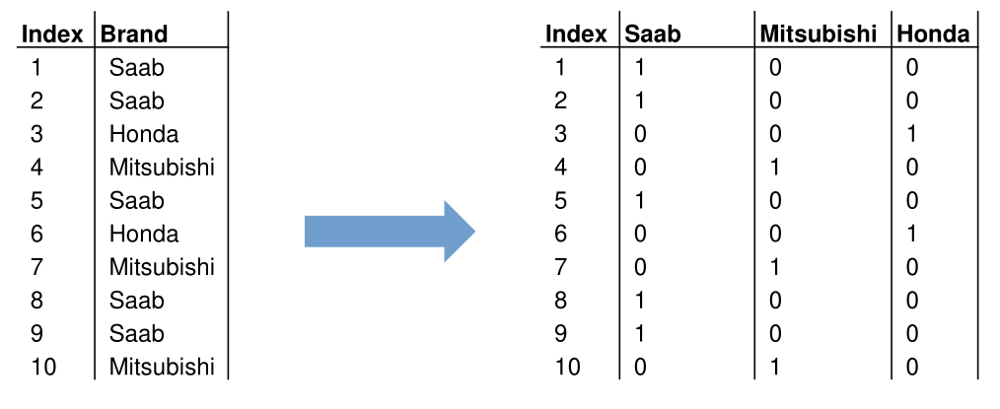

# Data

* **Structured Data**
  Structured data has a fixed data model
  * **Categorical**
    Discretete data like labels
    * **Nominal**
      Discrete data which cannot be ordered (e.g. labels)
    * **Oridnal**
      Discrete data which can be ordered
  * **Numerical**
    Numerical data
    * **Continuous**
      There are no discrete steps (e.g. floating-points)
    * **Discrete**
      There are discrete steps (e.g. whole integers)
*  **Unstructured/Semi-structured Data**
  Unstructured and semi-structured data does not have a fixed data model.
  XML and JSON are often classified as semi-structured data

The actual encoding does not effect how the data can be analysed. Even if some data, which physically is continuous, is stored discrete, it can still be analysed as if it was continuous.

## Encoding Categorical Data

With encoding categorical data can be encoded with a numeric representation

* One-Hot Encoding
  For every category a new boolean variable is being created. If true then the category is present, if false the category is absent
  
* Label Encoding
  Every category is associated with an integer value
  
* Ordinal Encoding
  Associate every category an integer based on its order. This only works for ordinal data
  

## Design Matrix (Daten Matrix)

The data can be expressed by a $N\times D$ matrix with numerical values, where $N$ is the amount of samples and $D$ the amount of variables/features.

$$
X_{N\times D}=
\begin{pmatrix}
x_1^{(1)} & x_2^{(1)} & ... & x_D^{(1)} \\
x_1^{(2)} & x_2^{(2)} & ... & x_D^{(2)} \\
... & ... & ... & ... \\
x_1^{(N)} & x_2^{(N)} & ... & x_D^{(N)} \\
\end{pmatrix}
$$
The following vector $x^{(n)}$ expresses all variables of the $n$-th sample and is equivalent to a row of the design matrix
$$
x^{(n)}=
\begin{pmatrix}
x_1^{(n)} \\
x_2^{(n)} \\
... \\
x_D^{(n)} \\
\end{pmatrix}
$$

## Typical Data Processing

As data will rarely be in the correct format and quality needed for analysis, the following tasks often will be performed to bring the data up to the required standard.

* **Data integration/consolidation**
  Collect and merge the data from multiple sources
* **Data cleaning**
  Remove and modifying incorrect data 
* **Data transformations**
  Normalize, descretize and aggregate data
* **Data reduction**
  Reduce data by removing samples and/or attributes

### Data Cleaning

* **Detect (near) duplicates**
  Duplicate numeric values can be detected with the distance/similarity of the feature vectors.  Text duplicates can be detected with the Levinstein-Distance.
* **Missing values**
  Missing values can be replaced by measures of central tendency, like the average or median, replace the value with a fixed value (like `-1`), fix manually or simply remove the row entirely.
* **Detect outliers**
  Outliers should be removed as they are usually a result of an error
* **Smoothing**
  Smoothing eliminates noise and can make patterns more noticeable. There are different methods
  * **Equal-width Binning**
    The range of the data is divided in $N$ bins of equal size. Outliers can dominate the result when only few data points are in a bin. Each bin is replaced by the mean or the closest boundary value.
  * **Equal-depth Binning**
    There are still $N$ bins but each bin has the same number of samples. Each bin is replaced by the mean or the closest boundary value.
  * **Smoothing by bin boundaries**
    replace each value by closest boundary value
    [24, 28, 29, 35], [41, 41, 44, 45], [46, 48, 49, 54] $\to$ [24, 24, 24, 35], [41, 41, 45, 45], [46, 46, 46, 54]

### Feature Scaling

Feature scaling is used to get all data in the same number range since many algorithm perform poorly with different number ranges (e.g. person height between 1.5 and 2.2m, and wheight between 65kg and 80kg)

#### Min-Max Normalisation

This will transform all data points between `0` and `1`
$$
x'=\frac{x - \min(x)}{\max(x) - \min(x)}
$$

#### Standardisation

This will transform the data to be distributed around `0` 
$$
x'=\frac{x-\mu(X)}{\sigma}
$$
$\sigma$=Standard Diviation ($\sigma^2$=Varianz)

$\mu$=Average

#### Logarithm

Apply the natural logarithm to the data

