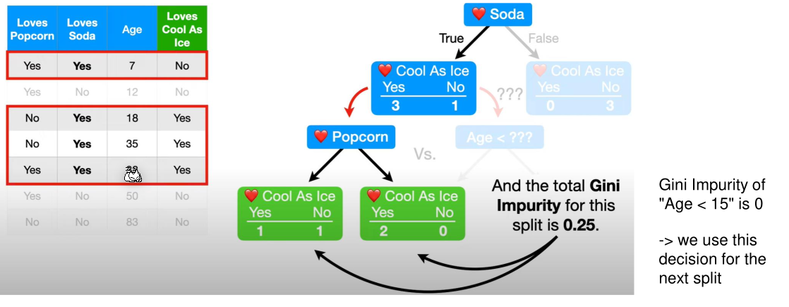

# Decision Tree

**Pure** nodes predict the label perfectly, like "False" in the following example. **Impure** nodes have some false positives/negatives, like "True" in the example.

## Building a Decision Tree

To build a decision tree, the gini impurity score works quite well and is calculated with $I_G=1-\sum^c_{j=1}p_j^2$ (or in words, 1 minus the squared sum of the probability of all classes). 

For a yes-no-decision, the formula would look like $1 - p_{yes}^2 - p_{no}^2$.

To calculate the gini impurity for a decision, the weighted average of its children's gini impurity scores is calculated: 
$$
I=\frac{n_{yes}}{n_{yes}+n_{no}}\cdot p_{yes} + \frac{n_{no}}{n_{yes}+n_{no}}\cdot p_{no}
$$

For numeric data, the gini impurity is calculated by doing the following steps:

1. Sort the data from lowest to highest
2. Calculate the average between every node (given they are not equal). These are the numbers in the box next to the age column in the example
3. For each average, compute the gini impurity score for the decision `Age < $avg`. Below is an example for the decision `Age < 9.5`. The score is calculated with a weighted average, like with yes-no-decisions.
   
4. The decision with the lowest gini score should be chosen

The following shows how to find the first decision. In this case "Loves Soda" as it has the lowest gini impurity score and was chosen as the "root decision" in the decision tree.

 

Only impure leaves can further grow. In this example `Loves Soda=No` is already pure and as such won't be further divided. `Loves Soda=Yes`, on the other hand, isn't pure. To find the next decision, only the data which fit the leaf node above is used. In this example, only rows with `Loves Soda=Yes` are used.

The next decision can be one of the remaining, not yet in this branch used, columns. This uses the same processes as finding the "root decision". Importantly, the decision boundary for numeric data needs to be recalculated as the data set changed.

Because the gimi impurity of `Loves Popcorn` is `0.25` and the gimi impurity of `Age < 15`  is `0`, the former is chosen. The following tree is the result:

The building of the tree is done, even though not all columns were used, because all leaf nodes are pure. 

It can be advantageous to stop the tree building before all leaf nodes are pure to reduce overfitting.

## Regression Trees

Decision trees can also be used as an alternative for regressions. As seen in the following example, using a linear regression is not especially useful.

## Pruning

Pruning is a tool to prevent overfitting of decision trees. One of the issues of regression tree is that with each split the data is also split, leaving less and less data to use as training data. 

By just adding one miss-classified data point, the decision trees goes from the above tree to the tree below.

Pre-pruning is pruning which is used while building the tree:

* Min-Sample Pruning: Only split nodes with at least $k$ nodes
* Max-Depth Pruning: Restrict the max. depth of the tree

An alternative is post-pruning, which is done after the tree was built. To to this, for each decision, the errors with the validation set is calculated with the decision and without the decision. If the error is higher without the decision then the decision is cut.

## Random Forest

While training, multiple trees are trained with a random subset of the data. Individual samples might be used in multiple subsets or in no subset at all. Each decision tree has different features. This will result in a large number of different decision trees. 

When classifying data, each tree votes and the majority is used for the final answer.

## Out-of-Bag Error

