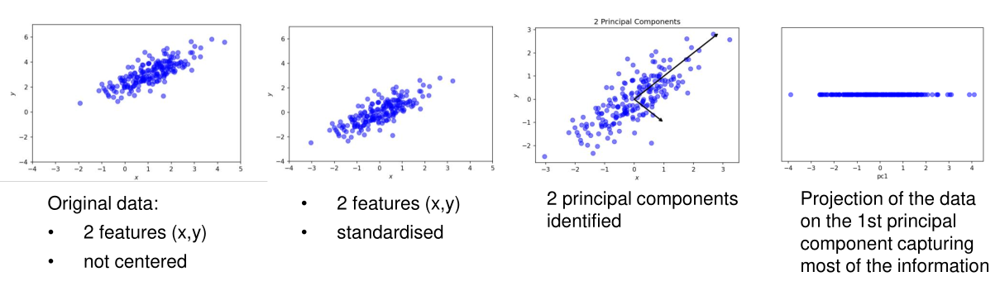
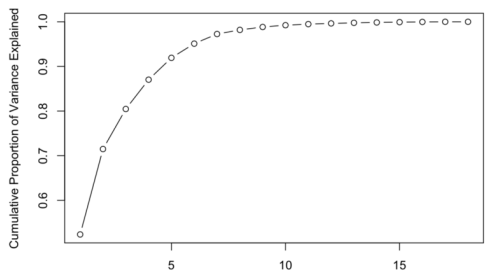
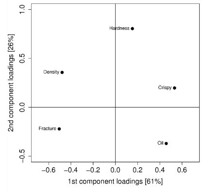
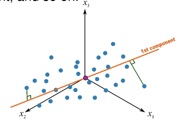
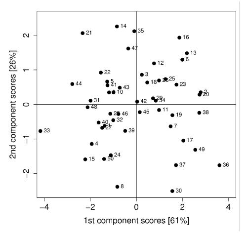
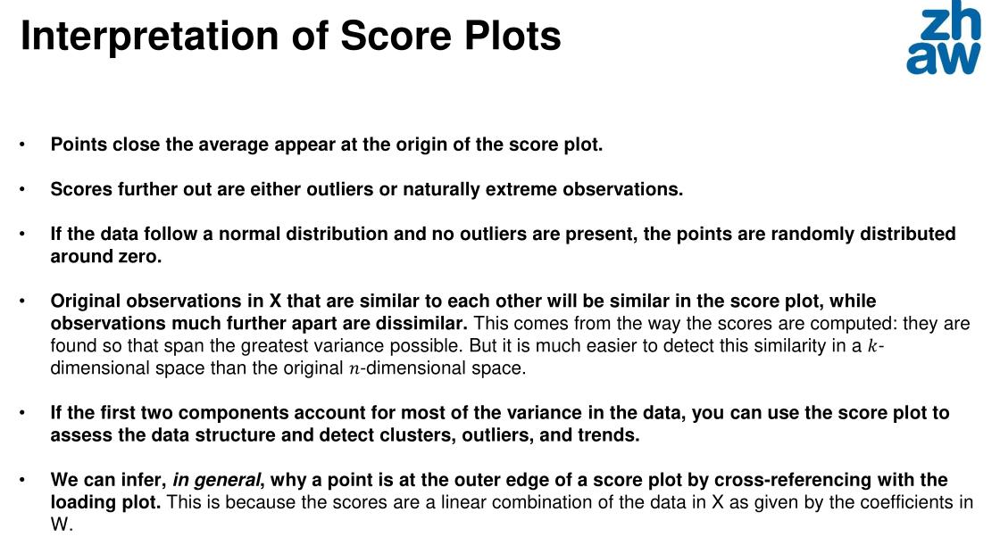
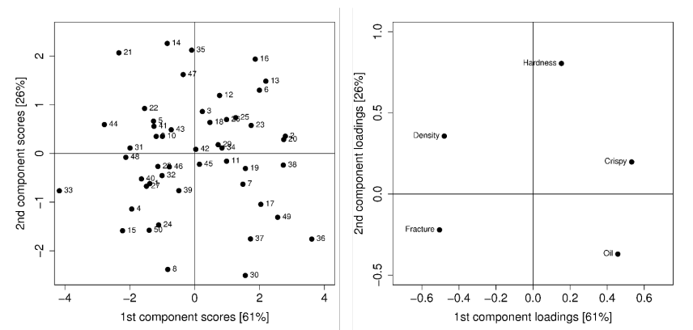

# Dimensionality Reduction

Some primitive methods of reducing the dimensions are:

* Remove features with too many missing values
* Remove features with a low or zero variance
* Remove features with high correlations
* Backward Feature Elimination
* Apply principle component analysis or tSNE

## Principle Component Analysis (PCA)

As an input for PCA, the data is used in a matrix $X \in R^{m\times n}$, where $m$ is the number of samples, and $n$ the number of features. The goal of PCA is to reduce the number of features that explains "as much as possible" of the data.

1. Standardise the data
   Each feature should have a mean of $0.0$ and a variance of $1.0$. This can be done by the following formula $\frac{X - mean}{variance}$
2. Identify new coordinate axes (components) that capture the amount of information contained in the data in decreasing order
3. Select a subset of components which capture the most information
4. Project the original data to the new, lower dimensional, subspace

### Find the Components

To find the components, first calculate the co-variance matrix $C$ with the standardised data:
$$
C=\frac 1 {m - 1} X^TX
$$
Afterwards compute the $n$ eigenvectors $\vec w$ and corresponding eigenvalues $\lambda$ of the co-variance matrix. To do this, the following characteristic equation has to be solved:
$$
C\vec w - \lambda \vec w = 0
$$
Finally, select the $k\le n$ eigenvectors $\vec w$ (components) with the largest eigenvalues:
$$
\lambda_1 \ge \lambda_2 \ge ... \ge .. \lambda_k \ge .. \ge \lambda_n
$$
Each eigenvalue $\lambda_i$ expresses how much of the data's variance is explained by the component $i$.

The chosen $\vec w$ are the columns in the transformation matrix $W\in R^{n\times k}$

To get the transformed data $T$, the following has to be done:
$$
T=XW \in R^{m\times k}
$$
If $k=n$, then $T$ contains the same data as $X$. Otherwise the dimensionality of the data is reduced to $k$ dimensions. Because $W$ has been chosen in way, to reconstruct as much information as possible by sorting after the eigenvalues descending, most information should be retained.

### Hyper-Parameter Tuning

To find the best value for $k$ for PCA, the following method can be used.

* Rule of Thumb
  2-5 PCs is usually enough

* Kaiser's Rule
  Choose all components whose eigenvalues are greater than 1

* Elbow Method

  Take the component before the slope starts leveling off
  

* Explained and Cumulative Variance

  The cumulative variance can be calculated with $\sum^k_{i=1}\frac {\lambda_i}{\sum^n_{j=1}\lambda_j}$
  This score can then be interpreted as, how much of the data's variance is explained by the first $k$ components. $k$ can be chosen to explain as much of the data as required.
  

### Loading Plot

A "loading plot" plots the values of the $W$ matrix. Each entry in the matrix shows the correlation between the variable and the component. The value is between $-1$ and $1$, where $0$ means no correlation and $-1$ and $1$ means a very strong correlation (the sign can be ignored).

In the plot, we can see that Hardness has almost no correlation with the 1st component, since it is close to $0$ on the X-axis, while having more correlation on the 2nd component, as it is near $1$ on the Y-axis.

### Score Values and Plots

$$
T: t_{ij}=x_{i1}w_{1j}+x_{i2}w_{2j}+...+x_{in}w_{nj}
$$

The score of the principal component $j$ are the values in the column $j$ of the matrix $T$. This means, for each component there are $m$ scores, one score for each sample.

When creating a scatter plot of the score values, we can identify values which are very similar to each other. Data points which are close to each other, are similar. This might not be obvious in the original data due to its high dimensionality.

Additionally, data points close to the centre are close to the average while data points far from the centre are outliers and contribute a lot to the variance.

### Combining Score and Loading Plots

From each loading data point can a ling though the origin point be drawn. If a score data point on this line is close to the origin point, then it is close to the average. On the other hand, if the point is far away from the origin point then it is far from the average of the loading data point.

For example, the data point 21 in the left upper hand corner is far away from the origin on the "oil-loading-line" and thus is far away from the average of oil. On the other hand, the score data point 33 is on the "oil-loading-line" close to the origin point and thus is close to the average.

## t-Distributed Stochastic Neighbor Embedding
