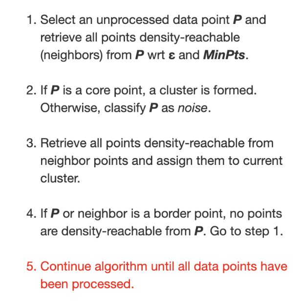
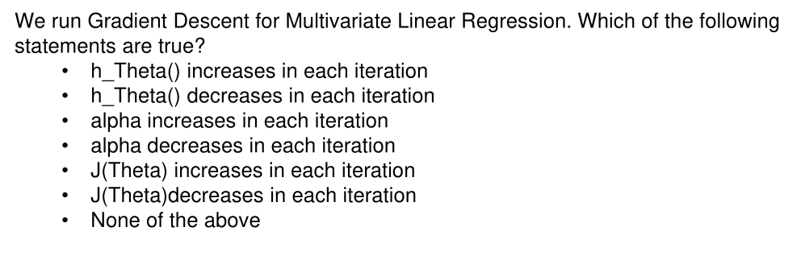
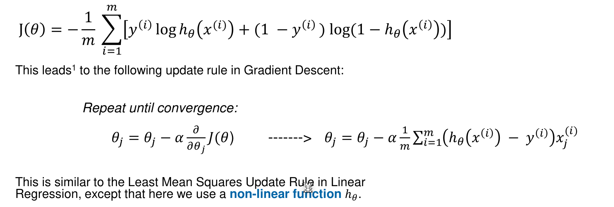

# Fragen

How are values sorted when binning? E.g. when binning a sinus curve, boundary binning will have 2 values which are lower then the middle value. (Introduction Data Processing/p.58)

In the following description of DB-SCAN what does 4. do? Isn't point 3 missing a repeat or an further condition at point 2. (Clustering/p.34) https://educlust.dbvis.de/#

Are none of these correct? (linear regresion/p.40)

For linear regression: How can gradient descent with multi variant data be solved with matrices? (linear regression/p.26)

For linear regression: Does the mini-batch gradient descent $n$ ***random*** samples or always the same $n$ samples?

For logistic regresion: This can't be the derivation of the $J(\theta)$ given in the slide (Logistic Regresion/p.41). What is the difference between $x^{(i)}_j$ and $x^{(i)}$?

What is a landmark? (SVM/p.29)

After one vs rest or one vs one, what to do with the different hyper plane? Merge them all toghether by drawing them on the same plot? (SVM/p.37,p38)

**Do we have to produce python code?**

What is a soft-max regression (Neural Network/p.14)