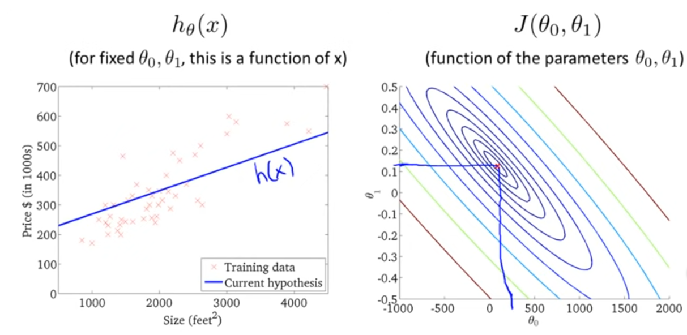
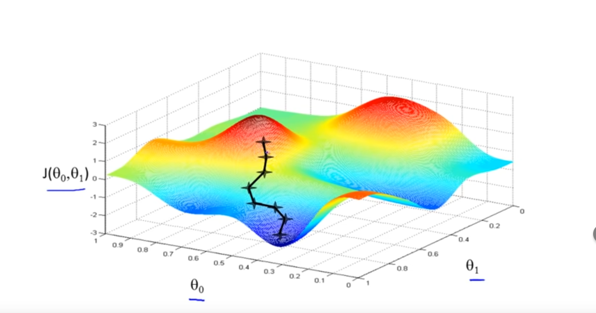

# Linear Regression

A linear function, adjusted to a set of results, can be used to predict the result of other input values. The function takes the following form:
$$
h_\theta(x)=\theta_0+\theta_1\cdot x
$$

## Cost Function

To find a fitting function $h_\theta$, we want to minimise $\frac{1}{2m}\sum^m_{i=0}(h_\theta(x_i)-y_i)^2$ (halve of the average of the summed error squared). More formally, this is named a cost function:
$$
J(\theta_0, \theta_1)=\frac 1 {2m}\sum^m_{i=0}(h_\theta(x_i)-y_i)^2
$$
This cost function is also called the **squared error function**.

Cost functions can be plotted as a contour graph. In the example below, the marked spot on the contour plot corresponds with the plot of $h_\theta(x)$.

## Gradient Descent

Gradient decent is a general algorithm to find a local minimum of a function. 

The algorithm starts at a guess and then, as long as possible, moves the current position to a location where the function is lower. This is repeated, as long as there is a lower position.
$$
\begin{flalign}
&\text{repeate} \text{ until convergence \{} &&  \\
& \hspace{2em} temp_0 := \theta_0-\alpha \frac{\partial}{\partial \theta_0}J(\theta_0, \theta_1)\\
& \hspace{2em} temp_1 := \theta_1-\alpha \frac{\partial}{\partial \theta_1}J(\theta_0, \theta_1)\\
& \hspace{2em}\theta_0 := temp_0\\
& \hspace{2em}\theta_1 := temp_1\\
&\text{\}} \\
\end{flalign}
$$
Importantly, the code above updates $\theta_0$ and $\theta_1$ simultaneously. $\alpha$ is the *learning rate*. It dictates the step size. However, even when $\alpha$ is fixed, gradient descent can still converge to a local minimum as the derivation will get smaller and smaller when the algorithm gets closer to a local minimum.

The code above can easily be extended to support as many variables as needed.

## Cost Function and Gradient Descent

To use the gradient descent algorithm to find the local minimum of the cost function $J$, the partial derivation of $J$ for $\theta_0$ and $\theta_1$ is needed. Luckily, these are straight forward:
$$
\begin{align}
\frac{\partial}{\partial \theta_0}J(\theta_0, \theta_1
&= \frac{\partial}{\partial \theta_0} \left(\frac{1}{2m}\sum^m_{i=1}(h_\theta(x_i)-y_i)^2\right)
=\frac{1}{m}\sum^m_{i=1}(h_\theta(x_i)-y_i)\\

\frac{\partial}{\partial \theta_1}J(\theta_0, \theta_1
&= \frac{\partial}{\partial \theta_1} \left(\frac{1}{2m}\sum^m_{i=1}(h_\theta(x_i)-y_i)^2\right)
=\frac{1}{m}\sum^m_{i=1}(h_\theta(x_i)-y_i)\cdot x_i
\end{align}
$$
 

These partial derivations can be plugged in the algorithm of gradient descent.

## Multivariate Linear Regression

If there are more than one feature, the hypotheses has to be adjusted to reflect this:
$$
h_\theta(\vec x)=\theta_0x_0 + \theta_1x_1 + \theta_2x_2 + ... + \theta_nx_n
$$
$x_0$ is always defined as $1$. This simplifies $h_\theta(\vec x)$ as all terms are the "same".

This can also be written with vectors:
$$
\vec x = \begin{pmatrix}
x_0 \\ x_1 \\ x_2 \\ ... \\ x_n
\end{pmatrix}
\\
\vec \theta = \begin{pmatrix}
\theta_0 \\ \theta_1 \\ \theta_2 \\ ... \\ \theta_n
\end{pmatrix}
\\
h_\theta(\vec x)=\theta_0x_0 + \theta_1x_1 + \theta_2x_2 + ... + \theta_nx_n 
= \vec\theta^T \cdot \vec x
$$
The vectors $\vec x$ and $\vec \theta$ have the size $n+1$, where $n$ is the number of features.
$$
\begin{flalign}
&\text{repeate} \text{ until convergence \{} &&  \\
& \hspace{2em} \theta_j := \theta_j-\alpha \frac{\partial}{\partial \theta_0}J(\theta_0, \theta_1)
=\theta_j-\alpha \frac{1}{m}(h_\theta(x^{(i)}) - y^{(i)})\cdot x_j^{(i)}\\
&\hspace{2em}\text{for } j \in \{0, 1, ..., n+1\}\\
&\hspace{2em} \text{(simultaneously update } \theta_j \text{)}

&\text{\}} \\
\end{flalign}
$$
