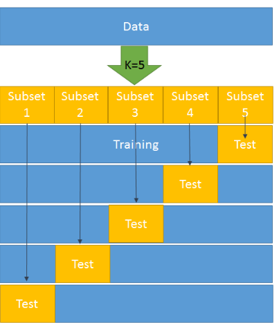

# Model Selection

The goal of model selection is to find good hyperparameters for a given algorithm

## Hyperparameters and Normal Parameters

Hyperparameters are parameters which aren't minimised by the cost function (e.g. when using gradient descent).

## Hyperparameter Tuning

Here are some general approaches:

* Manually setting the hyperparameters
* **Grid Search**
  Search all combinations of hyperparameters in specified ranges
* **Randomised Search**
  Train models on random hyperparameter combinations
* **Genetic Algorithms**
  Using an algorithm, which does the selection, crossover and mutation steps to improve the hyperparameters

## Data Split

If we want to also tune hyperparameters of a model, we need an independent validation set. This needs to be independent, as the model shouldn't interact at all with the test set.

## k-Fold Cross-Validation

With k-fold cross-validation, we split the training set in to multiple approximately equally sized subsets. We then go through all subsets and use it as a test set and the rest as the training set. Afterwards we have $n$ subsets of metrics (and also parameters). The values of the metrics are summed up and are the k-fold cross-validation score.

k-fold-validation is only used for hyperparameter tuning by optimising for the best k-fold cross-validation score. With those found hyperparameter, one can train the model and determine the best parameters.

This  is also called leave-one-out cross-validation (LOOCV) if we have $n$ samples and use $n$ folds. This results in $1$ test sample and $n-1$ training samples for each fold.

After the k-fold-validation the entire training set can be used to train the mod

## Learning Curves

* If both curves are close to each other and both of them have a low score then there is a potential underfitting. This means that the model should be complexer to handle the data.
  
* If the training curve has a much better score than the testing curve then there is a potential overfitting (High Variance)

Examples:

* The model is too simple to detect the patterns of the data. The model should be made more complex
  
* With this example, there is likely a high variance, overfitting is happening and the mode should be simplified. This is also called regularisation.
  

