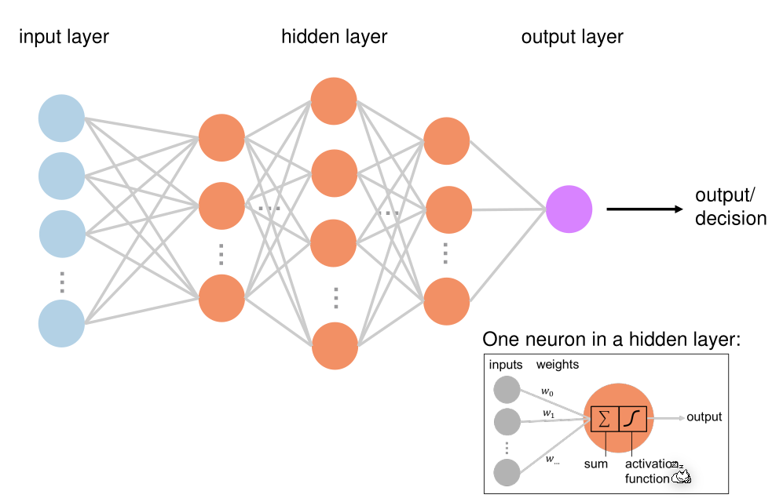
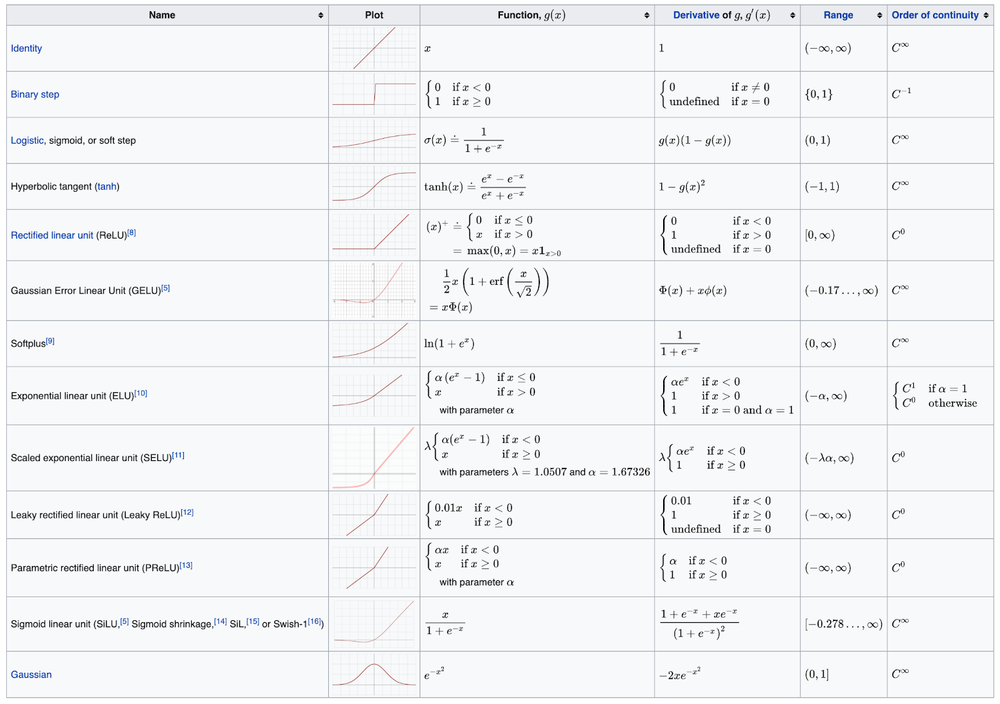
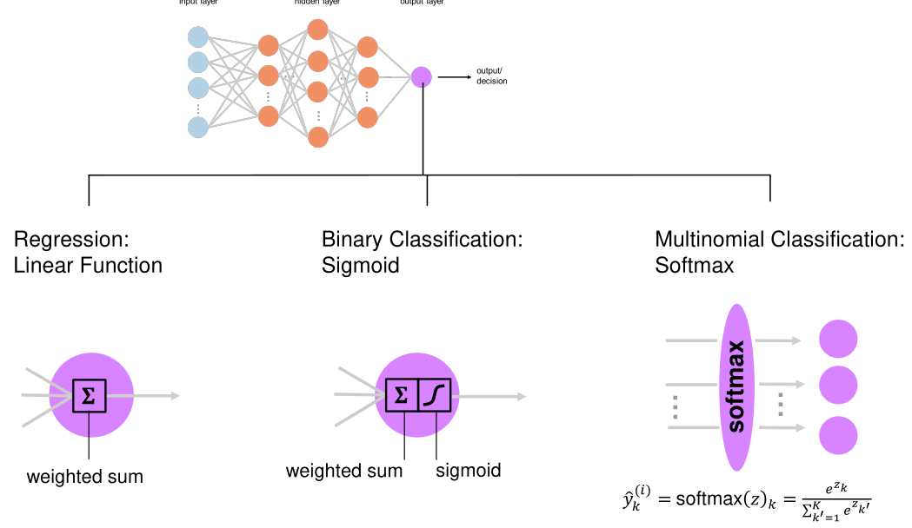
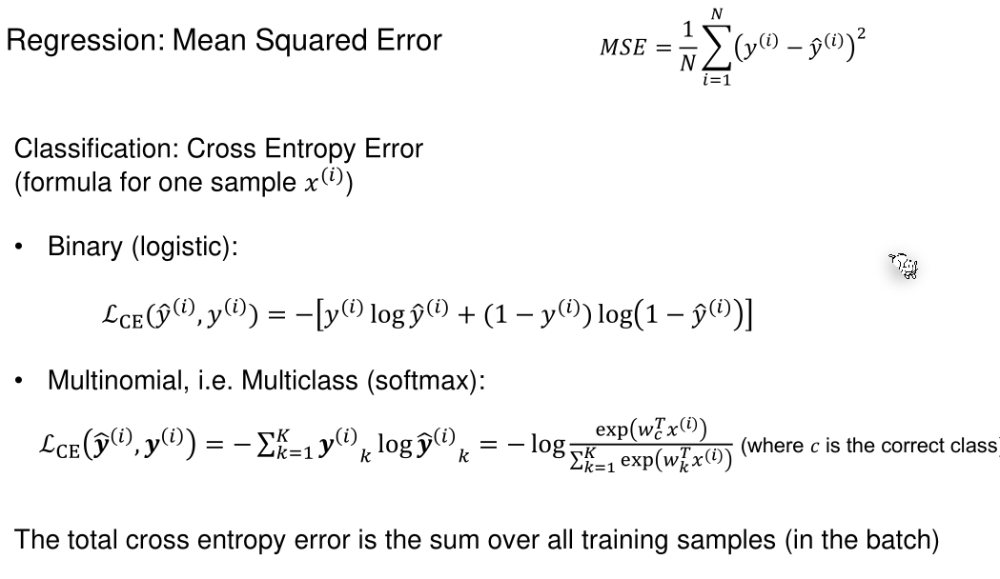
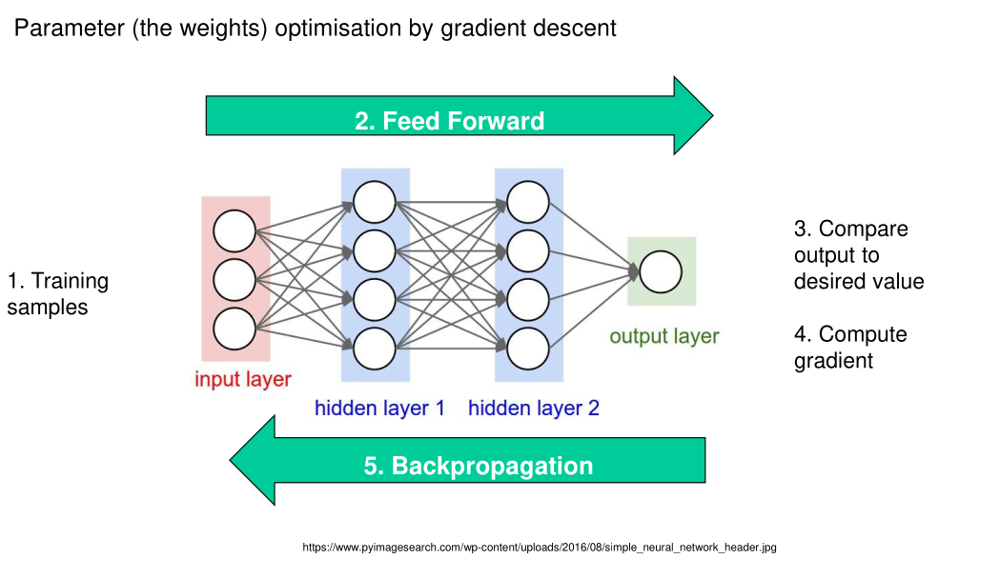

# Neural Network

## Feed-Forward Neural Network

A neuron calculates the wheighted-sum of all its input, subtracts a bias value and puts that result through the activation function.

There are different activation functions that can be used:

This is a more complete table:

### Output Layer

Depending on the problem a different output layer is used. 

*(Softmax ensures that the results of the output nodes are percentages)*

### Cost-Funcction

### How to Train your Feedforward Neural Network

