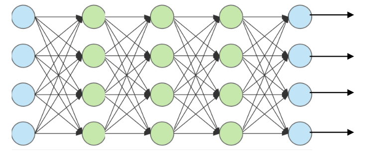
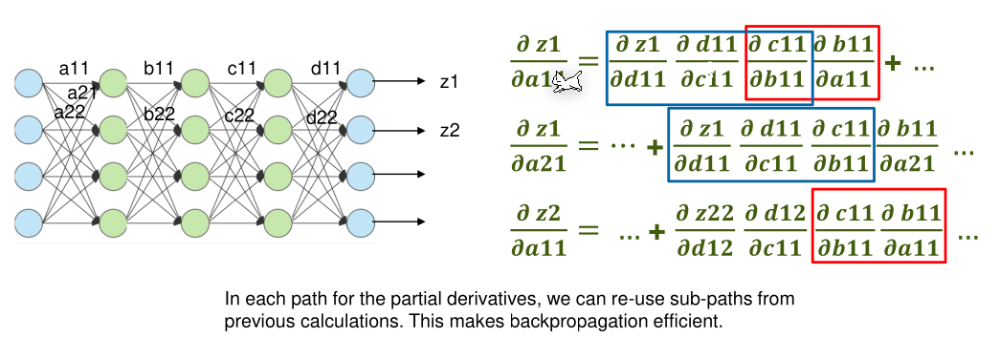
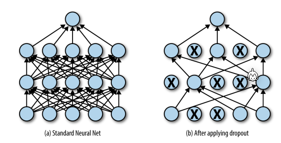
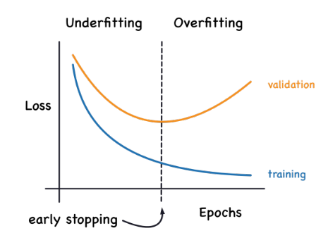
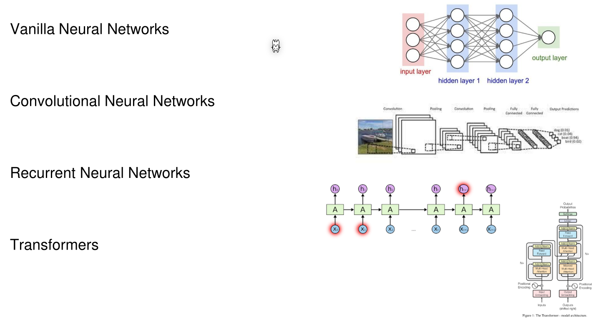
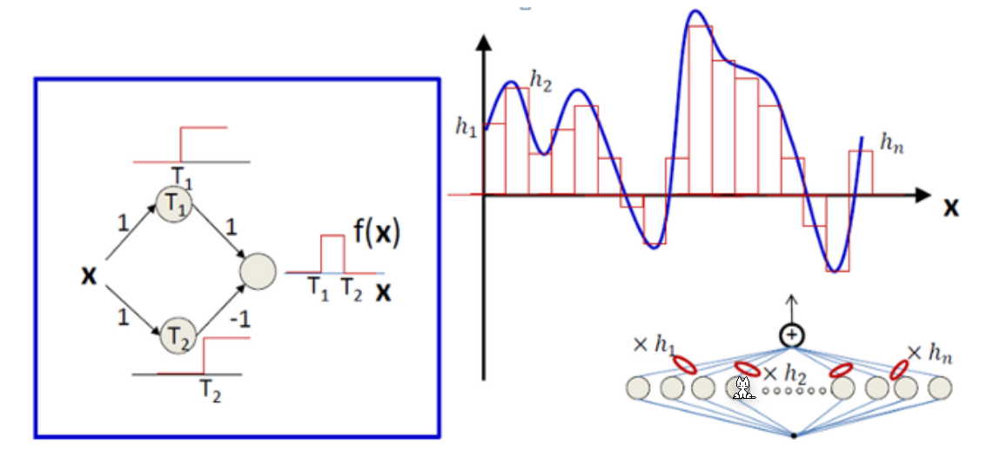

# Neural Network


$$
NrOfWheights=layerSize^k\\
NrOfPaths=
$$
Where $layerSize$ is the number of nodes per layer and $k$ the number of layers.

## Feed-Forward Neural Network

In a feed-forward neural network, all layers all fully-connected (every node is connected to every node of the next layer), but have no connection with in the same layer. Thus the information can only flow forward.


A neuron calculates the wheighted-sum of all its input, subtracts a bias value and puts that result through the activation function.


There are different activation functions that can be used:


This is a more complete table:


### Output Layer

Depending on the problem a different output layer is used. 


*(Softmax ensures that the results of the output nodes are percentages)*

Instead of softmax one-vs-all can also be used. 

### Cost-Fuction


### How to Train your Feedforward Neural Network


The following is true for partial derivations if $f \circ g$ holds:
$$
\begin{align}
z&=f(y) & y = g(x) \\
\frac{\part z}{\part x}&= \frac{\part z}{\part y}\frac{\part y}{\part x}
\end{align}
$$


### Vanishing Gradient Problem

One problem with back progagation is that with large model and the sigmoid function is that all partial derivations are between $-1$ and $1$. This leads to the partial derivation getting smaller and smaller, thus the model learns very slowly. ReLu solves this to a degree, since the partial derivation can either be $0$ or $1$.

## Optimizing

The following techniques are ways to optimise a model and prevent it from overfitting.

### Dropout

###### 

When doing dropout, during training (during testing all nodes are used) some nodes are not updated. This should cause other neurons to learn the same behaviour and make the model overall more stable. Typical dropout rates are between 20% and 50%. 

From experience, larger networks with dropout perform better then small networks without dropout.

### Early Stopping



At a certain point during training a model can start to be over fitted and learn noise instead of the pattern in the data. This causes the model getting worse for data other then the training data (as can be seen in the diagram above).

To prevent this, one can introduce checkpoints, where loss and other quality measurements are taken and evaluated. If the score get worse, then revert to the previous best checkpoint.

### Data Augmentation


To generate more training data, one can generate them artificially by:

* adding noise
* combining or extrapolate training samples
* modify existing training samples

This should cause the model to become more roust and stable.

This can also work for text:


### In Case of Bad Performance

If a model doesn't predict to a satisfactory degree, one should analyse the learning curve when changing the following values:

* The number of training samples
* The number of hidden neurons
* The activiation functions
* Regularisation
* Learning rate / Learning rate decay
* Batch size
* Optimisation algorithms
* Number of epochs
* Early stopping
* Dropout
* Data augmentation

## Architecture of Neural Networks



## Universality Theorem

> A neural net with one hidden layer and arbitrary number of neurons can approximate any given continuous function.



The main idea is to cut a function into small pieces and use two neurons to approximate these steps. The left diagram shows two neurons approximating a step function.

## Keras


```python
model = Sequential()
model.add(Dense(5, input_shape=(72,)))
model.add(Activation('relu'))
model.add(Dense(7, input_shape=(5,)))
model.add(Activation('relu'))
model.add(Dense(2, input_shape=(7,)))
model.compile(optimizer='sgd', loss='mse')

# Data:
X = np.random.random((100, 72))
y = np.random.random((100, 2))

# Train:
model.fit(X, y, epochs=1, batch_size=10)
```

