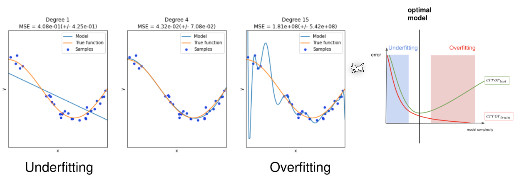
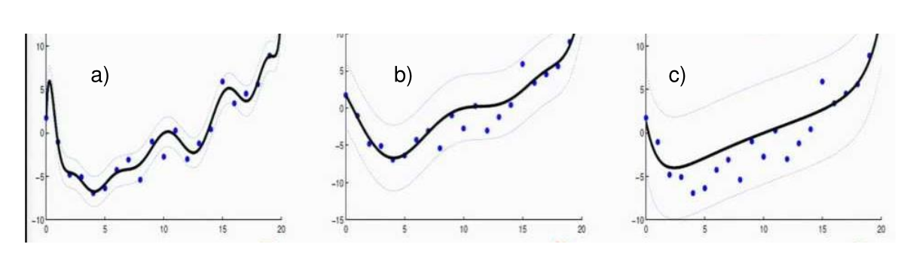

# Polynomial Regression

For polynomial regression, we have to alter the $h_\theta$ function.
$$
h_\theta(x_i)=\theta_0\cdot 1 + \theta_1\cdot x_1 + \theta_1\cdot x_1^2 + \theta_1\cdot x_1^3 
+ ... + \theta_1\cdot x_1^n
$$
To solve this with a matrix for $\theta$, the following matrix has to be used:
$$
\begin{pmatrix}
1 & x_1 & x_1^2 & x_1^3 & ... & x_1^n \\
1 & x_1 & x_1^2 & x_1^3 & ... & x_1^n\\
...\\
1 & x_1 & x_1^2 & x_1^3 & ... & x_1^n
\end{pmatrix}
$$
*Note: Each column contains the values of the vector of $\vec x_1$*

If we have multiple samples (like the cost of an apartment depends on the size, location , ...), we may have to include combinations in $h_\theta$, like $h_\theta(x)=\theta_0 + \theta_1x_1 + \theta_2x_2^3 + \theta_3x_2^3x_3x_4$

## Evaluation Metrics

Regressions can be meassured 

**TODO**

## Underfit and Overfit

If the degree of the polynomial is not height enough then the polynomial is not flexible enough do adjust to the data. However, if the degree is too large, then polynomial becomes too flexible and gets inaccurate again. 

## Regularisation

The cost function is adjusted to:
$$
J(\theta)=\frac 1 {2m}\left(\sum^m_{i=1}(h_0(x_i)-y_i)^2 + \lambda \sum^n_{j=0}\theta_j^2 \right)
$$
The $\sum^n_{j=0}\theta_j^2$ part puntions a lot of $\theta$ with high values. When minimizing $J(\theta)$, this leads to minimize as many $\theta$ as possibles. $\lambda$ dictates how much high $\theta$ are punished. 

When $\lambda$ is low, then a lot of $\theta$ have higher values and a curve like `a)` will be the result. However, if $\lambda$ is a high value, then a lot of $\theta$ have lower values resulting in a curve like `c)`. 

If $\lambda$ is extremely high, then the incline will become $0$, as every $\theta$, except $\theta_0$ (with is $1$), will trend towards $0$. This leads to a straight line with no incline.