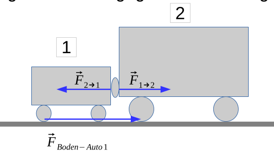
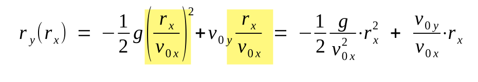

# Dynamik

Es gibt vier grundlegende Gesetzte:

1. Trägheitsgesetz (Ohne äussere Kräfte bleibt der Impuls erhalten)
2. Bewegungsgesetz ($F=a\cdot m$)
3. Wechselwirkungsgesetz (Aktion = Reaktion)
4. Kräfte sind Vektoren

## Bewegungsgesetz

Das Bewegungsgesetz betrifft nur die Beschleunigung. Als Beispiel: Ein Lift, von einem Seil gezogen, fährt mit **konstanter** Geschwindigkeit hoch. Die Schwerkraft und die Seilkraft sind in diesem Fall gleichgross. Dies liegt daran, dass wenn die wirkende Kraft nicht $0$ ist, dann würde der Lift beschleunigen oder verlangsamen.

## Wechselwirkungsgesetz

Aktion = Reaktion bedeutet, dass wenn ein Objekt angestossen wird, drückt es mit der selben Kraft zurück.

Als Beispiel: Das Auto, beim Bremsen, stösst die Strasse gleich stark nach vorn, wie die Strasse das Auto nach hinten stossen. Das Auto bremst also nicht weil die Bremsen nach hinten stossen, sondern weil die Strasse zurück stosst.

Wenn z.B. ein Auto (*1*) ein Lastwagen (*2*) stösst, dann stösst der Lastenwagen mit der selben Kraft zurück, wie das Auto auf den Lastwagen drückt. Das Auto drückt auf die Strasse, welche zurück drückt. Die effektive Kraft, kommt nun von $\vec F_{Boden - Auto1}-(\vec F_{2 \to 1}- \vec F_{1\to 2})$

## Freier Fall

Auf ein Körper wirkt die Gewichtskraft $\vec F_G=-mg$. Aus dem ergeben sich die folgenden Formeln:

* $\vec v = \int \vec a \mathrm dt = -gt+\vec v_0$
* $\vec r = \int \vec v \mathrm dt = -\frac 1 2 g t^2+\vec v_0t+\vec r_0$

## Schiefer Wurf

$$
\vec r(t)=\frac 1 2 (0, - g)t^2+|\vec v_0|(\cos (\alpha_0), \sin (\alpha_0)t + (x_0, y_0)\\
\vec r_y(r_x)=-\frac 1 2 g\left ( \frac{r_x}{v_{0x}} \right)^2+v_{0y}\frac{r_x}{v_{0x}}
$$

## Geschwindigkgeit

Um eine Geschwindigkeit in einen Vektor um zurechnen, kann die folgende Formeln verwendet werden: $(|\vec v|\cdot \sin(\alpha), |\vec v|\cdot \cos(\alpha))$

