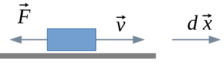
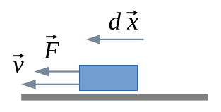
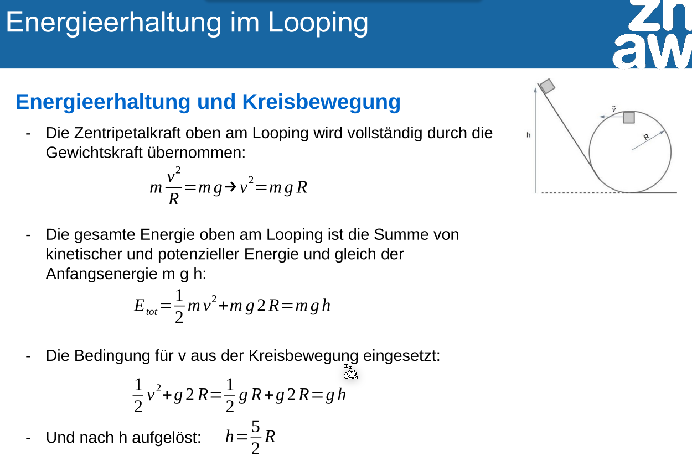

# Energie und Arbeit

Energie und Arbeit werden in Joule gemessen, was äquivalent zu $\frac{kg\cdot m^2}{s^2}$.

Die generelle Formel für Arbeit und Energie ist 
$$
W_{A\to B}=\int_A^B \vec F \circ \mathrm d \vec x
$$
Diese Formel kann in die folgenden spezifische Formel umgeformt werden:
$$
E_{pot}=...\\
E_{kin,trans}=\frac 1 2 m v^2 \\
E_{kin,rot}=\frac 1 2 J \omega^2 \\
E_{kin,total}=E_{pot} + E_{kin,trans} + E_{kin,rot}
$$
Die potentielle Energie in die Höhe kann folgendermassen berechnet werden:
$$
E_{pot,h}=m\cdot g \cdot h
$$

## Hubarbeit

Im folgenden Bild bewegt sich der Block nach rechts und es wirkt eine Kraft nach links. Daher nimmt die potentielle Energie ab.

Im nächsten Bild bewegt sich der Block nach links und die Kraft zieht nach links. In diesem Fall nimmt die potentielle Energie zu.

Dies funktioniert auch auf der horizontaler Ebene:

## Wirkungsgrad

$$
\eta=\frac{\text{Nutzenergie}}{\text{zugeführte Enerie}}
$$
$\eta$ ist der Wirkungsgrad, welcher aussagt, wie viel der hineingesteckte Energie wirklich genutzt wird.

## Energieerhaltung im Looping

## Leistung

Leistung ist Arbeit pro Zeit, bzw. Arbeit ist die Leistung integriert über die Zeit.
$$
P=\frac{\partial W}{\partial t}\\
W=\int P \mathrm d t
$$
Die Einheit ist daher: 
$$
W=\frac J s=\frac{kg \cdot m^2}{s^3}
$$
