# Impuls

Der Impuls ist definiert als:
$$
\vec p = m \vec v
$$
*(Dabei ist $m$ eine Masse in kg und $\vec v$ eine Geschwindigkeit)*

Der Gesamtimpuls eines Systems bleibt immer erhalten, insofern keine äusseren Kräfte einwirken.

## Stossexperiment

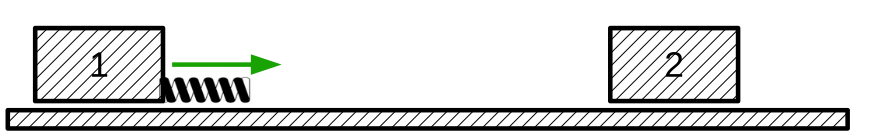

| $m_1$  | $\Delta v_1$ | $m_2$ | $\Delta v_2$ | $\frac{m_1}{m_2}$ | $\frac{\Delta v_2}{\Delta v_1}$ |
| ------ | ------------ | ----- | ------------ | ----------------- | ------------------------------- |
| $0.5$  | $-1$         | $0.5$ | $+1$         | $1$               | $-1$                            |
| $0.25$ | $-11.5$      | $0.5$ | $+5.5$       | $0.5$             | $-0.5$                          |
|        |              |       |              |                   |                                 |

Aus diesem Experimentt geht, dass folgendes gilt:
$$
\begin{align}
\frac{m_1}{m_2}&=-\frac{\Delta v_2}{\Delta v_1}\\
m_1 \cdot \Delta V_1 &= -m_2 \cdot \Delta v_2
\end{align}
$$
Oder in Worten: den Impuls bleibt erhalten. Körper 1 gibt den Impuls weiter an den Körper 2.

## Elastischer Stossversuch

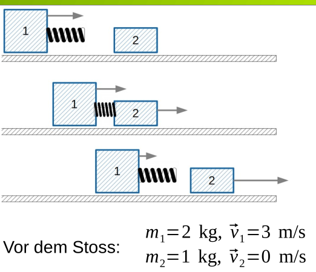

Der Gesamtimpuls des gesamten Systems ist $V_{Spt}=\frac{m_1 \vec v_2 + m_2 + }{}$

Aus diem geht er **TODO**
$$
\vec p_{vor}=\vec p_1+\vec p_2=m_1 \cdot \vec v_1 + m_2 \cdot \vec v_2 = 6 \frac{kg\cdot m}{s} = \vec p_{nach} \\
$$

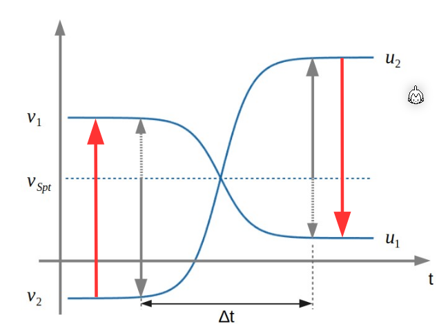

## Unelastischer Stossversuch

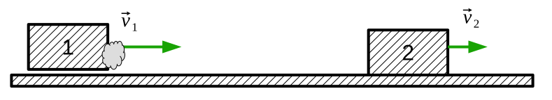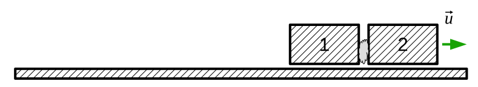

Der Gesamtimpuls ist 

$$
\begin{align}
\vec p_{vor}&=m_1\vec v_1 + m_2 \vec v_2 = \vec p_{nach} = (m_1 + m_2) \cdot \vec u\\
\vec u &=\frac{m_1\vec v_1 + m_2 \vec v_2}{m_1 + m_2}
\end{align}
$$
In einem Zeit-Geschwindigkeits-Diagramm sieht das folgendermassen aus:

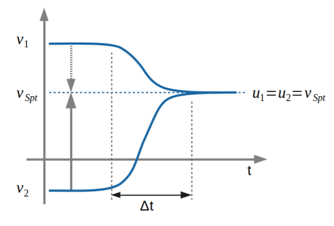

## Ballistisches Pendel

https://www.leifiphysik.de/mechanik/impulserhaltung-und-stoesse/versuche/ballistisches-pendel-simulation

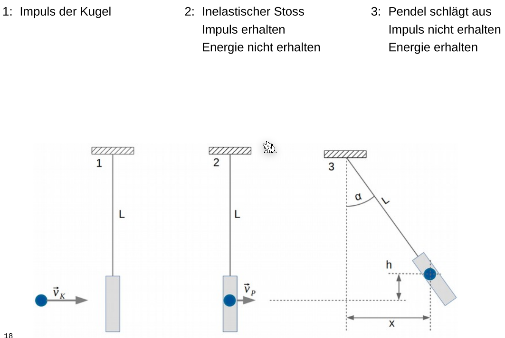

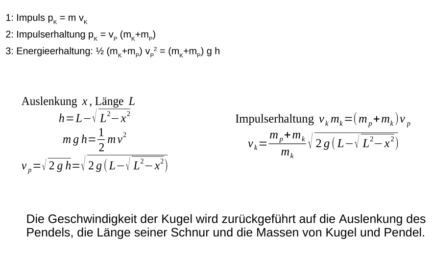

## Schwerpunkt Geschwindigkeit

$V_{Spt}$ ist die Schwerpunkt Geschwindigkeit und stellt die Spiegelachse dar, an dem sich die Geschwindigkeitsidifferenzen spiegeln.
$$
V_{Spt}=\frac{\vec p}{m_1+m_2}=\frac{m_1\cdot \vec v_1 + m_2 \cdot \vec v_2}{m_1+m_2}
$$
Im Falle der Elastischen Stosses, wird das $u_1$ und $u_2$ nach dem Zusammenstoss an $V_{Spt}$ gespiegelt.

Im Falle des unelastischen Stosses gilt nach dem Stoss $u_1=u_2=v_{Spt}$

Wenn gillt $m_2 \gg m_1$, dann gelten folgende vereinfachten Formeln: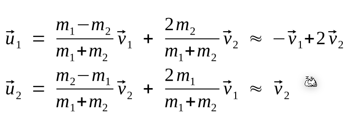

## Kraftstoss

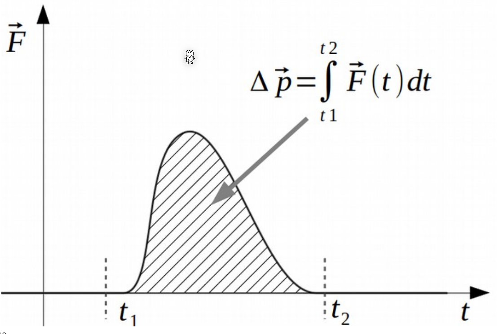

Die Impulsänderung durch einen Kraftstoss ist die Fläche einer $F(t)$ Funktion.

Im folgenden Diagramm ist grafisch dargestellt, wie der Impuls erhalten bleibt.

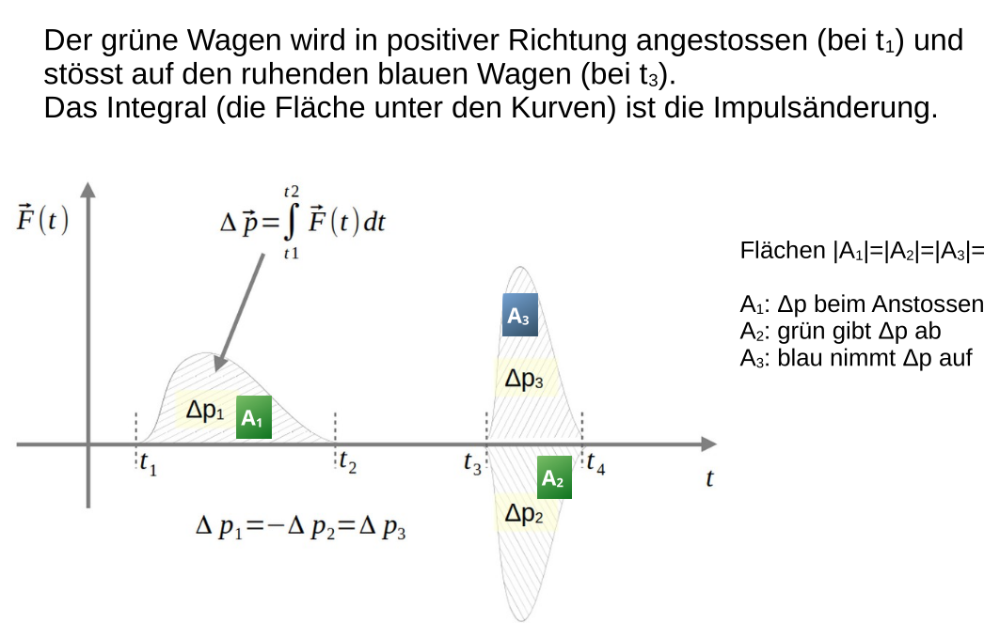

## Racketen

$$
v_{final}=v_{Gasse}\ln\left(\frac{m_{init}}{m_{final}}\right)
$$

$v_{final}$ ist die finale Geschwindigkeit, $v_{Gasse}$ ist die Austrittsgeschwindigkeit der Gasse, $m_{init}$ ist die initiale Masse und $m_{final}$ ist die finale Masse (ohne Treibstoff).
