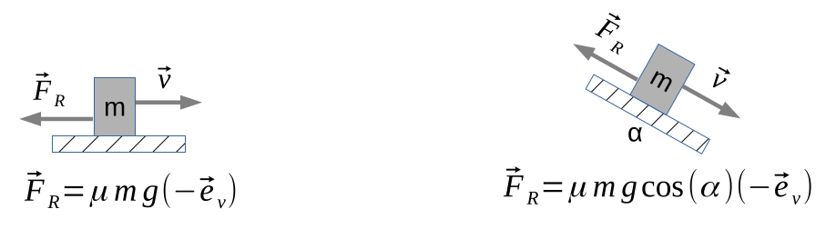
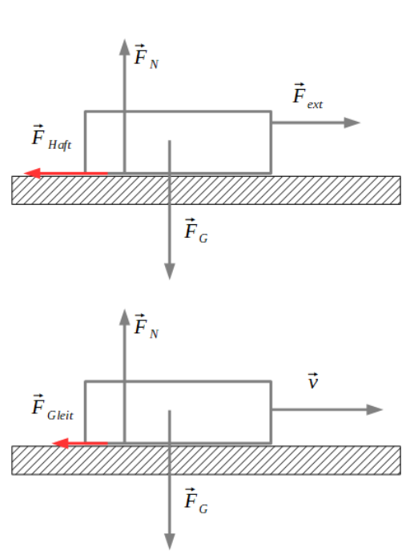
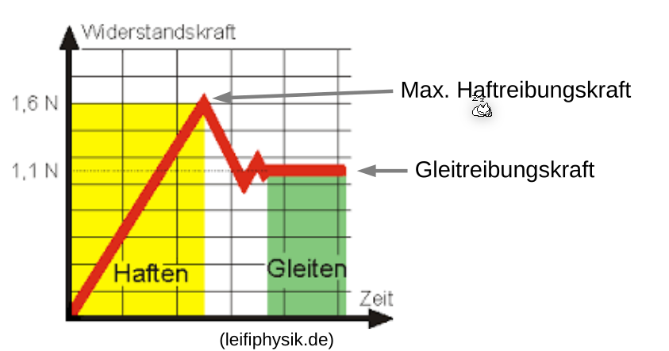
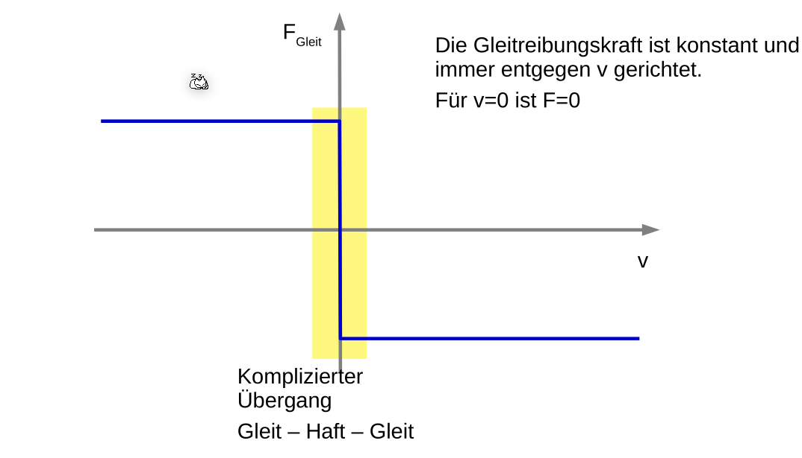
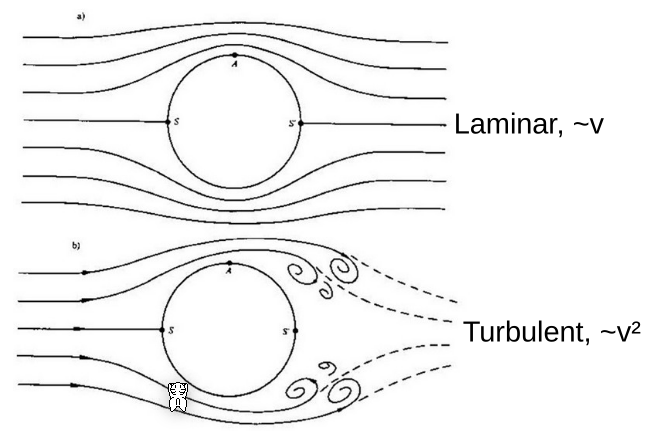
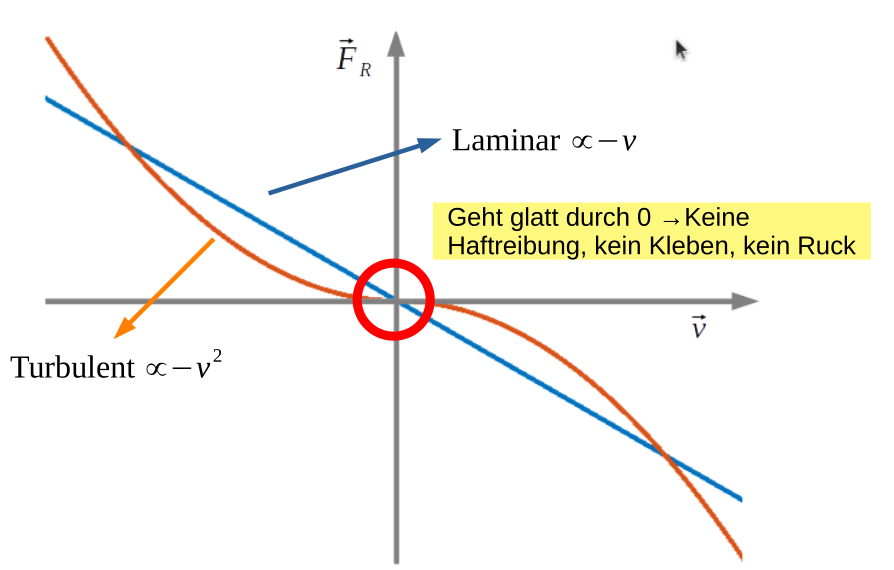
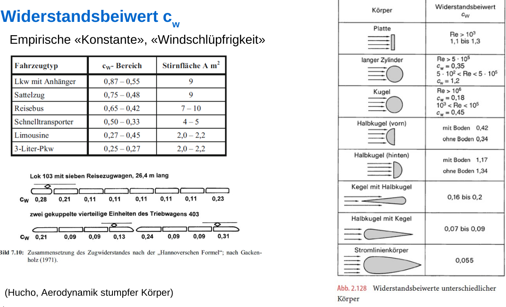

# Reibung

## Trockene Reibung

$$
F_R=\mu F_N \\
F_N=m\cdot g
$$
Die Reibungskraft $F_R$ ist proportional zur Normalkraft $F_N$ mit dem Faktor des Gleitreibungskoeffizient $\mu$.

Wenn eine Masse sich nicht bewegt, wirkt die Haftreibungskraft $\vec F_{Haft}$. Sobald sich die Masse sich bewegt gilt die Gleitreibungskraft $\vec F_{Gleit}$. $\vec F_{Haft}$ und $\vec F_{Gleit}$ unterscheiden sich nur durch den Gleitreibungskoeffizient $\mu$.

Das Vorzeichen ist wichtig zu beachten. Es zeigt immer in die entgegengesetzte Richtung, in welche sich eine Masse bewegt.

## Viskose Reibung

Es gibt zwei Arten von viskosen Reibung: Die laminare Strömung ist linear-proportional mit $v$. Wenn die Strömung turbulent ist, wie fast immer in der Realität, nimmt die Reibung quadratisch mit $v$ zu.

Die Reibungskraft bei turbulenten Strömen sieht folgendermassen aus:
$$
\vec F_R = - \frac 1 2 \rho A c_w |\vec v|^2 \cdot \vec e_v
$$
Dabei ist in dieser Formel die Dichte des Mediums $\rho$, die Stirnfläche der Masse $A$, ein Wiederstandsbeiwert $c_w$ und die Geschwindigkeit $\vec v$.

