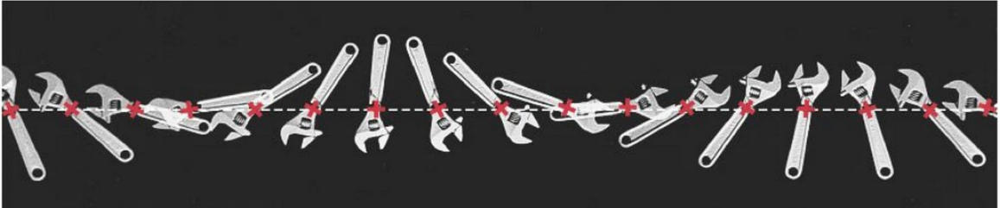
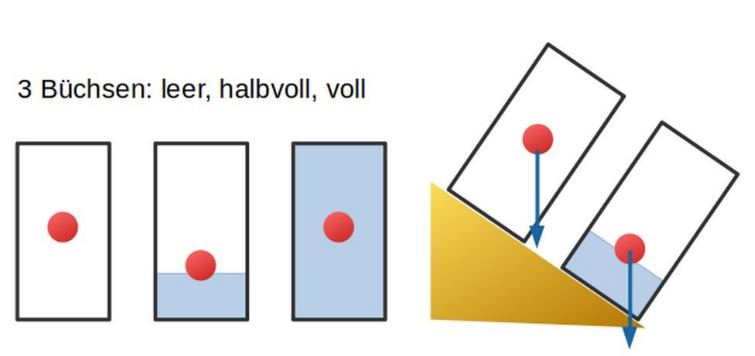
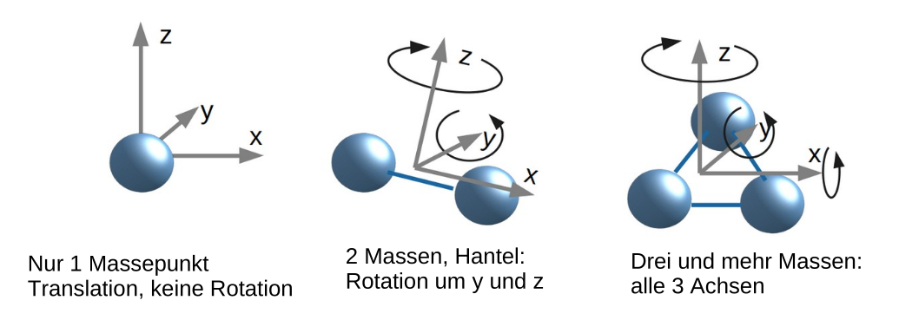
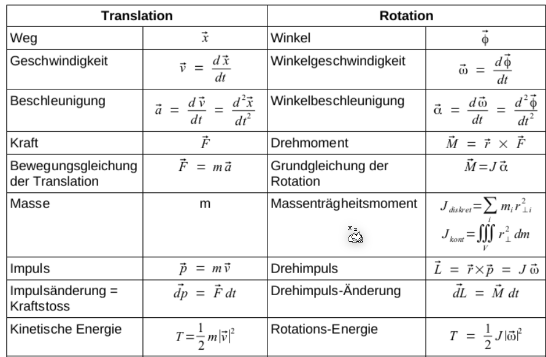
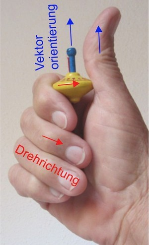

# Kinematik

## Bezugssystem

Ein Bezugssystem besteht aus Ortskoordinate und einer Zeit.

## Grössen

In der Kinematik wird der Ort $\vec r$, die Geschwindigkeit $\vec v$ und die Beschleunigung $\vec a$ verwendet.
$$
\vec v = \frac{d \vec r}{dt}\\
\vec a = \frac{d \vec v}{dt}\\
\\
\vec r = \int {\vec v} \mathrm dt\\
\vec v = \int {\vec a} \mathrm dt\\
$$

## Unabhängigkeit der Kooridnaten

Die `x`, `y` und `z` Koordinaten sind unabhängig von einander. Dies bedeutet auch, dass ein Problem auf ein 1D-Problem herunterbrechen

### 

$F_t(t)=qE_{x0}\sin(\omega t)$ 

Dabei ist $q$ die Ladung in Coulam und $E_0$ ein elektrisches Feld in $\frac V m$ (volt pro meter)

## Schwerpunkt

Der Schwerpunkt ist der gewichtete Mittelpunkt aller Massepunkte $m_i$.
$$
\vec R_S = \frac 1 {\sum_i m_i}\sum_i m_i \vec R_i
$$

Der Schwerpunkt kann sich nur durch eine externe Kraft verschieben.  Im Beispiel der Sonne und Planeten: Wenn alle Planeten in einer Reihe sind, dann ist der Schwerpunkt am selben Ort, wie wenn die Planten gleichmässig um die Sonne verteilt sind. Nur die Sonne ändert ihre Position relativ zum Schwerpunkt. Dies ist auch ersichtlich bei den Engländer im Bild oben.

Im Bild oben sind drei Red Bull Dosen mit verschiedenem Füllgrad dargestellt. Der rote Punkt ist der Schwerpunkt der Dosen. Wenn die Dosen gekippt wird, fällt die Dose um, wenn die Gewichtskraft, ausgehend vom Schwerpunkt, im Körper selbst bleibt (wie bei der 1/3 gefüllten Dose zu sehen ist). Falls die Schwerkraft ausserhalb zu liegen kommt, fällt die Dose. 

## Translation

> Ein Körper bewegt sich translatorisch so, als ob die gesamte Masse im Schwerpunkt konzentriert wäre und alle Kräfte dort angreifen würden.

Aus diesem Satz geht, wenn ein Kraft ein Körper nicht im Schwerpunkt angreift, dann bewegt sich der Körper trotzdem so, als ob die Kraft auf den Schwerpunkt liegt.

## Rotation

> Greifen dieselben Kräfte ausserhalb des Schwerpunkts an, erzeugen sie zusätzlich Drehmomente, die den Körper rotieren lassen. Die translatorische Bewegung bleibt aber gleich, wie wenn sie im Schwerpunkt angreifen.

Damit ein Körper sich drehen kann, muss er mindestens durch zwei Massepunkte beschrieben werden.

In der folgenden Tabelle ist ersichtlich, wie die Grössen aus der Translation direkt zu der Rotation übersetzt werden können:

Wie bei der Translation hängen die Grössen mit Ableiten zusammen.

Beim Drehimpuls gilt das selbe, wie beim Impuls. Der Drehimpuls bleibt erhalten, wenn keine externe 

Um eine Drehseite zu beschreiben, wird die Rechtehand mit den Finger in die Richtung des Rades auf das Rad gelegt. Der Vektor dieser Drehbewegung zeigt in die Richtung des Daumens, im rechten Winkel des Rades.

