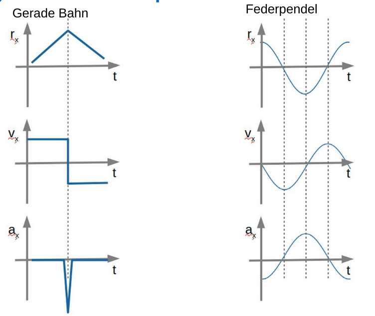
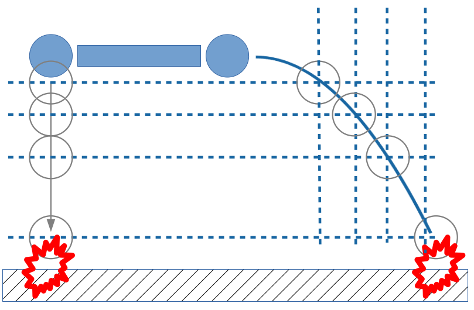

# Kinematik

## Bezugssystem

Ein Bezugssystem besteht aus Ortskoordinate und einer Zeit.

## Grössen

In der Kinematik wird der Ort $\vec r$, die Geschwindigkeit $\vec v$ und die Beschleunigung $\vec a$ verwendet.
$$
\vec v = \frac{d \vec r}{dt}\\
\vec a = \frac{d \vec v}{dt}\\
\\
\vec r = \int {\vec v} \mathrm dt\\
\vec v = \int {\vec a} \mathrm dt\\
$$

## Unabhängigkeit der Kooridnaten

Die `x`, `y` und `z` Koordinaten sind unabhängig von einander. Dies bedeutet auch, dass ein Problem auf ein 1D-Problem herunterbrechen