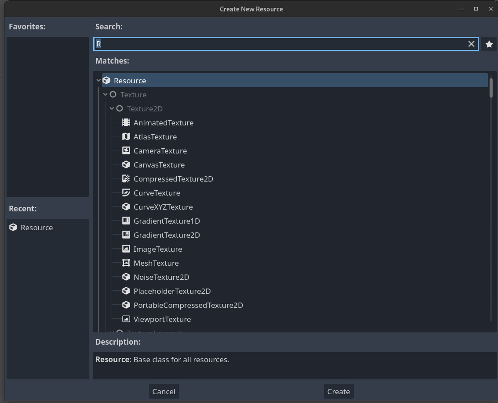

# Learnings

In the following paragraphs, learnings from examining other games are documented.

## Autoload Nodes
*[Doc Reference](https://docs.godotengine.org/en/stable/tutorials/scripting/singletons_autoload.html)

For global states, like which levels are completed, autoloaded nodes can be used. 
In `Project > Project Settings > AutoLoad` scripts which inherit from `Node` can be chosen. 

![[Pasted image 20230224212839.png]]

These scripts are loaded by Godot when starting the game and are available during while the game is running.

In C# the autoloaded node can be accessed with `GetNode<Type>("/root/<name>")`, like every other node in the root of the scene tree.

An autoloaded node can dispatch signals and function as a global dispatcher. This can get quickly unwieldy when the application and the amount of signal grows. However, for actual global signals, this can be a clean solution

## Custom Resource Types
A custom resource type can be created by inheriting from `Resource`. The resulting class can be set and edited in the Godot inspector. 
However, there is currently a C# limitation that a resource class can't be registered.
As a workaround, a new `*.tres` file (Right-Click in FileSystem > New Resource...) of the type `Resource` can be created. 

 
Then the custom resource script can be attached to the newly created `*.tres` file.

The resource file can be edited in the inspector and set to exported properties. The object of the `*.tres` file is global. If a script references a `*.tres` file and updates a property, other script will see this change. This makes it an alternative to autoload nodes.

## `Tween`
*[Doc Reference](https://docs.godotengine.org/en/stable/classes/class_tween.html)*

A `Tween` instance can interpolate a property of an object between two values.
## Open Questions
1. How to realize a UI with proper Model-Controller separation?
   One problem that arises is how to propagate a model instance to all controllers. In a traditional UI, the object would be passed to an other controller via the constructor. However, this does not work in Godot, as the constructor is invoked by Godot itself.