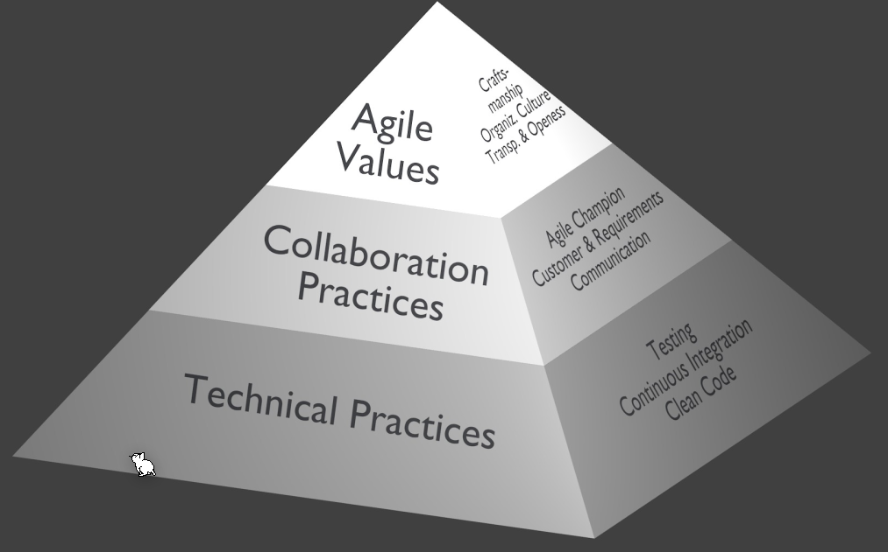
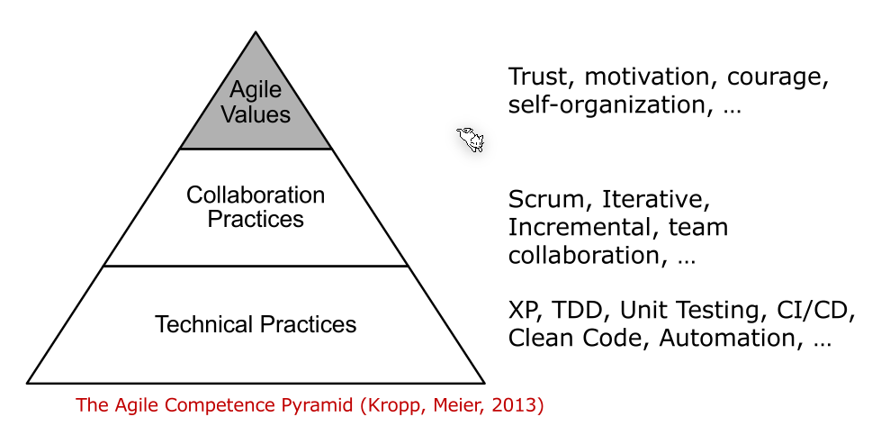

# Agile Development

## The Agile Manifesto

> We are uncovering better ways of developing software by doing it and helping others do it. Through this work we have come to value:
>
> **Individuals and interactions** over processes and tools
> **Working software** over comprehensive documentation
> **Customer collaboration** over contract negotiation
> **Responding to change** over following a plan
>
> That is, while there is value in the items on the right, we value the items on the left more.

* Individuals and Interactions
  *A fool with a tool is still a fool*. It is important to have a team of good engineers. The team should form bonds.
  A team is self organising (aka. individual).
* Working Software
  The developing software should work continuously. This also means that the software is continuously integrated.
* Customer Collaboration
  It is important to talk to the customer instead of ripping them of.
* Responding to Change
  Its important to respond to change

The last sentence is also key: The items on the right still hold values. Developing in an agile way doesn't mean there is no planning, just that responding to change is more important.

## 12 Principle

1. Customer Satisfaction First
   The customer should be satisfied by early and continuous  delivery
2. Welcome Changing Requirements
   The customers environment changes continuously. The software should adjust in lock-step.
3. Frequent Delivery
   Frequent delivery helps reduce the load of integrating. Additionally, the customer has a chance to give feedback which informs the developers actions for the next release.
4. Business and Development Working Together
   This is difficult to archive in practice as meeting with the business team every day is usually not possible.
5. Motivated Individuals at the Heart of the Project
   A manager micro-managing developers is not necessary. However, a coach, who supports the team and helps the team to archive their best, is vital. A coach does not play themselves, they only coach.
6. Face-to-Face is the prime Communication Method
   Instead of writing mail after mail, a talk, face-to-face, is usually a lot more efficient.
7. Working Software is the primary Measure of Progress
8. Aim for Sustainable Progress
   A project should be able to be maintained at a constant pace indefinitely.
9. Continuous Attention to what Matters
   The quality and design of the software (the technical excellence) needs to be maintained 
10. Keep it Simple
11. Create Self-Organising Teams
    The best architectures, requirements and designs emerge from self-organising teams
12. Make Time for Reflection
    The team needs to reflect on how to become more effective at regular intervals and then tune and adjust their behaviour accordingly.

## Pyramid of Agile Development

*(Collaboration Practices = Management Practices; Technical Practices = Engineering Practices)*

### Collaboration Practices

#### Agile Champion

An agile champion promotes the agile values to induce the following:

* to lead and inspire agility
* to help decide necessary changes to switch to agile development and then implement those
* to convince others of the necessity of a change to agile development
* to prevent wild-west agile (cowboy agile) and then later back sliding to the former approach
* remove impediments preventing the change to agile development

#### Collaboration and Communication

Intense and open communication is seen as one of the keys to successful agile projects.

The team should communicate well with:

* them self
* the customer/end-user
* management

This is similar to the agile value "transparency and openness".

### Agile Value

#### Organizational Culture

An agile team can work within a componey which has:

* an agile organization and company
* only an agile company
* neither an agile organization, nor company
