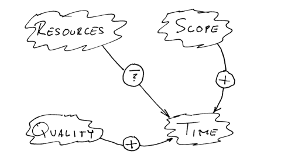
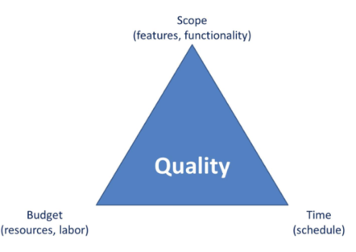
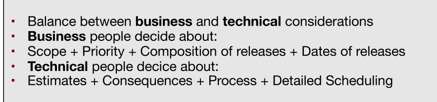
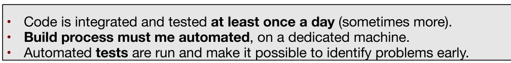
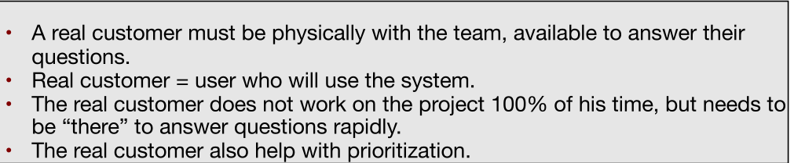

# Extreme Programming

## Four Variables

There are four variables, time, resources, quality and scope, to develop software.

In a traditional waterfall model, the resources, scope and time are fixed by a contract and the quality is implicitly set.

In agile development, the quality, time and resources are fixed, but the scope can be managed. Scrum does this by letting the customer choose the next features.

## Cost of Change

In a traditional waterfall model, change at a late stage is viewed as expensive. However, this doesn't necessarily hold true. Tools like, unit tests, refactoring and clean code (high cohesion, low coupling),  help to keep the curve flat.

## Values of XP

* **Communication**
  Everyone is part of the team and everything from requirements to code is worked on together.
* **Simplicity**
  Only do what is needed and asked for, but no more. Small simple steps should be taken (continuous integration) instead of big leaps to mitigate failure.
* **Feedback**
  Because releases are delivered regularly, the team can ask and listen to feedback and adjust accordingly. 
  Another important take away, is to adjust the process to the project, not the other way around.
* **Courage**
  It's important to tell the truth about the progress and estimates. 
* **Respect**
  Every member is given and feels respected. Importantly, also management respects the right of the team to the authority over the project.

## XP Practices

### The Planning Game

### Small releases

### Metaphor

At the beginning of the project a project vision is written so everybody has the same understanding of the project and its scope. This applies to technical and non-technical people.

### Simple Design

The right design for a software system is one that:

* Runs all tests
* Has no duplicated logic
* Has the fewest possible classes and methods
* Put in what is needed when it is needed
* **Emergent, growing design** (no big design upfront)

### Testing

Any program feature without an automated test simply does not exist.

A development cycle exists of:

* Listen (requirements)
* Write the test
* Implement the changes
* Refactor

### Refactoring

When implementing a feature, one should always ask themself if the code and architecture can be improved. Tests provide a safety-net which allows changes to be done without fearing bugs and crashes.

### Pair Programming

XP dictates that all production code is written by two people looking at one screen. However, this is rarely being done in practice. It can be a useful technique to write the tricky parts of a software. 

The pairs should change frequently.

### Collective Ownership

Everybody takes responsible for the whole system. While not everybody can be an export in every system, everybody should know the basics.

### Continuous Integration

### 40 hours week

Developing the software needs to be sustainable. This also means, that extended periods of overtime cannot exist.

### On-site customer

This hasn't materialised in practice, as the customer also has a job to do.

### Coding Standards

Collective ownership + constant refactoring means that coding practices must be unified in the team.

### Primary Practicies

### Corollary (=logische/folgende) Practices

