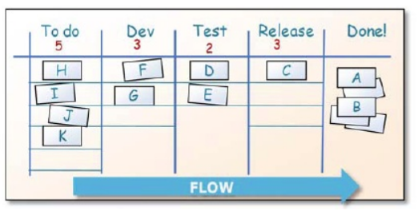
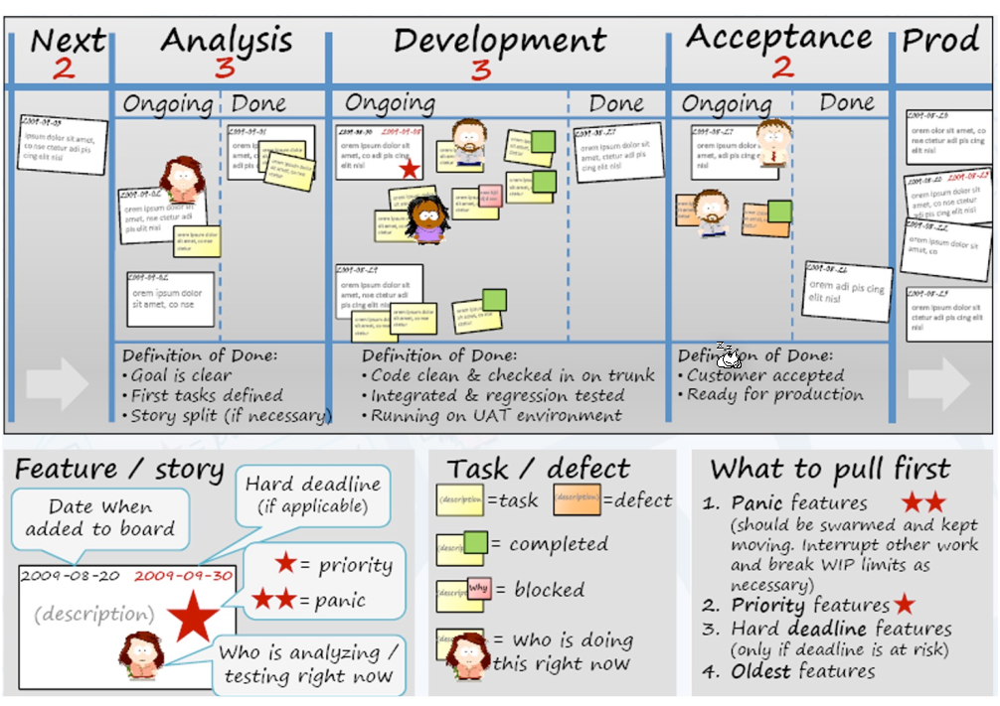
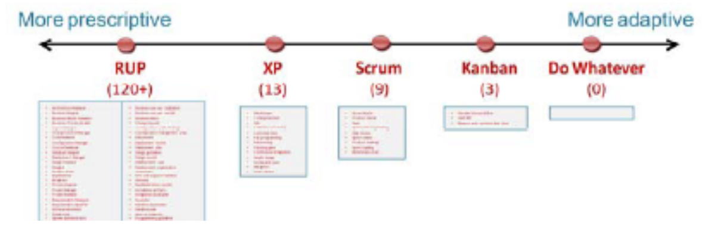
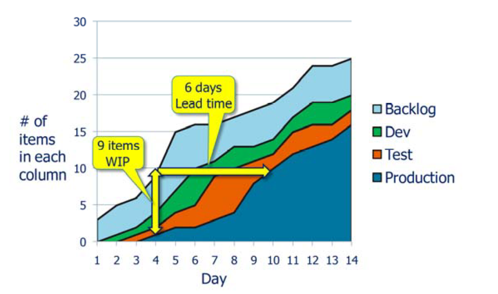
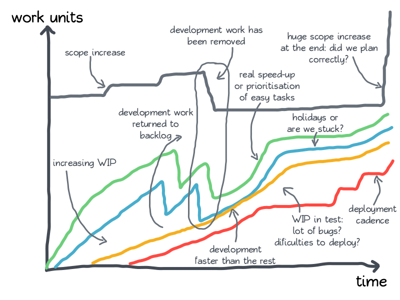
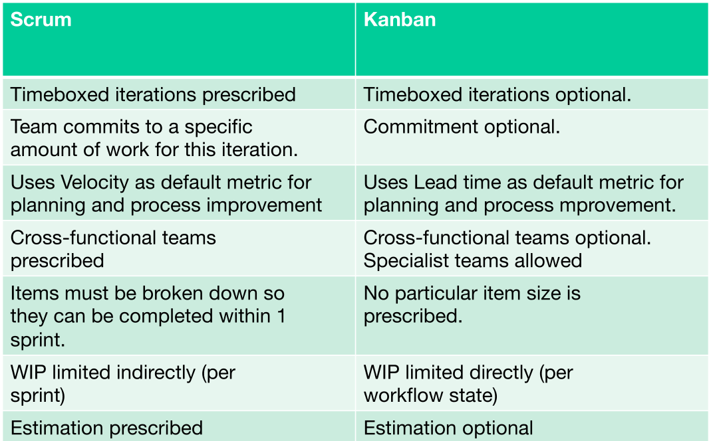
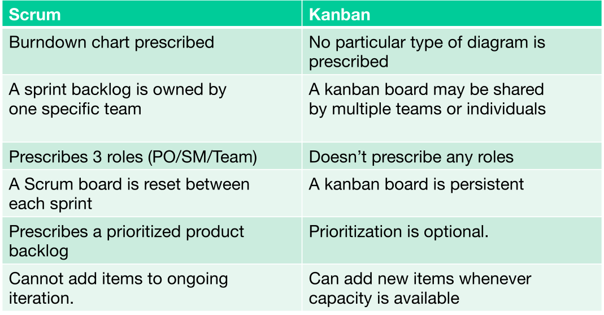
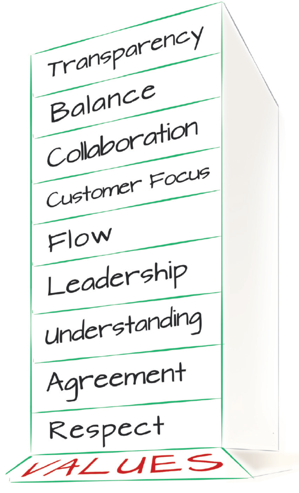
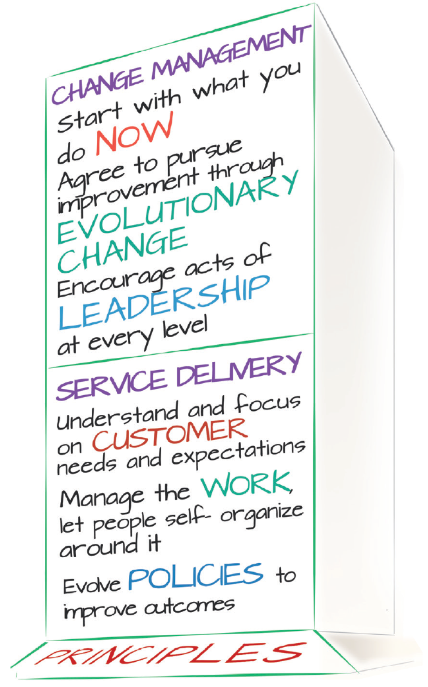
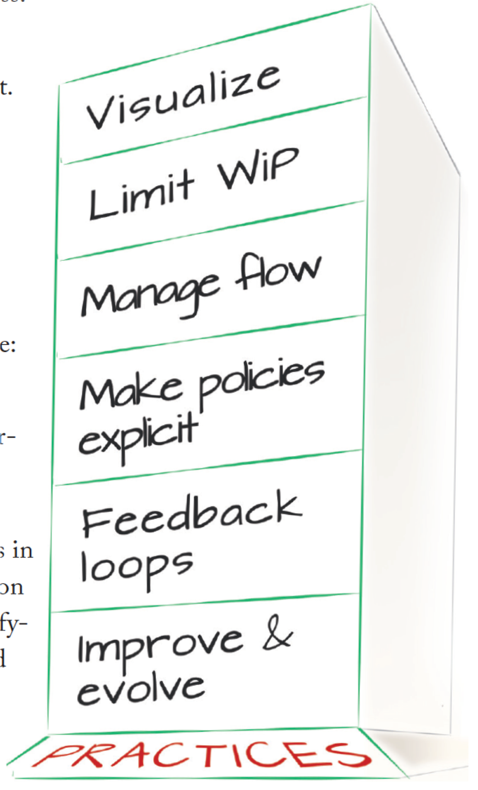

# Kanban

In kanban the work is pieced into items on a card, which then flow throw the kanban board. Each column has a **Work in Progress (WIP)** limit, which limits how many cards are allowed in the given column. If there is space in a column, a card from the previous column can be **pulled** in.

The **lead time** (cycle time) is the average time to complete one item. This gives predictability to the process since one can estimate when a task will be done. Furthermore, one can introspect the process and see where there are bottlenecks.

Kanban doesn't have sprints, rather tasks are continuously pulled from the backlog or the customer.

Kanban needs some slack in the system. There is a danger that there is a bottleneck where tasks start to pill up. This leads to the system overall being slower. 

Compared to scrum, kanban has a lower usage of the team but has more predictability through the lead time.

**Kaizen** means to make small changes for the better. Translated to the kanban world, this means changes should be done  by the person doing the work.

The following is a good representation of a kanban board:

In compared to scrum and xp, kanban has less rules to follow and sits between scrum and nothing.

## Cumulative Flow Diagram (CFD)

In the CFD the number of tasks in each columns are entered in the diagram each day.

## Kanban vs Scrum

## Kanban Values

## Kanban Foundational Principles

## Kanban Practices

