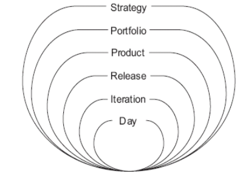
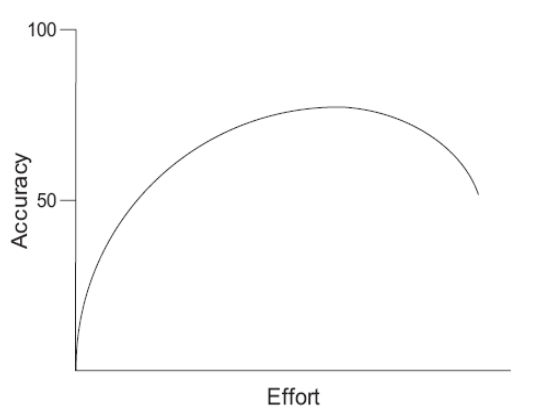
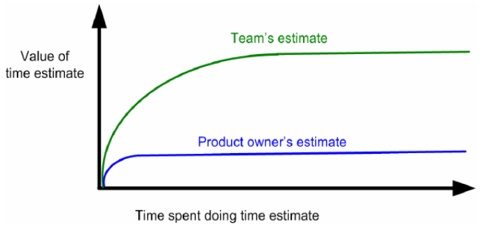
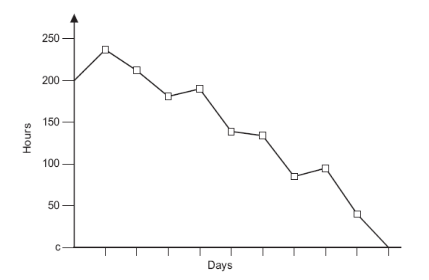
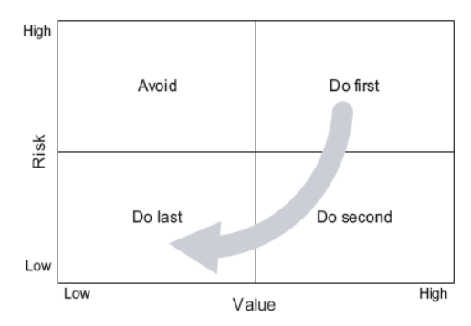
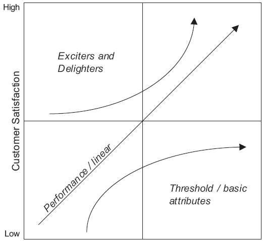

#  Planning

## Planning Onion (Level of Planing)

In agile development, there are multiple planing cycles, each being longer than the previous one. Agile teams plan at the  innermost three levels

## Choosing a User Story

To choose a user story multiple factors should be looked:

* value for the end user
* financial value the feature provide
  * Internal Rate of Return (IRR)
  * Net Present value
* the cost of developing the feature
* the knowledge gained by developing the feature
* the risk associated with the feature
  * scheduling risk (the feature might not be done until April)
  * cost risk (the feature might cost a lot more)
  * functionality risk (the feature might be unfeasable)

## Story Points

Story points doesn't have a unit. One story point is the amount of work for a reference user story. 

## Estimating

When estimating, as the amount of effort increases the accuracy doesn't necessarily increases. An agile team should stay on the left side of the curve.

Also, an estimate is a range (eg. between 2 and 5 days), not an exact number and not a commitment.

The user stories should be estimated by the team without the product owner. The teams should be aware of that the estimates are crude.

A team should re-estimate a user story when its relative size has changed.

## Planning Poker (Techniques for Estimating)

In planing poker, everybody gets cards with the possible story points. The available cards can either be the Fibonacci numbers or $2^n$ (1, 2, 4, 8, ...), but not continuous numbers (1, 2, 3, 4). Additionally, 0 should not be a valid number, as ten tasks with 0 will probably take longer then $10\cdot 0=0$.

For user story, the range of available cards should be in the range of $1-10$. For epics and themes 13, 20, 40 and 100 should be added to the list of available cards.

1. Each estimator is given a deck of cards, each card has a valid estimate written on it
2. Customer/Prodct owner reads a story and it's discussed briefly
3. Each estimator selects a card that is their estimate
4. At the same time, all estimator reveal their card
5. The differences should be discussed, especially outliers
6. Re-estimate until the score converge

## Iteration Planing

The chart above shows how user stories are added to a sprint. Importantly, the team **has to commit** to implementing the feature in that sprint.

## Burndown Chart

The burndown chart represents the story points left in the current sprint.

## Prioritising

When prioritising user stories, different metrics can be used:

* The financial value of having a feature
* The cost of developing and supporting a new feature
  This is more or less equal to the story points
* The amount of knowledge gained by developing the feature
* The amount of risk removed by developing a feature

## Kano Model of Customer Satisfaction

* **Threshold/basic attributes** are must-have features (the mvp of a product)
* **Performance/linear** are features for which "the more-the better" holds (more levels in a game)
* **Exciters and delighters:** are features which provide a great customer experience, but come at a price premium (Example: Great graphics in a game)

