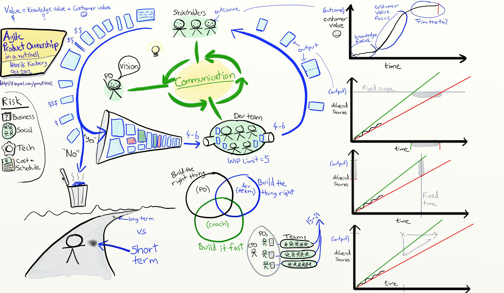
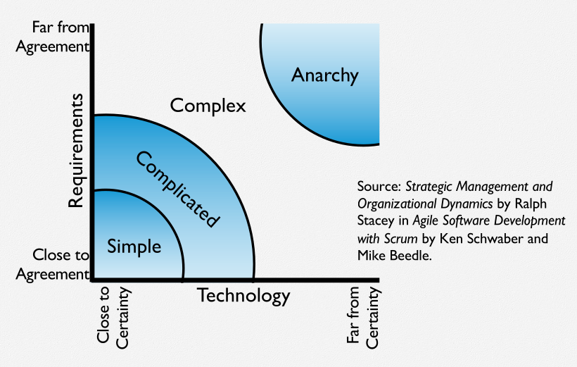
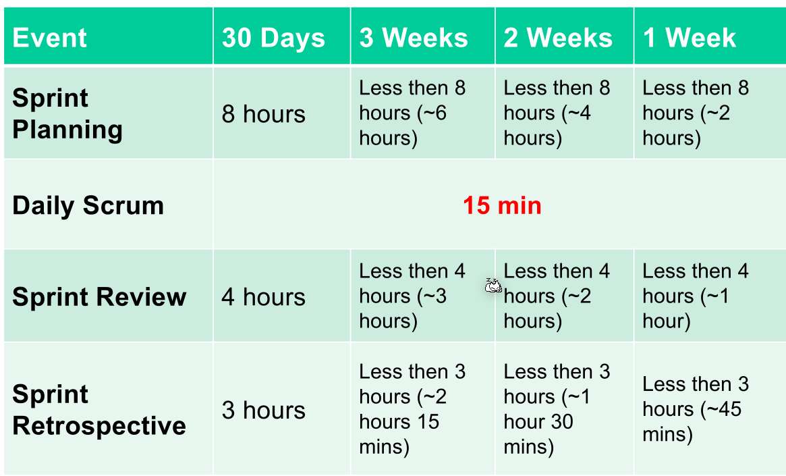
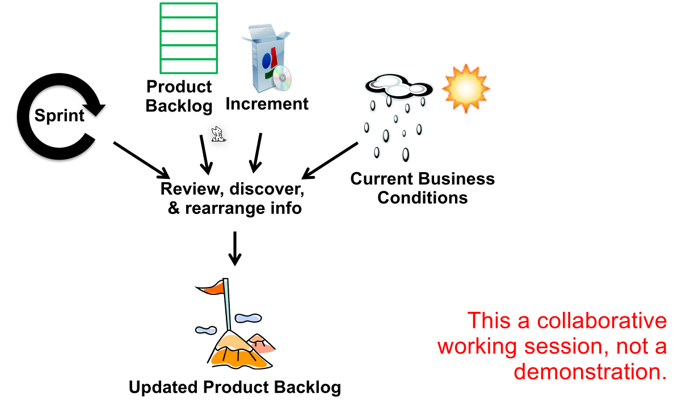
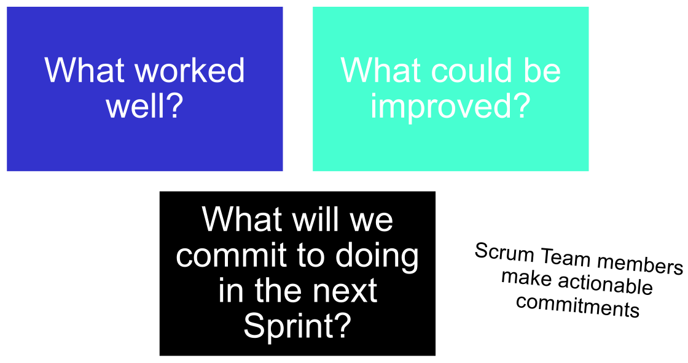
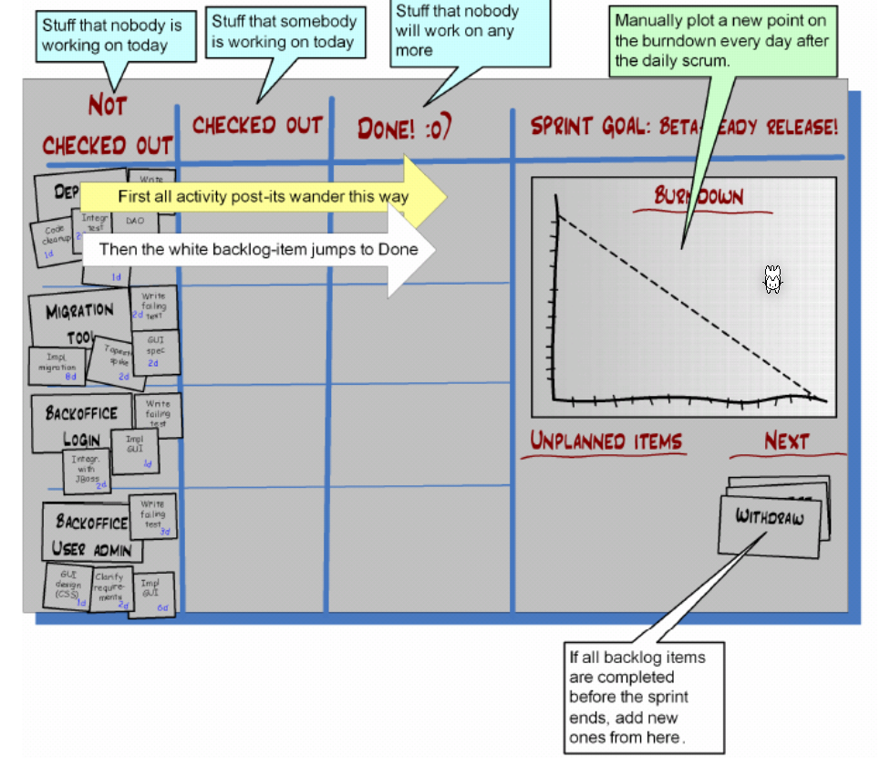
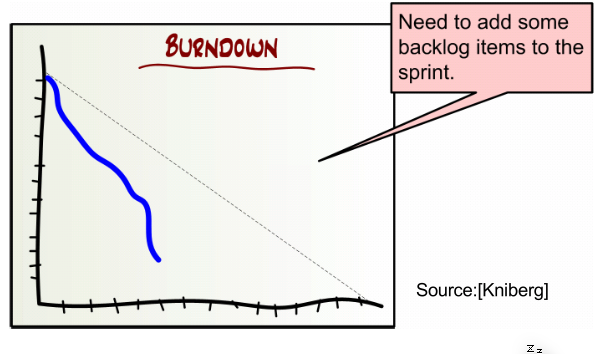

# Scrum

Scrum is efficient between 5-9 people. Less then there is no communication problem, more, then the people organize them in subgroups.

Scrum teams should be cross-functional, meaning that people with different jobs should work together (developers, UX designers, testers, ...).

## Definition of Done (DoD)

The definition of done is written by the whole team. It can be adjusted (making it more or less rigreous) in the sprint retrospective.

The problems when no definition of done is that thechinical debt accumulates exponentially. This can make progress an illusion and shipping date can get unpredictable. Since the velocity isn't acccurate anymore, teams will over-commit the amount of work.

A typicall definition of done looks like this:

1. Unit tests pass and coverage met standard (85% or above)
2. Sufficient negative unit tests were written (more negative
than positive)
3. Code is reviewed (or Pair programmed)
4. Coding standards are met
5. Continuous integration implemented (automated build,
deployment and testing)
6. Code is refactored (to support the new functionality)
7. User acceptance tests pass (test case requirements)
8. Non-functional tests pass (scalability, reliability, security, etc.)
9. Necessary documentation is completed

## Definition of Ready for a User Story

The definition of ready for a user story gives a checklist for a user story.

A typical definition of ready for a user story looks like this:
1. User Story defined
2. User Story Acceptance Criteria defined
3. User Story dependencies identified
4. User Story sized by Delivery Team
5. Scrum Team accepts User Experience artefacts
6. Performance criteria identified, where appropriate
7. Person who will accept the User Story is identified
8. Team has a good idea what it will mean to Demo the
User Story

## Roles

### Developer

The developers develop the software...

They are responseable for the commiting to a sprint and upholding this commitment, as well sticking to the definition of done.

### Product Owner

The product owner  defines the features of the product and priotize them. Additionally, the product owner defines when a release with what content will be released.

A product owner also accepts and rejects work done by the developers.

### Scrum Master

The scrum master ensures that the values of scrum are upheld.

A scrum master does the following:

* Keeps Scrum process running
* Ensures a proper power balance between PO, Team, Management
* Protects the Team
* Moderates in the Team
* Helps to organize (e.g., Meetings)
* Helps to keep the Team focused on the current Sprint
* Helps to achieve Sprint goals
* Works with PO
* Educates PO, Team, Management and Organization
* Solves impediments
* Encourages and helps to achieve transparency
* Strives to develop a Team into a High Performance Team
* Encourages and protects self-organization
* Educates and focuses a Team toward business-driven
development
* Supports Team building and Team development by utilizing the
abilities and skills of individuals, and fostering a Feedback culture
* Helps to self-help
* Ensures and supports Empowerment of the Team
* Addresses needs efficiently and effectively
* Detects hidden problems and strives to solve them
* Helps Team to learn from its experiences

### Chickens and Pigs

In scrum, there are chickens and pigs. Pigs are commited, while chickens are not. Chickens are allowed to attend the daily meetings, but are disallowed to interfeere.

## Scrum Events

In the following table, the **maximum** time each event can take.

### Sprint Review

In the sprint review the full scrum team is present in addition to the stakeholders. The team can show the work they did in the previous sprint by usually showing a demo.

Informally, there is a max of 2 hours of prep-time, no slides are allowed and every stakeholder is allowed.

### Checkliste

**TODO add checklist**

### Sprint Retrospective

In the retrospective, the team reflects what was working and what not. It typically takes 15-30 minutes and should be done after evvery sprint with the whole team. It is an opertunity to reflect on the internal processes.

In comparison to the sprint reviews, where the focus is technical, the focus in the sprint retrospective is on the process (e.g. are the necessary skills their, how is the relationship to the customer, ...).

### Daily Scrum

The team should meet daily for a maximum of 15 minutes. Each member talks about what they did yesterday, what they will do today and what they will do tomorrow.

This should improve the communication and render all other status meetings redundent. Importantly, technicial questions are **not** discussed in this meeting.

## Task Board

The not checked-out column is sorted by priority and contains all user stories which are not worked on today. User stories wander from left to right. 

### Burndown Chart

The burdown chart shows many backlog item (tasks and user stories) are left in the sprint. The dotted line shows the plan, while the blue line shows the actual tasks which are done.