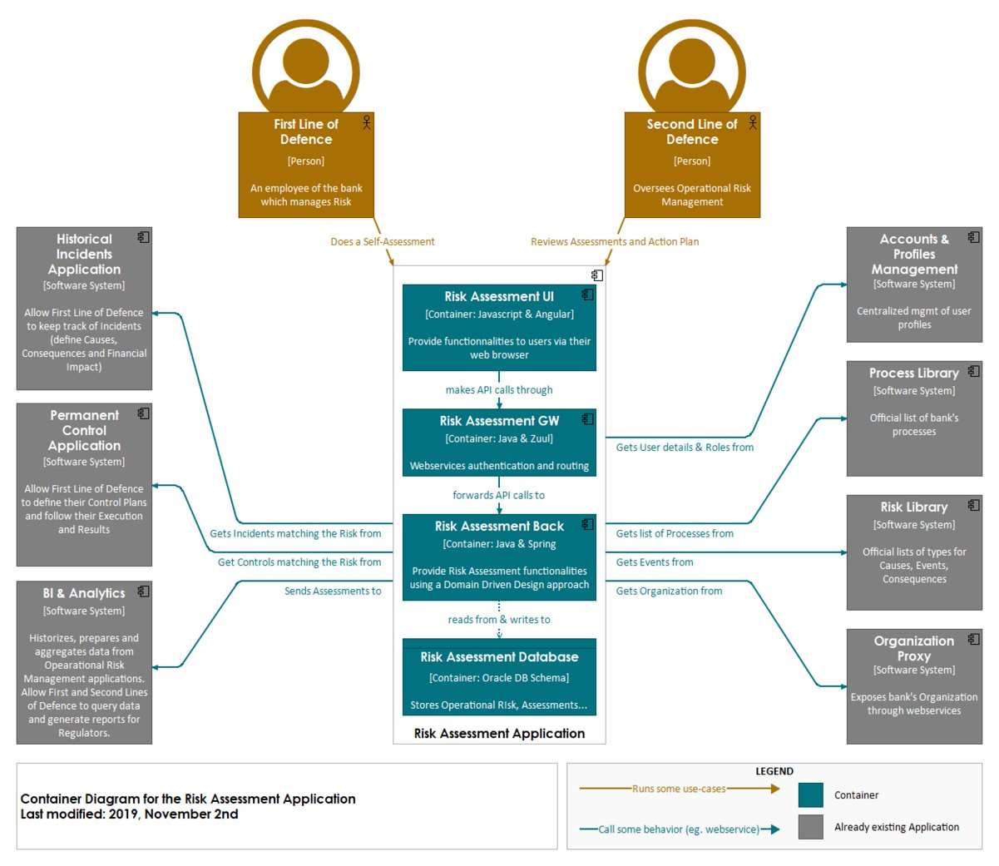

# C4

## Context

Ein Systemkontextdiagramm hilft, folgende Fragen zu beantworten:

1. Was ist das Software-System, das gebaut wird?
2. Von wem wird es verwendet?
3. Wie passt es in die bestehende Umgebung?

## Containers

Ein Containerdiagramm hilft, folgende Fragen zu beantworten:

1. Wie ist die Gesamtform des Softwaresystems?
2. Was sind die High-Level-Technologieentscheidungen?
3. Wie sind die erantwortlichkeiten im System verteilt?
4. Wie kommunizieren die Container miteinander?
5. Wo muss der Entwickler Code schreiben, um Funktionen zu implementieren?

## Component

Ein Komponentendiagramm hilft, die folgenden Fragen zu beantworten.
1. Aus welchen Komponenten setzt sich jeder Container zusammen?
2. Haben alle Komponenten ein Zuhause (d. h. sie befinden sich in einem Container)?
3. Ist es klar, wie die Software auf hoher Ebene funktioniert?

