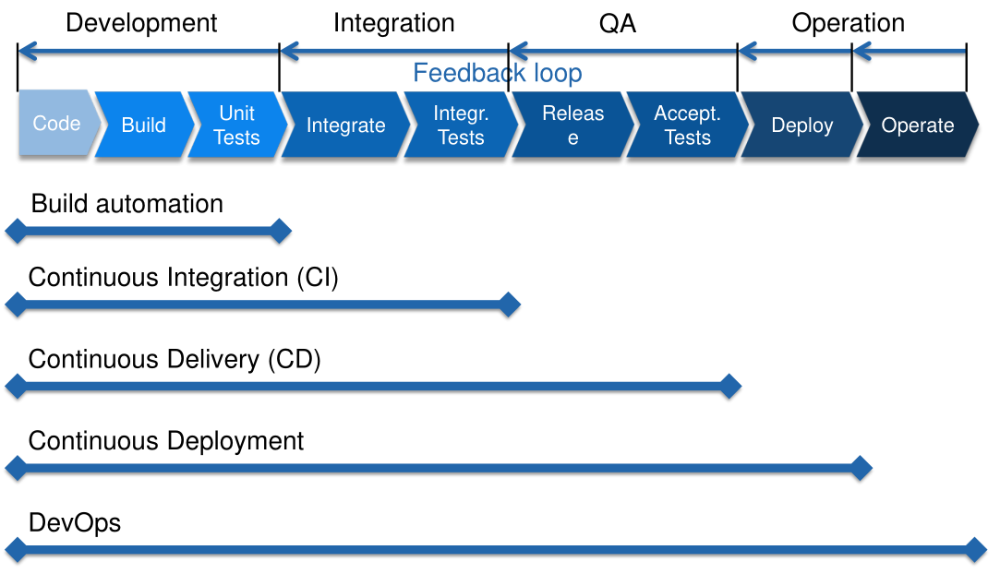

# CI

* On-Demand
  run a script or press a button
* Scheduled
  at certain times → nightly builds
* Triggered
  on certain events → commit/push to VCS

## Types of Automation

* Build Automation
  Thinks like building, packaging or creating documenation
* Test Automation
  Automated execution of unit-, integration- and acceptance-test
* Deployment Automation
  Automatically deploy to production or testing
* Operation Automation
  Automatically provision infrastructure, monitoring, ...

Automation has a lot of benefits like:

* developers can't reliable built software locally
* unit testing consistent
* transparent deployment
* documentation from Jenkinsfile or similar
* manual work is error-prone
* ...

## Best Practices

* Maintain a single source repository
* Automate the build
* Make your build self-testing
* Every commit should build on an integration machine
* Keep the build fast
* Test in a clone of the production environment
* Make it easy for anyone to get the latest executable
* Everyone can see what’s happening
* Automate deployment