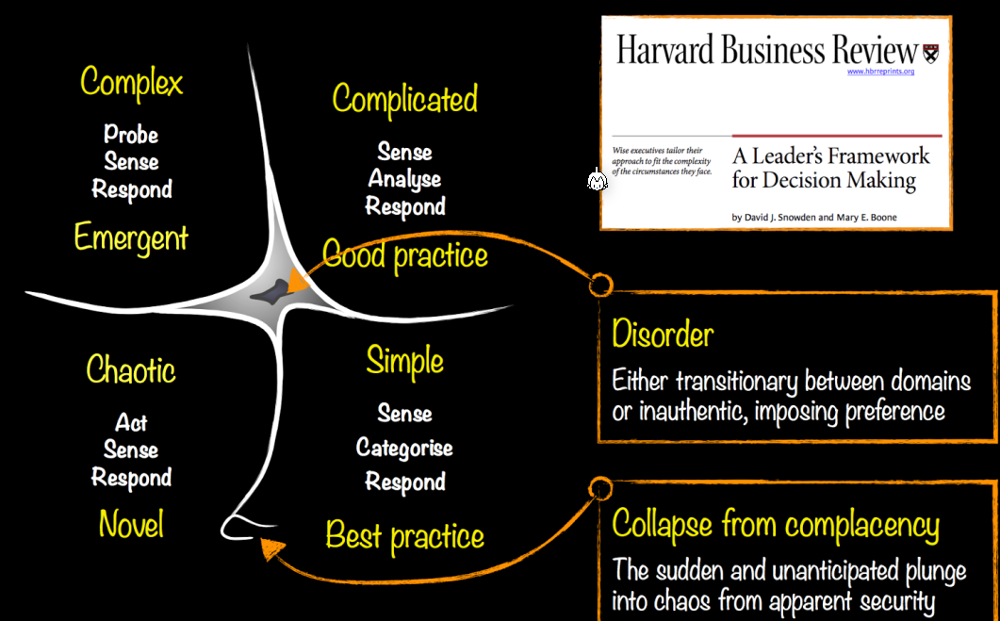
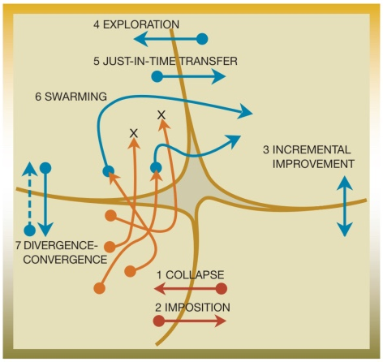
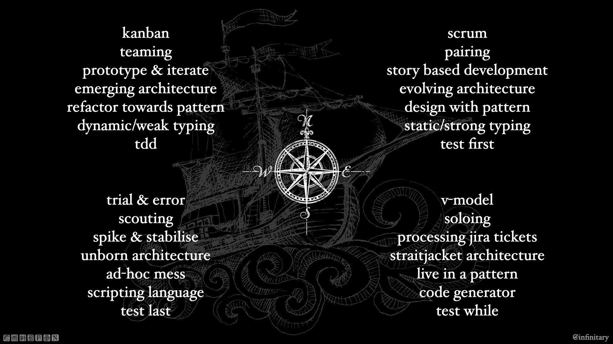

# Cynefin

Cynefin is not a model (represents reality), but a sense making tool (a way to look at reality).

* **Simple/Clear**: There can exist a step-by-step instructions
* **Complicated:** In a complicated system, one needs to consult an expert, but there is still an ordered system
* **Complex**: A complex system can only be understand by probing it and interacting with it
* **Chaotic**: A transistion state in which a system has no rules. The brain strugles dealing with this. In an chaotic system, you do something and see what happens, then you do it again and something else happens.
* **Disorder**:  A transition state where you don't know in which state you actually are and just use the model which is most familiar.
* **Collapse from  complacency**: When a system is overconstraint and looks nice and simple, but then collapses when the reality isn't that simple.

Between complicated, complex and chaotic isn't a strict line.

## Codefin

## Exaptation

**Exaptation**, also **radical repurposing**, is the taking of  an idea, concept, tool, method, framework, etc., intended to address one thing, and using it to address a different thing, often in another  domain.

An example is the re-purposing of snorkelling mask as oxygen masks during the Covid-19 crises. Similarly, a Ukrainian web app designed for use for transport, parking and  paying utility bills has been re-purposed to warn of air raids, and  directs people to bomb shelters.

## Constraints

Constraints limit the number of options one have. In the cynefin framework, different stages have different kinds of constraints:

* **Simple Domain**: Rigid constraints
* **Complicated Domain**: Governing constraints
* **Complex Domain:** Enabling constraints
* **Chaotic Domain:** Absence of constraints

### Governing/Enabling Constraints

Laws, rules and codes create a governing constraint and give a sense of stability. However, they are sensitive to change.

### Internal/External Constraints

*(Unsure what this means...)*

Connections, like hashtags in knowledge management and links in  networks, provide a flexible and adaptive structure but at the cost of  visibility and control. Containers, like categories, spreadsheets cells, and departments, provide clear, reassuring boundary conditions.  Changing connections between people and organisational units is less  costly than trying to restructure or reorganize departments. As new  connections start to provide new ways of dealing with issues, then the  constraints can be tightened and eventually formalized into new units  and departments.

### Connecting/Containing Constraints

Connections between people or between departments are flexible can be easily changed but invisible and hard to control effectively. On the other side, categories, containers and departments provide a clear structure, but changing them is costly.

One way is to let connections form and then later tighten the constraints and formalise the connections into categories, departments and rules.

### Rigid, Flexible and Permeable Constraints

Rigid constraints cannot be changed. If rigid structures are pressured enough, they fail catastrophically. 

Flexible constraints adjust to pressures constantly.

Both can be enhanced with permeability, which is a special condition that allows for exceptions. This, however, comes with the danger of too many people applying for the exception.

### Dark Constraints

Dark constraints are not officially defined and cannot be seen, only their effects can be observed. [Apparently,] narratives are powerful antidotes against dark constraints.

Dark constraints can somewhat be meassured by looking how much of the past can be explained with the known constraints. The more unexplainable things, the more likely are unexpected and potentially catastrophic surprises.