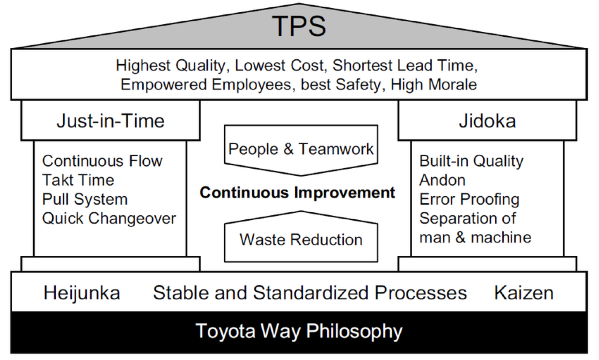
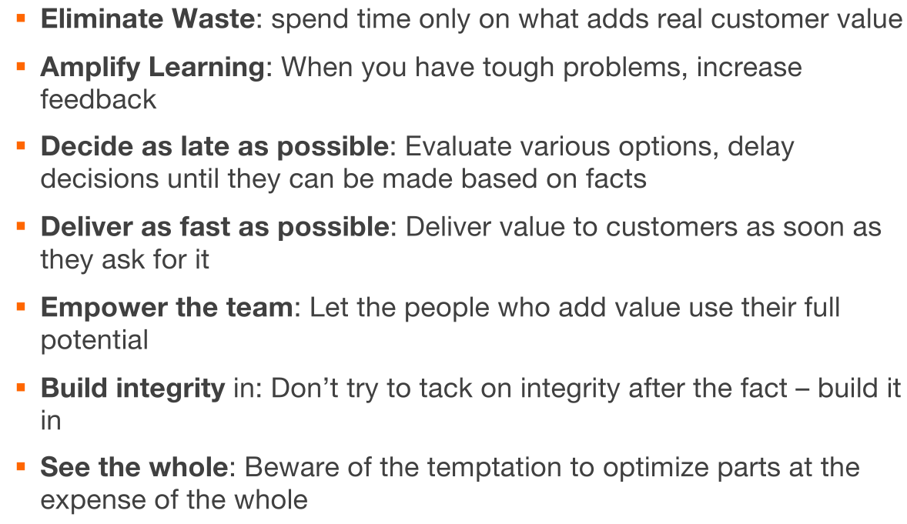

# Lean

The Toyota Production System (TPS) has two pillars: **Just-in-Time** and **Jidoka**.

TPS/Lean focuses on reducing the waste (unnecessary code, meetings, documentation, bugs, ...) in a system and produce a higher value for the final customer.

The followings are the principles of lean:

There are three types of waste:

* Wasted code
  Code which is either partially completed, outdated, unnecessary or defected
* Project management
  Processes which aren't necessary, hand offs (there is a loss of knowledge), or extra features
* Waste in work force
  * Task switching slows people down
  * When people wait for instructions or information

