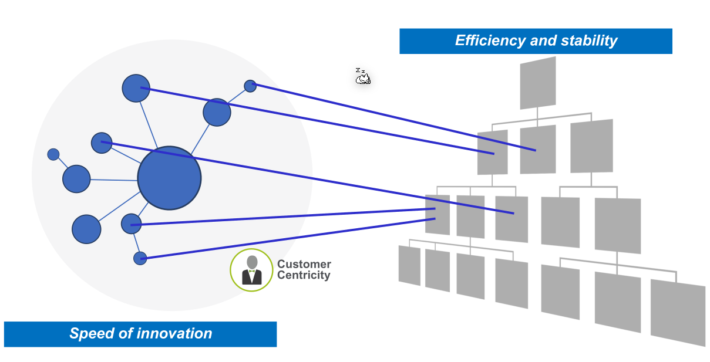
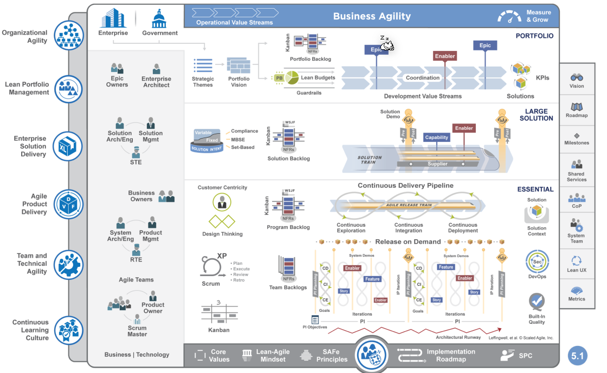
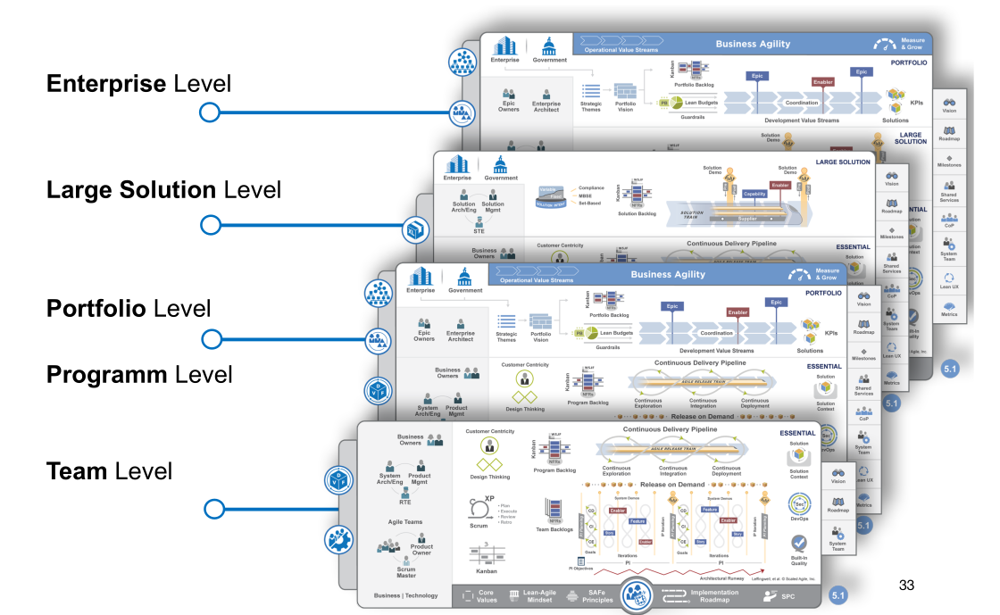
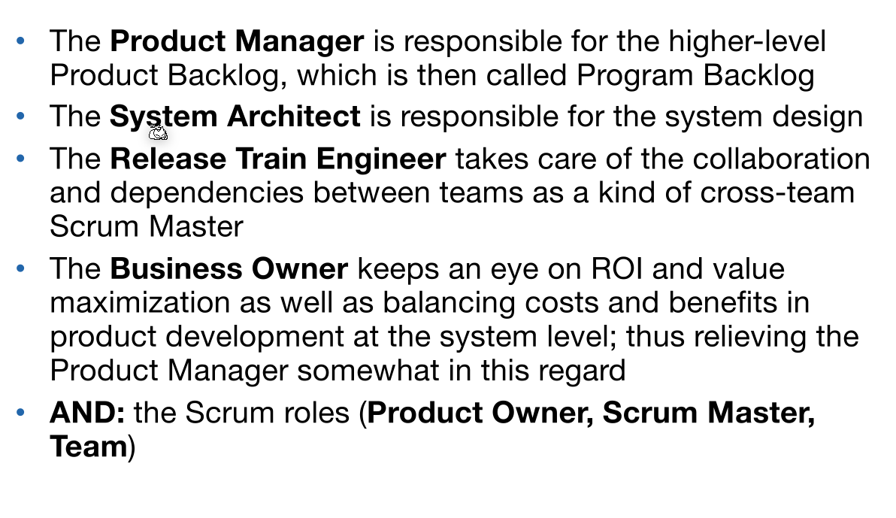
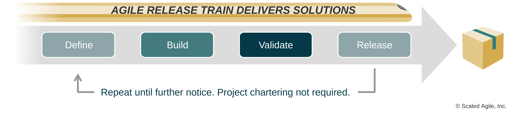

# SAFe

Traditional management optimises for efficiency and stability, while agile optimises for innovation speed. SAFe tries to inject innovation speed into traditional management.

SAFe keeps the traditional hierarchy, but adds agileness into individual blocks in the hierarchy.

The following is an overview of SAFe:

## SAFe Core Values

1. Alignment: Leaders communicate the mission by establishing and
expressing the portfolio strategy and solution vision, determining
business value during planning, and guiding the adjustment of scope
to ensure that demand matches capacity.
2. Built-in quality: Leaders change the system and demonstrate
commitment by creating an environment where built-in quality
becomes the standard.
3. Transparency: Leaders foster the visualization of all relevant work
and create an environment where “… the facts are always friendly,
every bit of evidence one can acquire, in any area, leads one that
much closer to what is true.”1
4. Program execution: Leaders participate as Business Owners in PI
planning and execution, celebrating high-quality PIs while
aggressively removing impediments and demotivators.

## SAFe Principles
1. Take an economic view
2. Apply systems thinking
3. Assume variability; preserve options
4. Build incrementally with fast, integrated learning cycles
5. Base milestones on objective evaluation of working systems
6. Visualize and limit WIP (Work-in-Process), reduce batch sizes, and
manage queue lengths
7. Apply cadence, synchronise with cross-domain planning
8. Unlock the intrinsic motivation of knowledge workers
9. Decentralise decision-making
10. Organise around value

## SAFe Levels

## SAFe Roles

*(Product Manager, System Architect, Release Train Engineer, Business Owner, Scrum Roles)*

## Agile Release Train (ART)

An agile release train is a long-lived team of agile teams  that incrementally develops, delivers, and often operates one or more solutions in a value stream.

