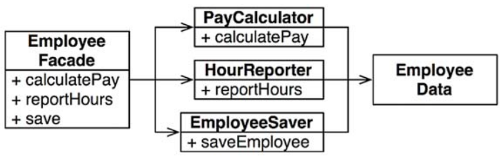
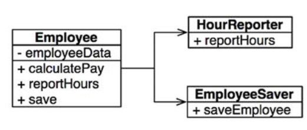
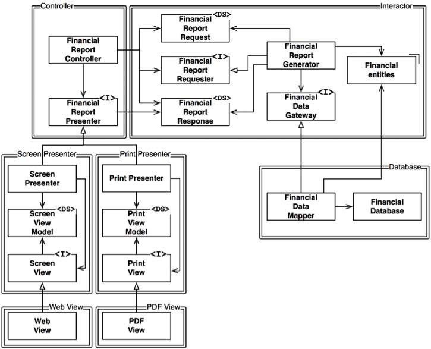
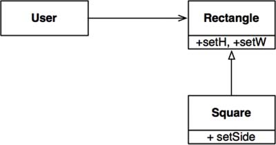
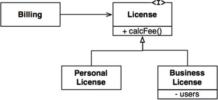
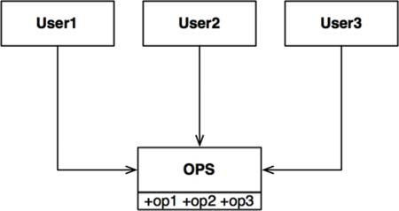
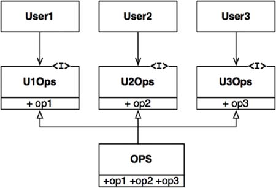

# SOLID

The SOLID patterns should help a mid-level software structure which can tolerate changes, is easy to understand and can be the basis for reusable components.

## S - Single Responsibility Principle

> A module should be responsible to one, and only one, actor.

The single responsibility principle does **not** state that every function/module/... needs to have one responsibility. Rather, it states, that every module should have one actor, which can demand change.

This should be done to limit the impact different stakeholder's demands can have.

### Symptom 1 - Accidental Duplication

One symptom of SRP being violated occures when different actors use the same functionality facilitated by the same module (e.g. overtime calculations used by the COO and CFO, but in different ways). If one user demands changes, the developer then implements those, it can be easy to miss the second actor. This will lead to features changing subtly enough (maybe some altered numbers) that nobody notices until it is too late.

### Symptom 2 - Merges

A second problem occurs, when two actors want a change. The changes might be implemented by two different developers, who both will change the same module (as it is shared). When completing the request, a merge conflict is practically guaranteed.

### Solutions

One possible solution is to split the data from the functions. To reduce the amount of classes a developer has to deal with, one can introduce a facade, which in turn uses the different logic classes. The classes, that actually implement the logic, mustn't know each other to avoid accidental duplication.



If one prefers to keep the logic closer to the data, one can implement the most important method in the original class and then use a facade for the other functions.



One possible downside of this "pattern" is that it promotes duplication to some part as some shared logic might be needed in multiple implementations.


* Cons:
  * If we have an application where 90% of logic is shared between two actors, should we duplicate those 90%? Probably not, but how much should be duplicated?
    * This even applies to the example: What if  a field is added to `EmplyeeData`. Then we have the two symptoms again, so should we duplicate this class as well? Where do we stop? What if the facade needs two change? If this is thought to the end, should we duplicate even the login screen? Probably not...
    * This leads to this principal only being applicable if its already set in stone, what will change in the future (which is almost never the case) 
  * One of the scrum principals is, that we should forget about the future. Adding unneeded complexity kills your project. This seems to be a primary case of adding complexity when its not clear if it is needed in the future.

* Mention that this pattern exists on the functions and class level, the component level (Common Closure Principle) and the architectural level (Axis of Change)

  

## O - Open Close Principle

> Software entities should be open for extension but closed for modification

This means, functions should be easily be added to existing code, but existing code shouldn't be altered. To do this, while writing code, ask your self, can more functionality be added to this code.

Advantages:

* Maintainability
  Easier to add code 
* Flexibility
* Scaleability

One way to archive the open close principle is by designing the architecture in a way that arrows between "modules" only go in one direction. This can be seen on the diagram below. All arrows point towards `Interactor`. This results in `Interactor` being protected from changes from `Controller` and `Database` since it doesn't even know about these modules. This also means, that not all modules are equally protected from changes and there is a hierarchy of protected-ness (namely `ScreenPresenter` = `PrintPresenter` < `Controller` < `Interactor`)



## L - Liskov Substitution Principle

> What is wanted here is something like the following substitution property: If for each object `o1` of type `S` there is an object `o2` of type `T` such that for all programs `P` defined in terms of `T`, the behavior of `P` is unchanged when `o1` is substituted for `o2` then `S` is a subtype of `T`.



The following square-rectangle example is the canonical violation of this principle. While `Square` inherits from `Rectangle`, it behaves different from a rectangle. This can be exemplified with the following code:

```C
Rectangle r = ...
r.setW(5);
r.setH(2);
assert(r.area() == 10);
```

If `r` were to be a `Square` this method will likely fail. The only way for a calee to deal with this, is to add an if statement to differentiate between `Rectangle` and `Square`.

The following is an example, where the Liskov Subsitution Principle was up held. Both `BuisnessLicense` and `PersonalLicense` behave the same and `Billing` doesn't have to know which implementation it uses.



## I - Interface Segregation Principle

> An object should only import what is uses



In the diagram above `User1` might only use `+op1`, yet they still have to import the whole `OPS` structure. If there were changes to `+op2` and `+op3`, `User1` probably still has to be redeployed.

This can be avoided by reworking the architecture in the following way: 



## D - Dependency Inversion Principle

> Avoid dependencies on volatile concrete classes

Depending on concrete implementation can be dangerous, since changes to those concrete implementation force changes to dependencies. This can be fixed by using abstract types, like abstract classes and interfaces, instead of their concrete implementation.

With that being said, there are always concrete dependencies (e.g. the `String` class in Java). Non-volatile concrete implementation, especially when defined by the platform, can be used without building needless abstractions. 

However, references **volatile** concrete implementations should be avoided.

These following coding practices emerge from this:

* Don't refer to volatile concrete classes
* Don't derive from volatile concrete classes
* Don't override concrete functions
* Never mention the name of anything concrete and volatile

When creating a new object, in most programming languages, this requires a concrete implementation. This can be solved by employing abstract factories. 

Most systems have dependencies to concrete implementation, which can't be architectured away. This is fine.
