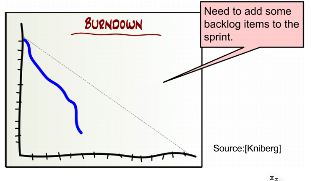

# Scrum

Scrum is efficient between 5-9 people. Less then there is no communication problem, more, then the people organize them in subgroups.

Scrum teams should be cross-functional, meaning that people with different jobs should work together (developers, UX designers, testers, ...).

## Roles

### Product Owner

The product owner  defines the features of the product.

### Scrum Master

The scrum master ensures that the value of scrum are up hold.

A scrum master does the following:

* Keeps Scrum process running
* Ensures a proper power balance between PO, Team, Management
* Protects the Team
* Moderates in the Team
* Helps to organize (e.g., Meetings)
* Helps to keep the Team focused on the current Sprint
* Helps to achieve Sprint goals
* Works with PO
* Educates PO, Team, Management and Organization
* Solves impediments
* Encourages and helps to achieve transparency
* Strives to develop a Team into a High Performance Team
* Encourages and protects self-organization
* Educates and focuses a Team toward business-driven
development
* Supports Team building and Team development by utilizing the
abilities and skills of individuals, and fostering a Feedback culture
* Helps to self-help
* Ensures and supports Empowerment of the Team
* Addresses needs efficiently and effectively
* Detects hidden problems and strives to solve them
* Helps Team to learn from its experiences

### Chickens and Pigs

In scrum, there are chickens and pigs. Pigs are commited, while chickens are not. Chickens are allowed to attend the daily meetings, but are disallowed to interfeere.

## Scrum Events

### Sprint Review

### Sprint Retrospective

In the retrospective, the team reflects on what was working and what not. It typically takes 15-30 minutes and should be done after evvery sprint with the whole team.

### Daily Scrum

The team should meet daily for a maximum of 15 minutes. Each member talks about what they did yesterday, what they will do today and what they will do tomorrow.

This should improve the communication and render all other status meetings redundent. Importantly, technicial questions are **not** discussed in this meeting.

## Task Board

The not checked-out column is sorted by priority and contains all user stories which are not worked on today. User stories wander from left to right. 

### Burndown Chart

The burdown chart shows many backlog item (tasks and user stories) are left in the sprint. The dotted line shows the plan, while the blue line shows the actual tasks which are done.