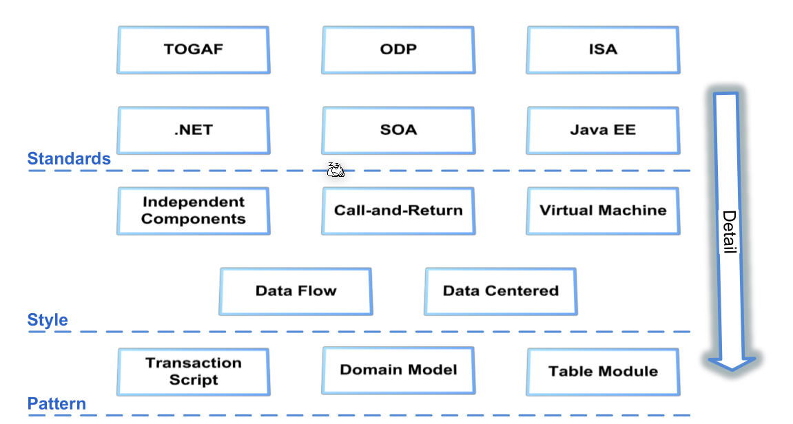
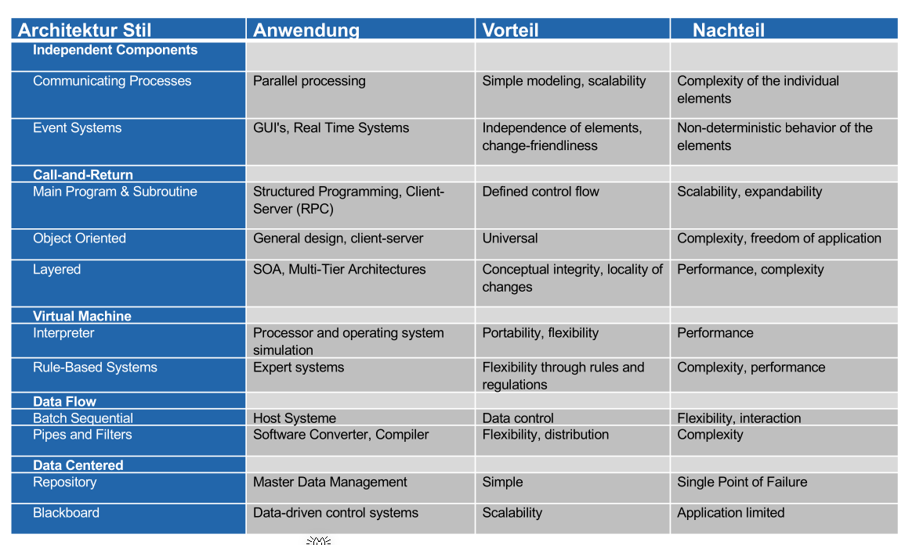
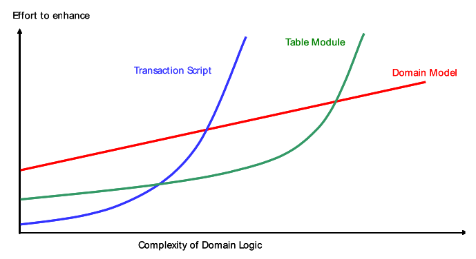

# Software Architecture

> Big design up front is dumb. Doing no design up front is even dumber.
>
> Or do just enough...

## Application Architecture

The main concern is the organisation of code. It matters how the code is split into modules, components, layers, ...

Usual questions in the application architectures are:

* Cross-cutting concerns: Issues which span multiple layers/components, like exception handling, logging, authorisation & authentication, ...
* Security
* Performance, scalability
* Auditing, regulatory requirements
* Real-word constraints
* Interoperability and integration into other software
* Operational, support and maintenance requirement
* Structural consistency and integrity. Things, like classes, modules, etc, should be where people expect them

### Non-Functional Behaviour

Non-functional behaviour are the properties of a software. Some of these can be measured while run-time, and some can't.

* Performance (response time / throughput): A system must guarantee the required response times. Not least because system response times have a significant influence on work productivity.
* Security: A system must be secure against unauthorized access and wanton destruction.
* Availability: A system must be available and meet defined minimum requirements.
* Usability: A system must be usable for its intended purpose.
* Robustness: A system must run stably and must not partially or completely stop its service under load.

* Scalability: A system must be able to be scaled (out or   up).
* Integrability: A system must fit seamlessly into an existing   environment.
* Portability: A system must support different platforms.
* Maintainability: A system must have defined maintenance interfaces and a clear and concise structure.
* Testability: A system must be testable as a whole and in  its individual components. The testing of the system must  be supported by the system itself through tools (automated  tests, logs, traces).
* Reusability: System components must be reusable for
  other systems.

The divide between measurable and immeasurable isn't as binary is it is made up to be in the slides.

###  Principle of Software Design

Software should be modular, portable, changable.

* Modularity: Components of a design should consist of easily exchangeable, understandable and self-contained parts (e.g. ACL, DB Access, Validator, Rule Engine).
* Portability: Portability is given when software or parts of it are designed to run in other environments,
* Changeability: The more malleable a system is, the easier it is to make changes (e.g. by separating domain specifics from cross-cutting concerns).
* Conceptual Integrity: Those parts of a system that contain similar functions should also be
  designed similarly (industry standards, reference architecture). Or, if you don't build a rocket, the architecture doesn't need to be rocket science. 
* Intellectual Control: A software design should be understood in detail by those responsible in terms of form, content and complexity (interface, scope). If the people working on the software don't understand its architecture then the architecture won't be implemented
* Buildability: A software design must specify a target system in such a way that it can be realized by a given team in a given time (know-how, technology).

### Coupling and Cohesion

There are different kind of coupling and cohesion. The basic rules, that higher cohesion will generally result in lower coupling.

* Data Coupling: data is exchanged between modules of a system
* Stamp Coupling: Data structures are exchanged between modules of a system
* Control Coupling: The exchange of data between modules controls the control flow
* Common Coupling: Different modules access the same data (Shared Data)
* Content Coupling: One module modifies the internal data of another module

* Coincidental Cohesion: The grouping of the functionality of a module is done by chance.
* Logical Cohesion: The functionality is grouped in a module, but they do not refer to each other.
* Temporal Cohesion: The time of the use determines the grouping of the functions.
* Procedural Cohesion: The call sequence of the functions determines the grouping.
* Communications Cohesion: The grouping of the functionality is determined by the common I/O.
* Sequential Cohesion: The sequence of data processing determines the grouping. Functions whose output simultaneously becomes the input for other functions are grouped together in a module.
* Functional Cohesion: The aim of this grouping is that a module can keep logic and data locally (information hiding).

To actually implement high cohesion, low coupling, the following can be done in code:

* **Independence of Design**: Each module can be designed independently of other modules and later changes take place only and exclusively in one module. The prerequisite is a constant definition of the interfaces and a "freezing" of the module specification.
* **Small Interfaces**: The number of messages exchanged between modules via interfaces is small.
* **Low Interface Traffic**: The frequency of information exchange between different modules is low.
* **Unity**: Similar problems and requirements are implemented similarly and classified and grouped accordingly.
* **Encapsulation**: Dependent modules are combined into larger units.

### Example 

A system is to be created that will allow easy checking of banknotes based on their security features and simplify the reporting of potential counterfeits.

* The system is to be made available to banks, bureaux de change and other cash acceptance offices.
* The system must be web-enabled and capable of simultaneously exchanging data with the central bank's laboratory system.
* The system must be multilingual and multi-client capable.

The following layers were designed:

These three layers contain the following seven logical layers:

These layers are then deployed on the following architecture:

## Silver Bullet

This comes from the paper "No Silver Bullet—Essence and Accident in Software Engineering".

Building software is so difficult because of its complexity, conformity, changeability and invisibility. 

Complexity can be split in inherit complexity and accidental complexity. Inherit complexity is complexity which comes from the fact that the project itself is complexity. Accidental complexity comes from spaghetti code. 

Because a software needs to conform to interfaces of its environment, the interface is as complex as its environment. Put differently, the more software is interconnected, the more complicate it gets.

Because software is easily changed, many changes are made. 

Software is invisible in itself. There is no geometric representation of software. To still be able to visualise it, one creates views into it, with diagrams and text.

## Layering

Importantly, **tiers are not layers**. Tiers are where software is running (e.g. a DB-Server, application server, client, ...). These are not layers. Multiple layers can run on one tier and one layer can run on multiple tiers.

## Distribution of Work

* Distributed Presentation: Distributed presentation hides the locality of each client, while the server presents all clients centrally (for example, on one screen)
* Remote Presentation: Remote presentation means that one client handles all presentation tasks, while the application and data are managed by the server
* Distributed Function: Distributed Function implements a division of labor at the functional level between client and server (Cooperative Processing)
* Remote Data: The server keeps all data in one place, no data is stored on the clients
* Distributed Data: The data is distributed on different servers, the client accesses different servers at the same time

## Architectural Style

* Independent Components: Independently executing elements that interact with each other via messages
* Call-and-Return: Defined by a fixed communication mechanism between calling and called element
* Virtual Machine: Allows the realization of portable and interpretable systems
* Data Flow: How data flows
* Data Centered: Central task is access and update of data of a repository

## The three Patterns

*  The Transaction Script Pattern organizes and divides the business logic into individual procedures so that each procedure covers a single request from the Presentation Layer.
* The Domain Model Pattern describes an object model of the problem domain that includes behavior and data.
* The Table Module Pattern describes a single instance (singleton) that encapsulates the business logic for all rows in a database table or view.