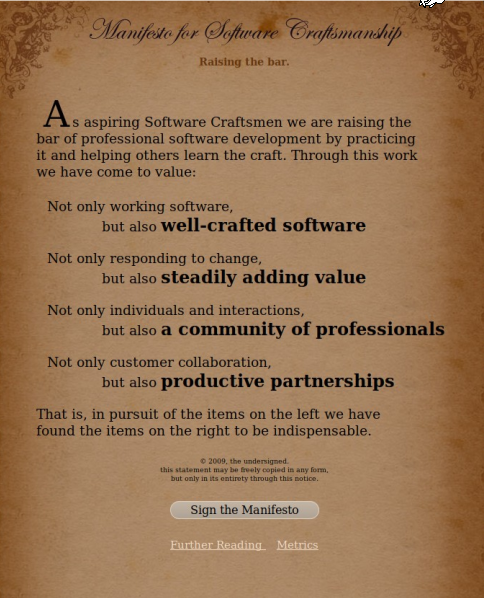
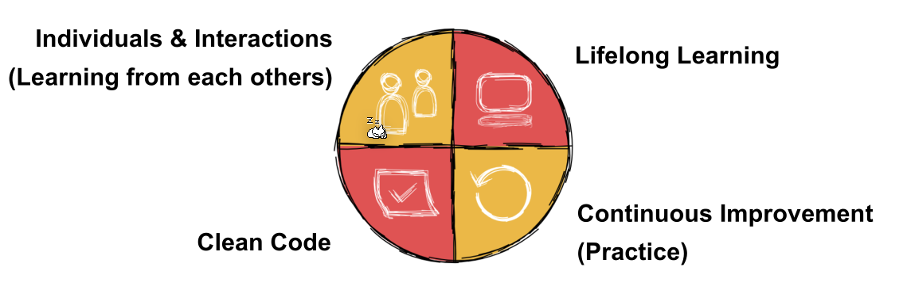

# Software Craftsmanship

## Manifesto 

* We will not make messes in order to meet a schedule.
* We will not accept the stupid old lie about cleaning things up later.
* We will not believe the claim that quick means dirty.
* We will not accept the option to do it wrong.
* We will not allow anyone to force us to behave unprofessionally.

These points produced the following manifesto

## Coding Kata and Dojos

Programmers solve small problems in a not-job-related code base, repeatedly.

In a dojo, these coding katas are solved in a group. One is programming, one is assisting and the rest is criticising. Who does what is cycling through the group.