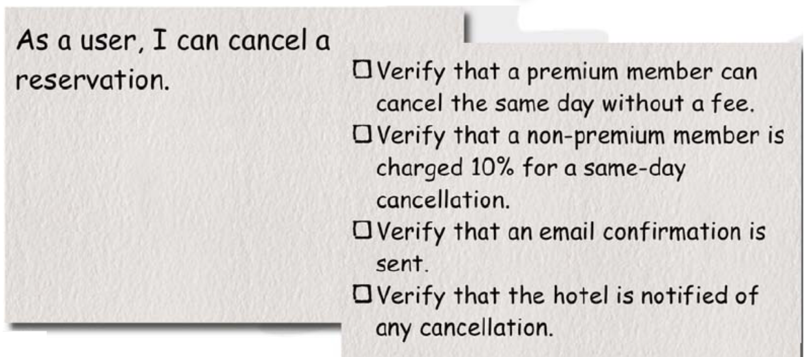
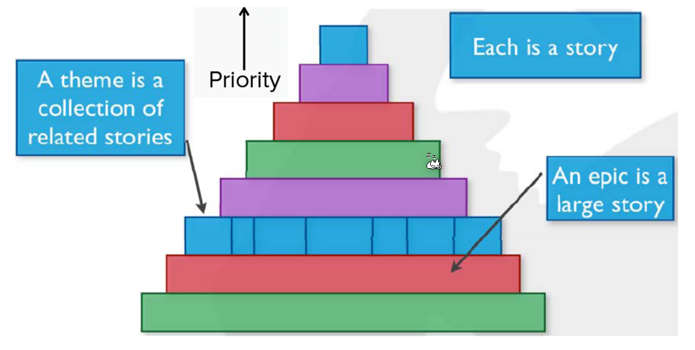
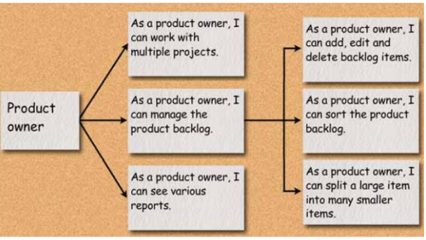

# User Story

A user story is a concise description of a functionality which brings value to the user. It can follow the following template:

>  As a `[user role]`, I want to `[goal]` so that `[benefit]`.

User stories are written during the sprint planing when all members of the teams are present.

User stories are **not**:

* Written contracts
* Requirements the software has to fulfill. Not every story gets implemented
* They do not need to include all details
* Too many details give the false impression of completeness. It is still necessary to talk to the customer

## The three Cs

* **C**ard
  User stories are traditionally written on note cards which may be annotated with estimates, notes, etc
* **C**onversation
  The actual details behind the user story come out during the conversations with the product owner
* **C**onfirmation
  Often acceptance tests are written on the back

## Non Functional Requirements

Non functional requirements can be formulated as special user stories if they can be worked on and then are done. If this isn't possible, then it can be written to the definition of done.

"The server needs to answer in 10ms" would be written in the definition of done as it is a never-ending story. On the other hand, "The webpage needs to be ported to a different server" could be formulated as a user story.

## Condition of Satisfaction

These are criteria which need to be fulfilled for the customer to be satisfied. The customer will likely test these conditions.

The acceptance tests are the subset of the condition of satisfactions which can be technically checked. As an example, "the app needs to be able to refund a booking" can be objectively tested, while "The app needs to be beautiful" can't.

## Termology

* **User Story**
* **Theme**
  A collection of user story, like "Multiplier". These can be initially used to create user stories by first listing themes and then generating the user stories.
* **Epic**
  A large user story

## User Roles/Personas

While developing the team shouldn't think of "the user", but rather of multiple user roles.

## How to find User Stories

Importantly, all members of the team, the customer, user and other affected people are present. First, the goal is just to generate as many user stories as possible without priorizing them.

Large user stories should be sub-divided into smaller user stories.

## Estimation

