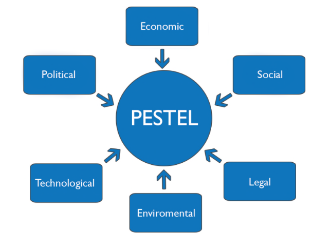
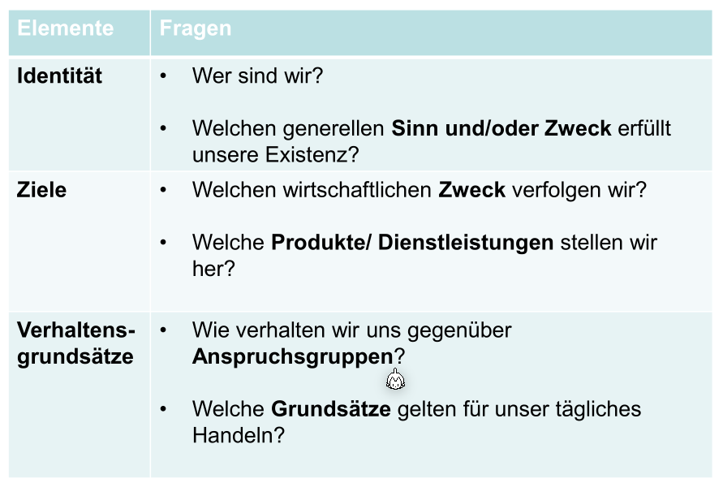
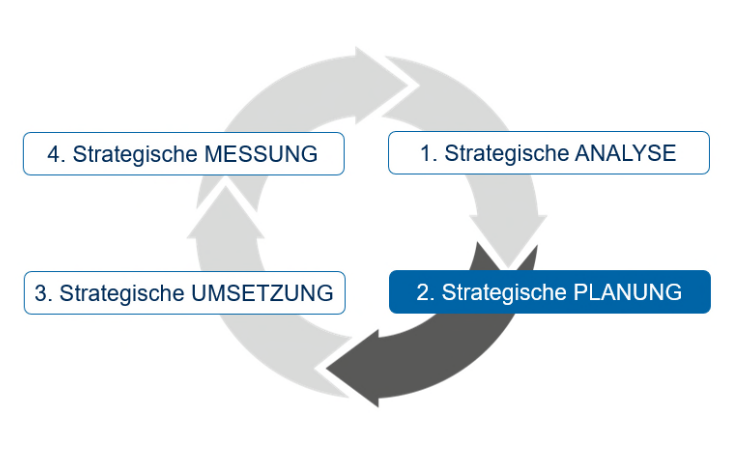
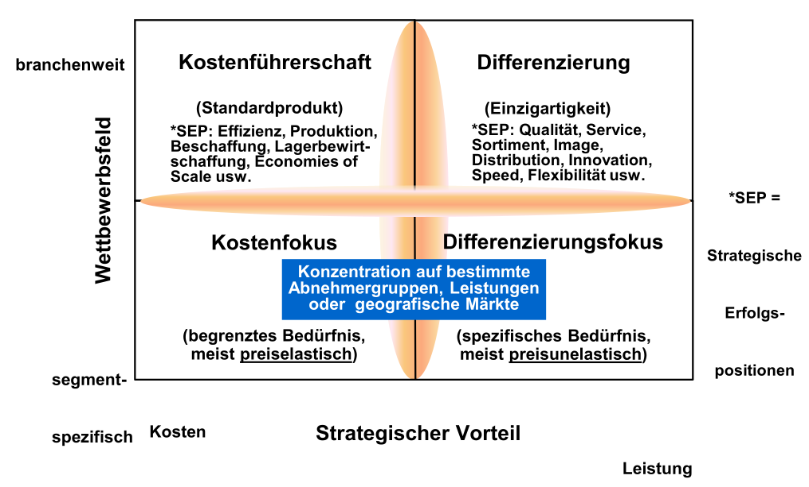

# Basics

## Gütereinteilung

## Bedürfnis – Bedarf – Nachfrage

## St. Galler Managementmodell

Eine Firma ist eingebettet in ihre Umgebung.

## Strategie

Um eine Strategie zu entwickeln, kann folgenden Prozess eingesetzt werden.

Folgende Analysen fliessen in eine Unternehmensstrategie ein.

### Analyse

#### Unternehmensanalyse und Umweltanalyse

Für das Analysieren gibt es mehrere Möglichkeiten, wie dies gewerkstellt werden kann: SWAT-Analyse, PESTLE-Analyse und das Fünf Kräfte Modell von Porter.

##### Kernkompetenzen

Kern-Kompetenzen sind dauerhafte Wettbewerbsvorteile sind 

* wertvoll
* selten
* nicht oder nur schwer imitierbar
* nicht substituierbar

##### SWOT Analayse

In der SWOT-Analyse wird zwischen der Innen- und Aussenwelt unterschieden.

Um Stärke und Schwächen zu finden, müssen die Kernkompetenzen gefunden werden. Kern-Kompetenzen sind dauerhafte Wettbewerbsvorteile sind wertvoll, selten, nicht oder nur schwer imitierbar und nicht substituierbar.

Die SWOT Akronyme können gekreuzt werden. Was daraus folgt sind aber noch keine Strategien, sondern nur Strategieansätze, bzw. strategische Stossrichtungen.

Nach dem Stärken, Schwächen Chancen und Gefahren gefunden wurde, werden diese, wie in der Matrix oben beschrieben, gemischt (z.B. Preisgünstig und Wetter/steigender Wohlstand => Potenzielle Strategie: Marketing).

Als Beispiel für dies für Easy-Jet:

* Stärken:
  * Direkt Flüge
  * Preisgünstig
* Schwächen
  * Nicht Interkontinental
  * Nur zu gewissen Zeiten an bestimmten Flughafen
* Chancen
  * Durch die Skallierbarkeit ist EasyJet flexibel bei hochem Passagier aufkommen
  * Wetter an anderen Orten (aus der Sicht der Schweiz) besser
  * Trend zu Wochenend-Städtereise
  * Steigender Wohlstand
* Gefahren
  * Verteuerung der Treibstoffkosten
  * Restriktionen von Klima
  * Höhere Flughafentaxen
  * Neue Billig-Airlines

##### PESTLE-Analyse

Mit der PESTLE-Analyse wird der Einfluss von sechs externen Umwelt-Faktoren eines Unternehmen untersucht:

* Political
* Economical
* Social
  Alters-Pyramide/Trends, wie Vegan, ...
* Technological
  ChatGPT
* Environment/Ökologisch
* Legal
  Neue Gesetze

Das folgende ist ein Beispiel für die PESTLE-Analyse für eine One Wheel Firma.

##### Fünf Kräfte Modell von Porter

Das Fünf Kräfte Modell ist eine Alternative zur PESTLE-Analyse.

Das fünf Kräfte Modell gibt Auskunft darüber, wie attraktiv ein Markt zum einsteigen ist, bzw. ob den Markt verlassen werden soll.

* **Potenzielle Konkurenten**
  Wie gross ist die Bedrohung von neuen Konkurenten? Mögliche Überlegungen wären: Wie gross ist die Eintrittshürde?
* **Kunden**
  Wie verhandlungsstark ist der Kunde? Wie stark kann der Kunde das Produkt selbst, wie auch den Preis beeinflussen? 
* **Lieferanten**
  Wie verhandlungsstark sind die Lieferanten? Gibt es alternative Lieferanten?
* **Ersatzprodukt**
  Gibt es Ersatzprodukte, welche ein Produkt/Dienstleistung ersetzten können?
* **Branchen Wettbewerb**
  Wie umkämpft ist die Branche bereits? 

Beispiel für Easyjet:

* Rivalität mit bestehenden Konkurrenten: Ryanair, Aer Lingus, ... sind alles auch billig Fluggesellschaft
* Verhandlungsmacht der Kunden: Der Kund verfügt über eine kleine Macht, da sie nicht viel des Umsatz von EasyJet ausmachen
* Verhandlungsmacht der Lieferant: Es gibt zwei Flugzeughersteller
* Potenzielle neue Konkurrenten: Keine neue Flugzeuggesellschaften sind zurzeit in Sicht
* Ersatzprodukte: Schnellzüge, Langstrecken-Büsse

#### Unternehmensbild

Beispiel von EasyJet:

Unser wichtigstes Ziel ist, unsere Kunden sicher von ihrem Abflugs- zu ihrem Bestimmungsort zu bringen und unsere Flugdienste mit einem ausgezeichneten Preis-Leistungs-Verhältnis anzubieten. Wir konzentrieren uns auf konsequente und zuverlässige Produkte und Preise für zahlreiche Routen in Europa und sprechen dabei sowohl die Märkte für Ferien- als auch für Geschäftsreisende an. In diesem Sinne möchten wir unsere Mitarbeiter fördern und mit unseren Lieferanten nachhaltige Beziehungen aufbauen. An vier Kernprinzipien erkennen Sie unsere Werte:

* Sicherheit – Unsere höchste Priorität, keine Kompromisse
* Teamarbeit – Gemeinsam erreichen wir unser Ziel schneller
* Pionierarbeit – Neue Wege und Chancen finden
* Leidenschaft – Wir streben danach, die Besten zu werden

#### Unternehmensstrategie

Die Unternehmensstrategie formt sich aus der Unternehmensanalyse, dem Leitbild und der Umweltanalyse.

Beispiel für EasyJet:

### Planung

#### 4-Branchenwettbewerbsstrategien nach Porter

*(SEP: Strategische Erfolgs Position)*

Eine Firma kann möchte in einem Punkt führend sein.

In der folgenden Abbildung sind Beispiele von Firmen:

#### Die vier Produkt-Markt-Strategien nach Ansoff

Im folgenden Beispiel wird die vier Produkt-Markt-Strategie nach Ansoff für eine Bungalow-Vermietungs Firma entwickelt:

Beschreiben Sie 3 mögliche Wachstumsstrategien basierend auf Ansoff (Wachstumsstrategien) für die Firma Chill Out Time:

* **Produktentwicklung**:
  Bungalow weiterentwickeln. Bspw. Familienbungalows oder Themenbungalows einführen, bspw. Karibikbungalow, Orientalbungalow. Oder neben den Bungalows auch kleine Boote oder Baumhäuser zum Übernachten vermieten.
* **Diversifikation**: 
  Neben den Bungalows könnte die Chill Out Time AG auch noch weitere Produkte oder Services Anbieten, bspw. Tauch oder Surfkurse, oder geführte Exkursionen auf Costa Rica. Oder eigene Produkte produzieren, bspw. Kokosnusswasser. 
* **Marktentwicklung**: 
  Vermarktung der Bungalows in neuen Märkten, bspw. Fokus auf asiatisch Länder (Japan oder Südkorea, ev. auch China). So werden neue Kundengruppen aus neuen Märkten gewonnen.