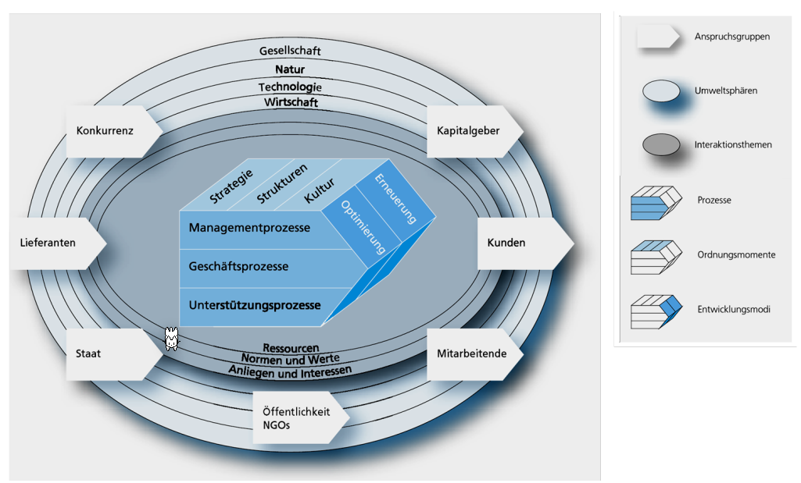
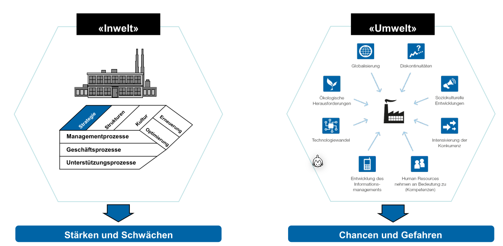

# Basics

## Gütereinteilung

## Bedürfnis – Bedarf – Nachfrage

## St. Galler Managementmodell

Eine Firma ist eingebettet in ihre Umgebung.

## Strategie

Um eine Strategie zu entwickeln, kann folgenden Prozess eingesetzt werden.

Folgende Analysen fliessen in eine Unternehmensstrategie ein.

### Analyse

#### Unternehmensanalyse und Umweltanalyse

Für das Analysieren gibt es mehrere Möglichkeiten, wie dies gewerkstellt werden kann: SWAT-Analyse, PESTLE-Analyse und das Fünf Kräfte Modell von Porter.

##### SWAT Analayse

In der SWAT-Analyse wird zwischen der Innen- und Aussenwelt unterschieden.

Um Stärke und Schwächen zu finden, müssen die Kernkompetenzen gefunden werden. Kern-Kompetenzen sind dauerhafte Wettbewerbsvorteile sind wertvoll, selten, nicht oder nur schwer imitierbar und nicht substituierbar.

Die SWOT Akronyme können gekreuzt werden. Was daraus folgt sind aber noch keine Strategien, sondern nur Strategieansätze, bzw. strategische Stossrichtungen.

##### PESTLE-Analyse

Mit der PESTLE-Analyse wird der Einfluss von sechs externen Umwelt-Faktoren eines Unternehmen untersucht:

* Political
* Economical
* Social
  Alters-Pyramide
* Technological
  Like ChatGPT
* Environment
* Legal

##### Fünf Kräfte Modell von Porter

Das Fünf Kräfte Modell ist eine Alternative zur PESTLE-Analyse.

#### Unternehmensbild

#### Unternehmensstrategie

### Planung

#### 4-Branchenwettbewerbsstrategien nach Porter

*(SEP: Strategische Erfolgs Position)*

Eine Firma kann möchte in einem Punkt führend sein.

In der folgenden Abbildung sind Beispiele von Firmen:

#### Die vier Produkt-Markt-Strategien nach Ansoff

