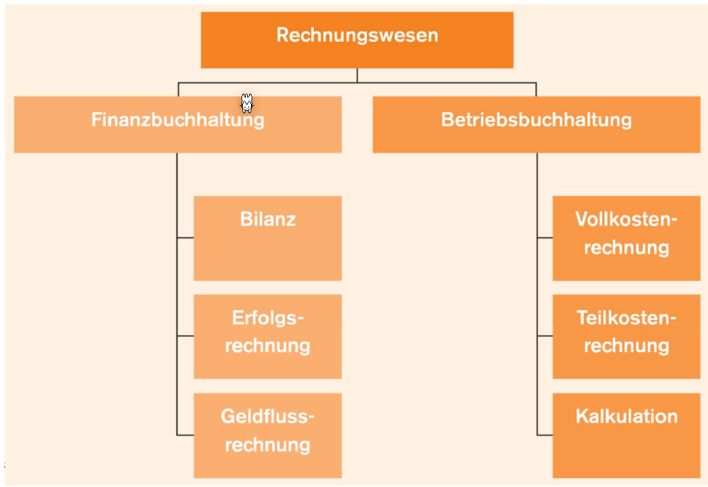
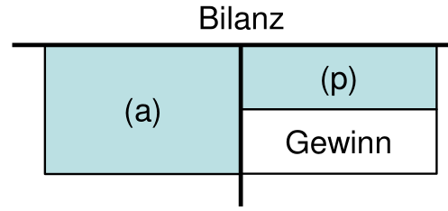
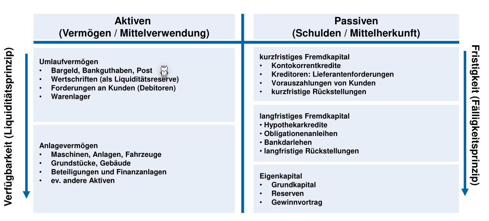
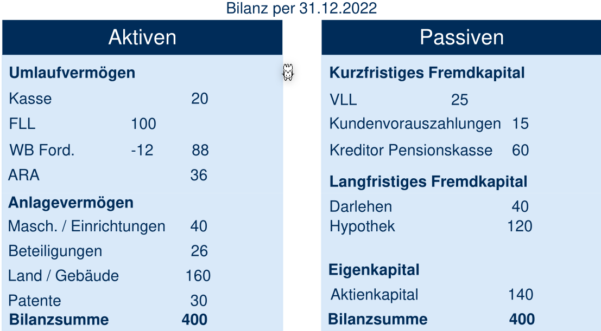
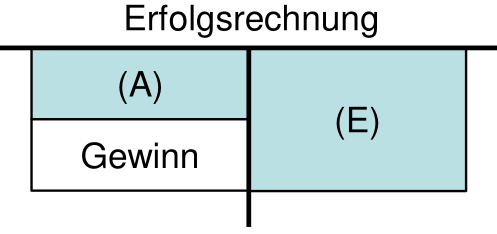
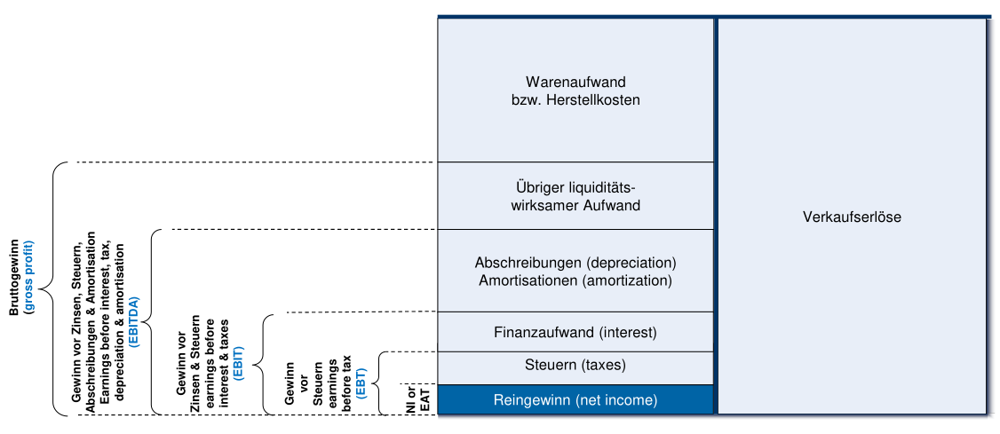
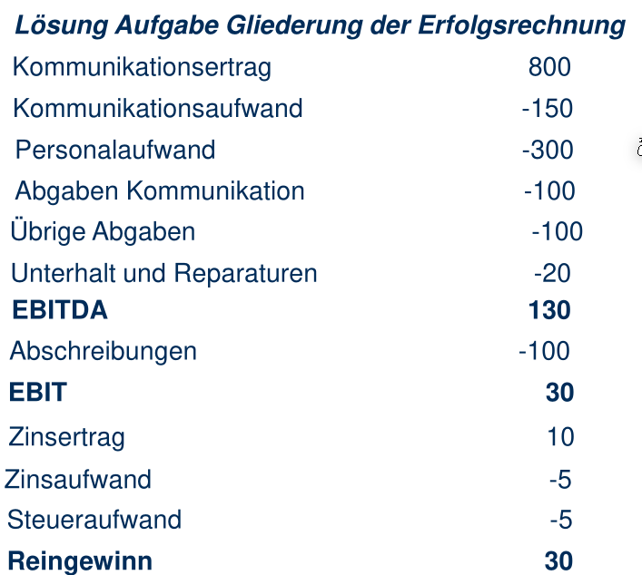
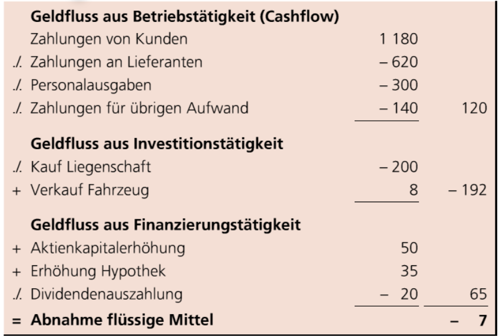
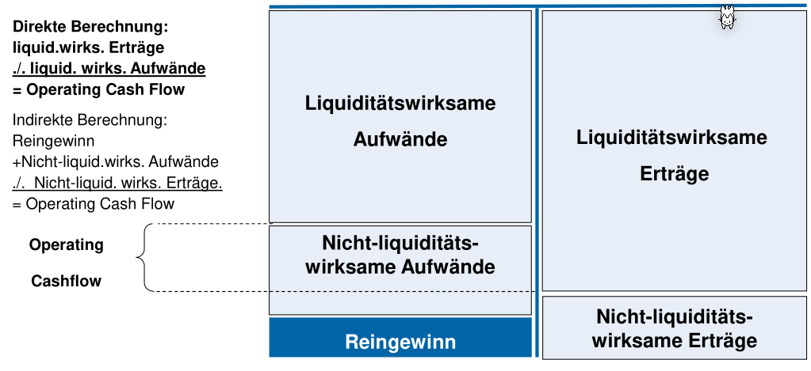

# Basics

## Einfache und Doppelte Buchhaltung

In der einfachen Buchhaltung werden alle Einnahmen und Ausgaben nach Datum sortiert festgehalten. 

Hingegen bei der doppelten Buchhaltung wird festgehalten auf welchem Konto die Bewegung statt gefunden hat und zusätzlich für was das Geld verwendet wurde.

## Rechnungswesen

Die Finanzbuchhaltung analysiert ein Betrieb als ganzes, während die Betriebsbuchhaltung die internen Finanzen betrachtet.

## Bilanz

Die Billanz ist eine Bestandsaufnahme eines Unternehmen und stellt das vorhandene Vermögen und die Schulden an einem Stichtag dar. Die Bilanz wird als Steuerdokument verwendet.

$(a)$ sind aktive Bestände ist Vermögen und Mittel, während $(p)$ passive Bestände sind, was Schulden sind.

Umlaufvermögen ist kurzfristiges Vermögen . Anlagevermögen ist langfristiges Vermögen, welche benötigt werden für den normalen Betrieb und man nicht willig ist, diese in den nächsten 12 Monate zu verkaufen (zum Zeitpunkt die Bilanz aufgestellt wurde).

KMU Kontorahmen, siehe https://www.kmu.admin.ch/dam/kmu/de/dokumente/savoir-pratique/Finances/kmu-kontenplan-franzoesisch.pdf.download.pdf/KMU-Kontenplan-Deutsch.PDF.pdf

Wie bei der aktiven Seite, kurzfristiges Fremdkapital muss innerhalb von 12 Monate zurück gezahlt werden, während langfristiges Fremdkapital länger bestehen können. 

Eigenkapital ist auf der passiven Seite, da $(a)=(p)$ gelten muss. Demnach ist Eigenkapital das Geld, welche den Eigentümer/Aktionäre gehören und sind Kapital, Reserven (zurückgehaltener Gewinn, welcher nicht an die Aktionäre ausgezahlt wird) und Gewinne).

Ebenfalls geht daraus hervor: $Eigenkapital = (a) - Fremdkapital$ .

Das folgende ist ein einfaches Beispiel:

## Erfolgsrechnung

$(E)$ ist die Ertragspositionen, also der Umsatz (wenn eine Rechnung verschickt wurde). $(A)$ sind Aufwände. Es gilt $Gewinn=(E)-(A)$. Es muss gelten $(A) + Gewinn = (E)$

Die Erfolgsrechung kann auch folgendermassen dargestellt werden:

*(Hint: EAT: Earning After Taxes; EBT: Earnings Before Taxes; EBIT: Earnings before Intrests and Taxes, EBITDA: Earnings before Intrests, Taxes, Depreciations and Amortisation)*

Wie auch bei der Bilanz gibt es bei der Erfolgsrechnung ebenfalls Kontoposition.

Folgendes ist ein Beispiel für eine Erfolgsrechnung:

## Geldflussrechnung

*`./.` ist das Kaufmännische Minus* 

Geldfluss aus Betriebstätigkeit kommt von der Erfolgsrechnung. Geldfluss aus Investitionstätigkeit kommt von den Anlagen. Geldfluss aus Finanzierungstätigkeit von der passiven Seite der Bilanzrechnung.

## Wichtige Kennzahlen

