# Kalkulation

Die Kalkulation ist Teil der innerbetrieblichen Finanzen und sind daher nicht öffentlich.

Die Aufgaben einer Kalkulation sind die Ermittlung der Selbstkosten, die Preisfindung, die Preisbeurteilung und die Offertenstellung.

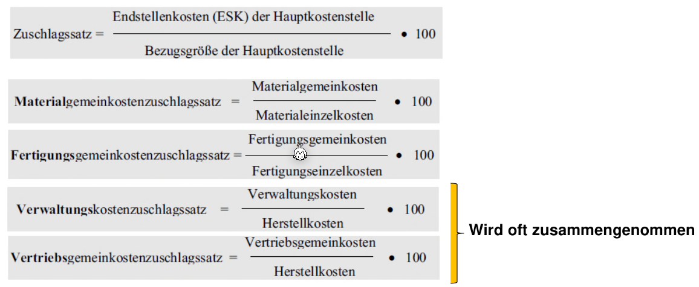

*(Endstellenkosten = Lager-Kosten)*

## Schema einer Kalkulation im Industriebetrieb

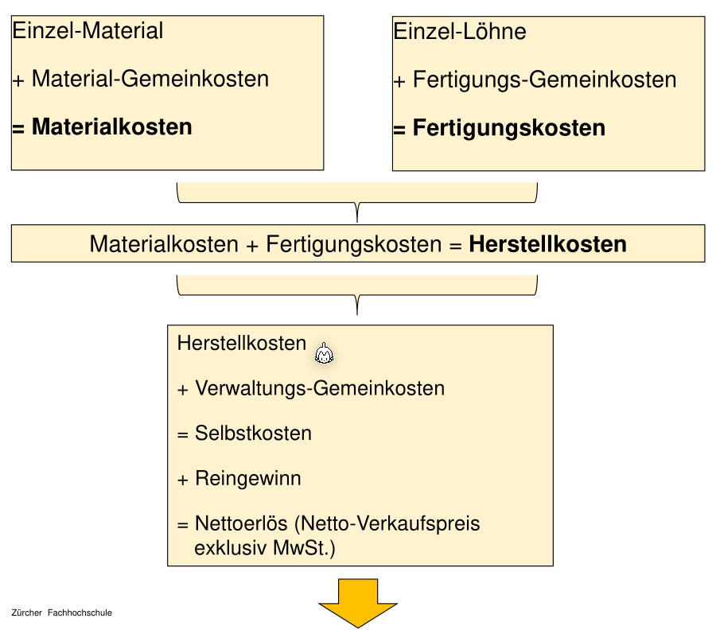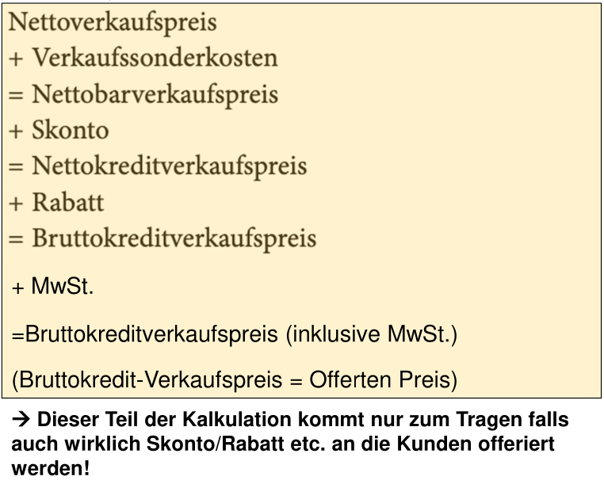

*(Verkaufssonderkosten=Provision/Kosten für Produktplatzierung im Laden, Skonto=Falls Kunde schneller zahlt, bekommt der Kunde Rabatt)*

Achtung: Skonto wird auf den Nettobarverkaufspreis gerechnet (nicht den Nettoverkaufspreis).!

Falls MwSt. gefordert ist, ist der Bruttokreditverkaufspreis 100% und der MwSt-Prozentsatz wird darauf gerechnet.

## Schema einer Kalkulation im Handelsbetrieb

Der Kalkulation im Handelsbetrieb wird in drei Teile unterteilt: Einkaufskalkulation, Betriebskalkulation und Verkaufskalkulation

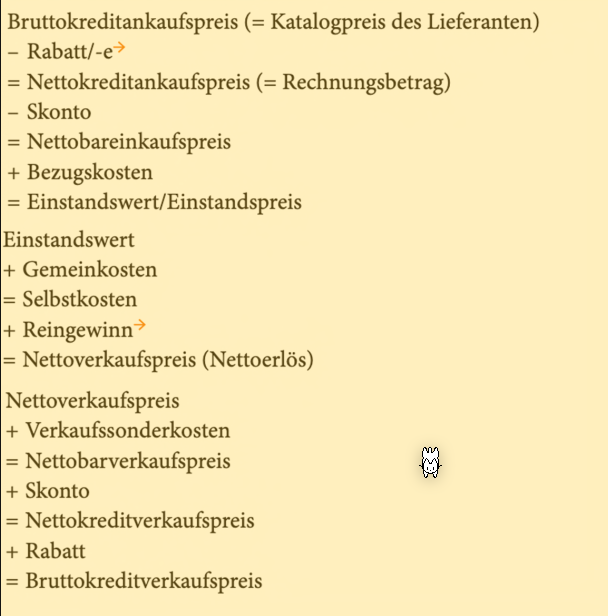

Die folgende Rechnung ist die Einkaufskalkulation:

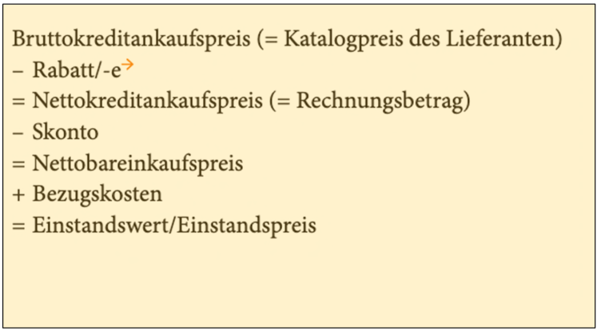

*(Bezugskosten = Lieferkosten, Logistik, Zoll, ...)* 

Achtung: Skonto wird auf den Nettokreditankaufspreis gerechnet.

Auf den Einstandswert/Einstandspreis sind die innerbetriebliche Kosten, wie Löhne, noch nicht verrechnet. Daher wird in der Betriebskalkulation die Selbstkosten mit gerechnet.

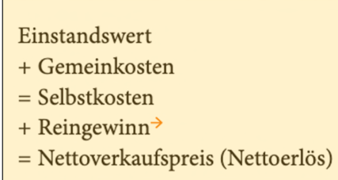

Nun kann denn Profit pro Produkt ausgerechnet werden:

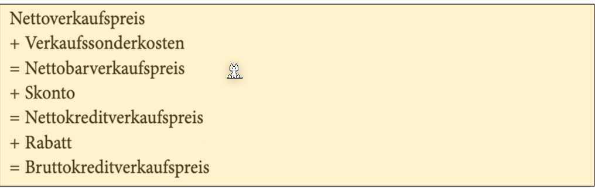

### Beispiel

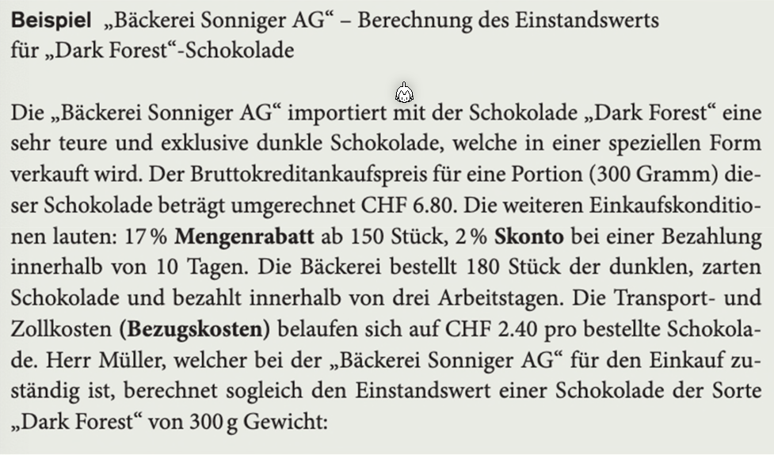

Einkaufskalkulation:

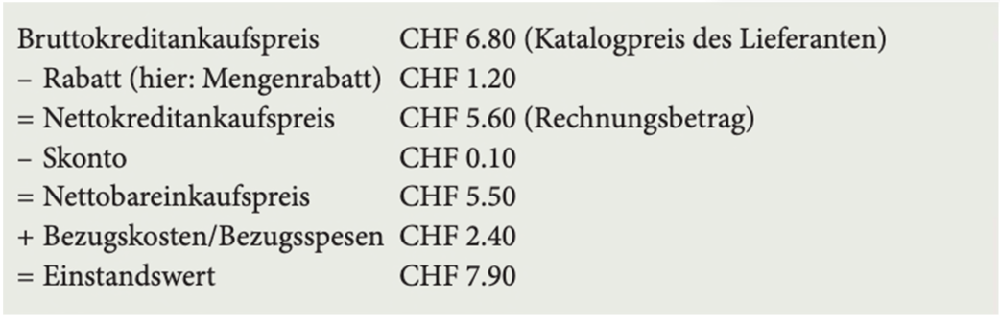

Betriebskalkulation:

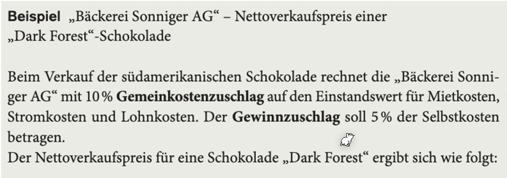

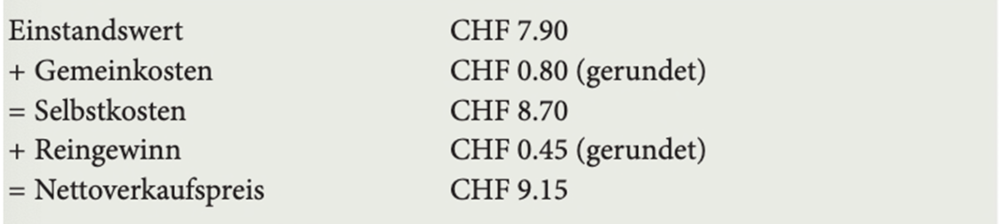

*(Achtung: Beim Abrunden kann es sein, dass am Ende "wir" Geld pro Produkt verlieren)*

Verkaufskalkulation:

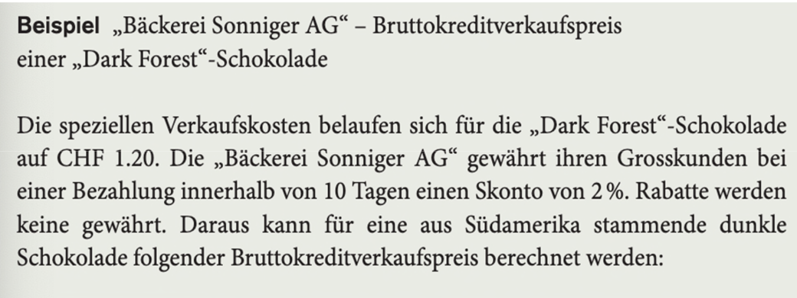

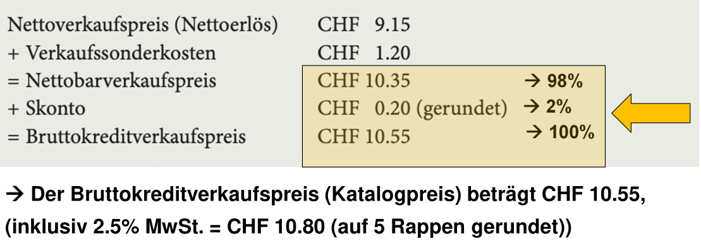

*(Achtung: der Nettobarverkaufspreis ist 98% (**nicht** 100%) von den 2% des Skonto, da von 10.55 man 2% Skonto Rabatt gibt)*
