# Teilkostenrechnung

## Begriffe

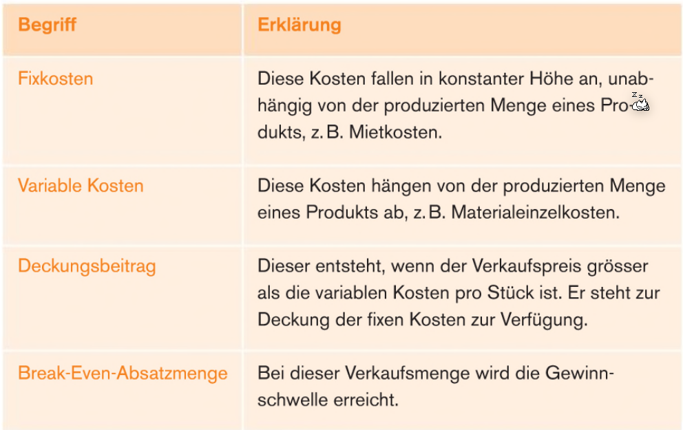

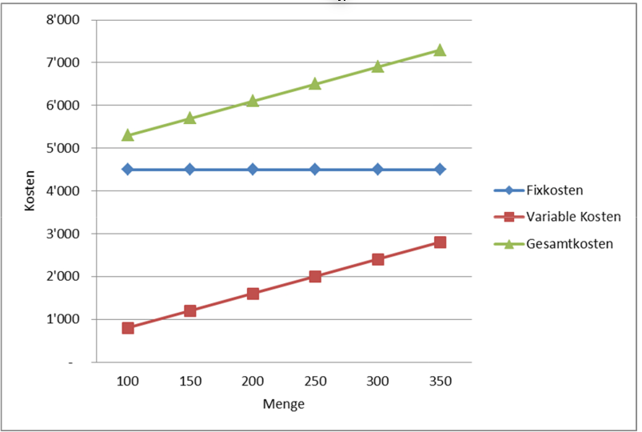

(*Variable Kosten starten **immer** bei 0/0. Dies stimmt im Diagramm oben nicht*)

## Deckungsbetragrechnung

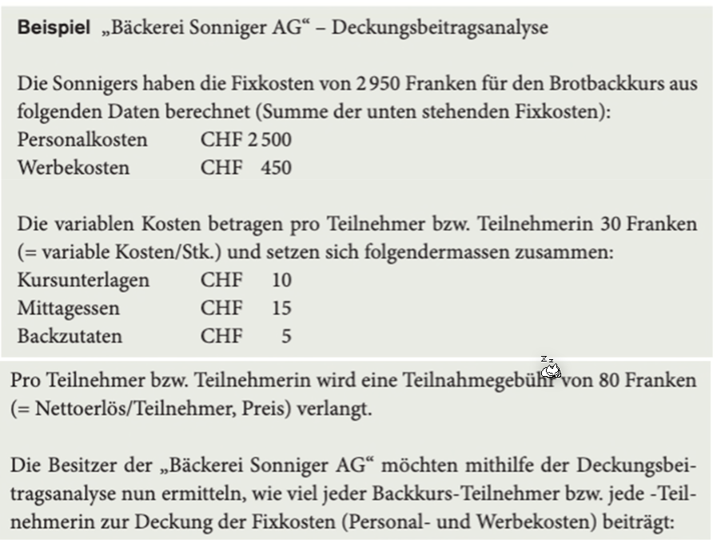

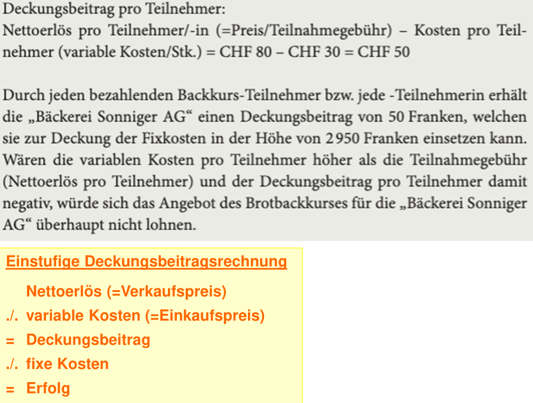

*(`./.`* ist das kaufmännische Minus)

## Break-Even-Analyse

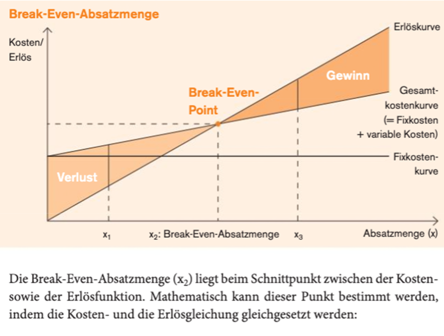

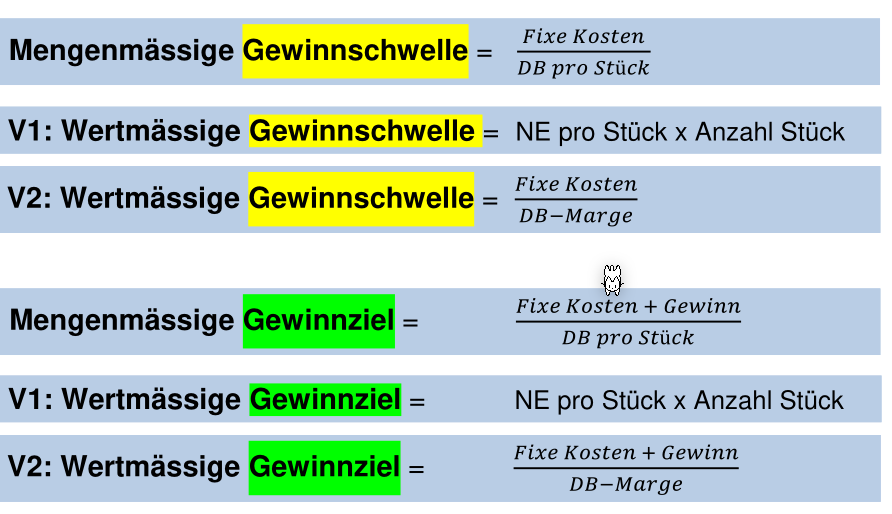

*(DB = Deckungs Betrag, Marge=%-Betrag des Nettoerlöses)*

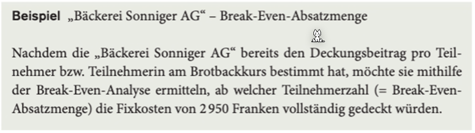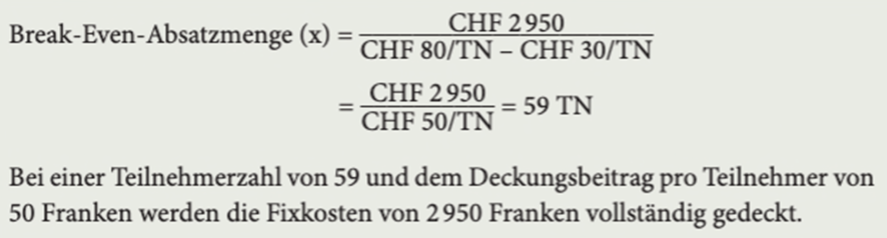

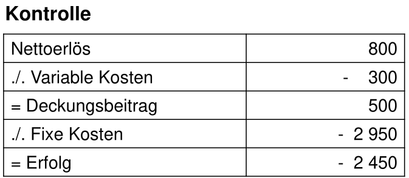

Da dies nicht geht, soll nun ausgerechnet werden, wie teuer der Kurs sein muss, um mit 10 Teilnehmer Break-Even zu sein:

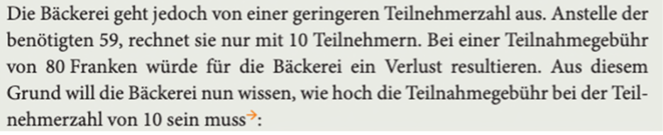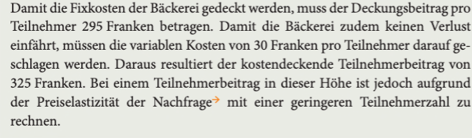

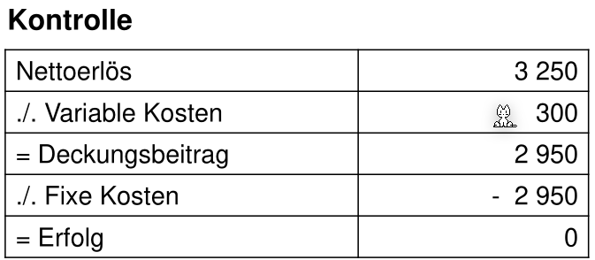

## 
