# Vollkostenrechnung

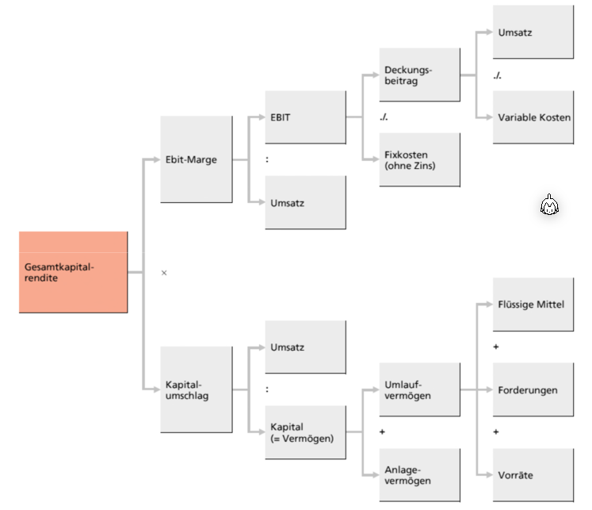

*(`./.` ist das Kaufmännische `-`, `EBIT` = Earning before interests and taxes)*

Bei der Kostenrechnung müssen die gesamt Kosten auf die einzelnen Kostenträger verteilt. Einzelkosten/Direktkosten sind Materialien, welche eingekauft wurden (z.B. für ein Baumunternehmen wären Türe). 

Es gibt allerdings auch Gemeinkosten/Indirektekosten, welche geteilt zwischen Produkten sind. Diese werden zuerst Kostenstellen zugewiesen. Diese Kostenstellen können weiter unterteilt werden in Hilfskosten/Vorkostenstelle und Hauptkostenstellen. 

Hilfskostenstellen werden verteilt auf Hauptkostenstellen, welche wiederum auf die Kostenträger verteilt werden.

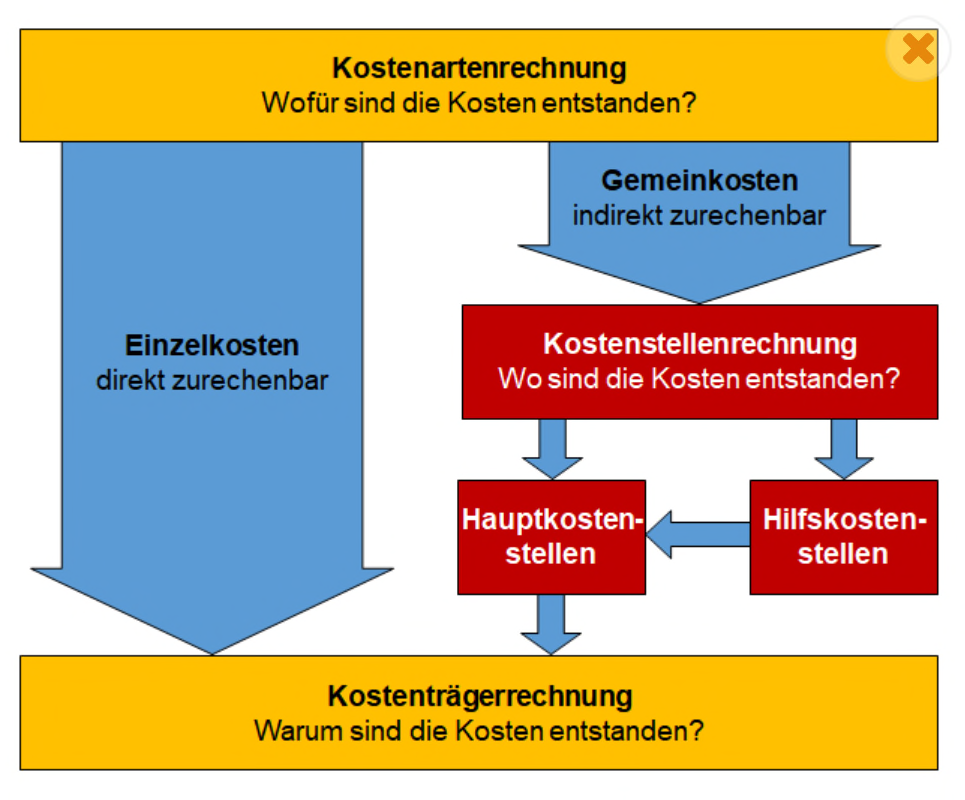

## Betriebsabrechnungsbogen (BAB)

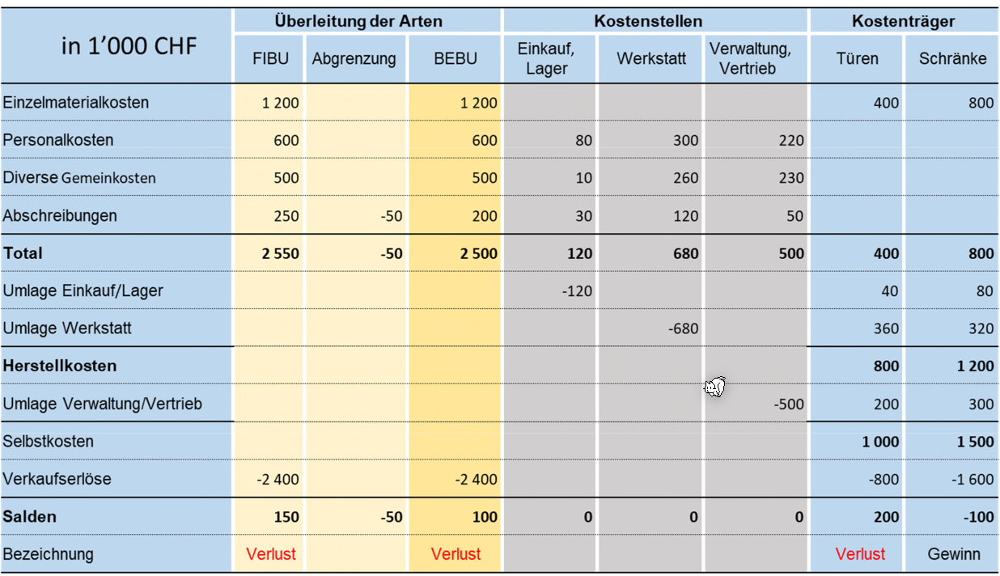

*(FiBu Finanz Buchhaltung, BeBu: Betriebsbuchhaltung)*

Beispiel 2:

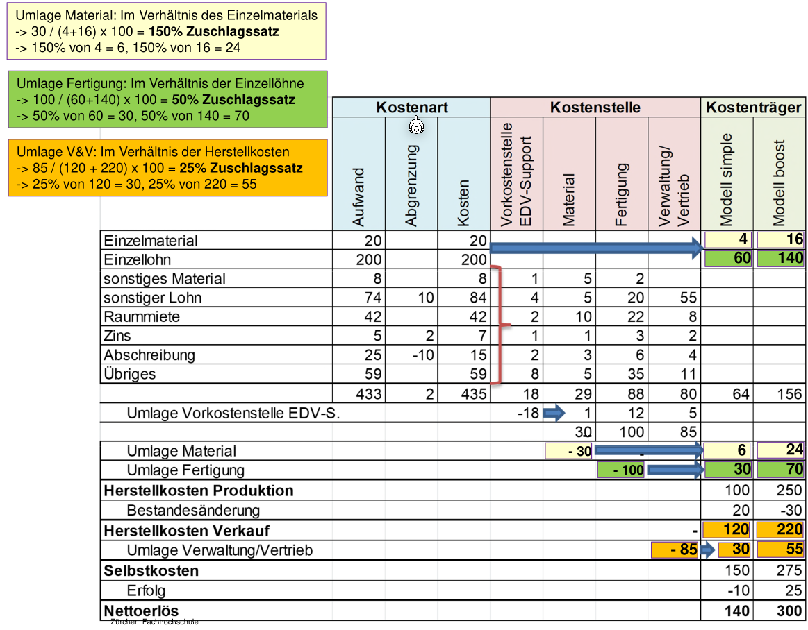

*Vorkostenstelle = Hilfskostenstelle; V&V = Verkauf & Vertrieb*

Der Zuschlagssatz ist `1` "Einheit" des Verähltniss (in diesem Beispiel `4` und `16`).

Formeln:

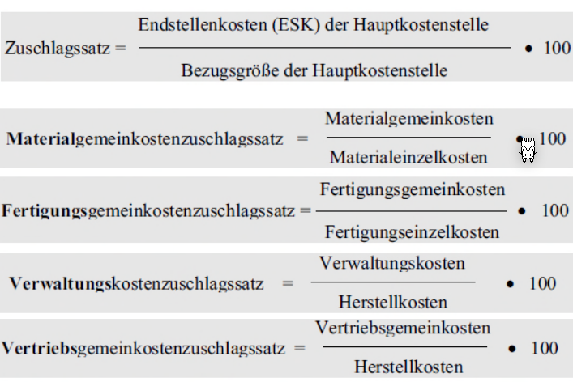

## Sachliche Abgrenzung

In der Finanz-Buchhaltung können Werte über oder unterbewertet werden. In der Betriebsbuchhaltung möchte man mit möglichst genauen Zahlen rechnen. Daher gibt es eine Abgrenzungs-Spalte, welche als Korrektur dient.

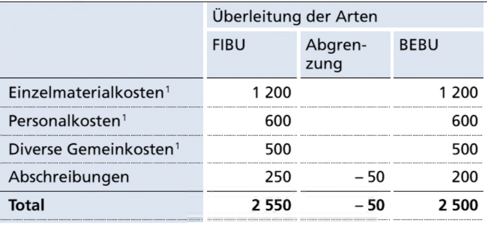

## Vollkostenrechnung

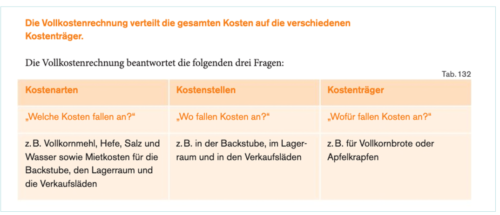

Das folgende ist ein rudimentäres Beispiel (BAB macht kein Sinn, wenn es nur ein Kostenträger Sinn macht):

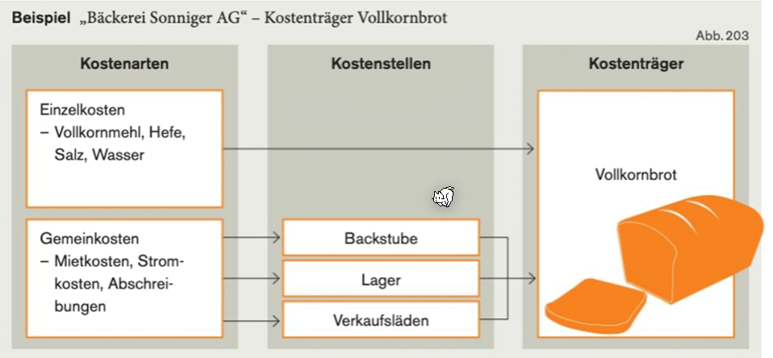

## Beispiel - Verteilen auf Kostenstellen

Im folgenden Beispiel werden Mietkosten verteilt mit einem Verteilschlüssel der Quadratmeter-Anzahl.

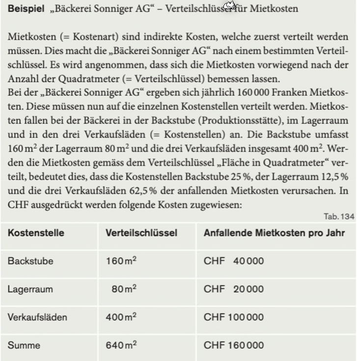

## Beispiel - Verteilen von Kostenstellen auf Kostenträger

In diesem Beipsiel werden die Kostenstelle auf die Kostenträger verteilt auf Basis des Verteilungsschlüssel `h/Stk.`

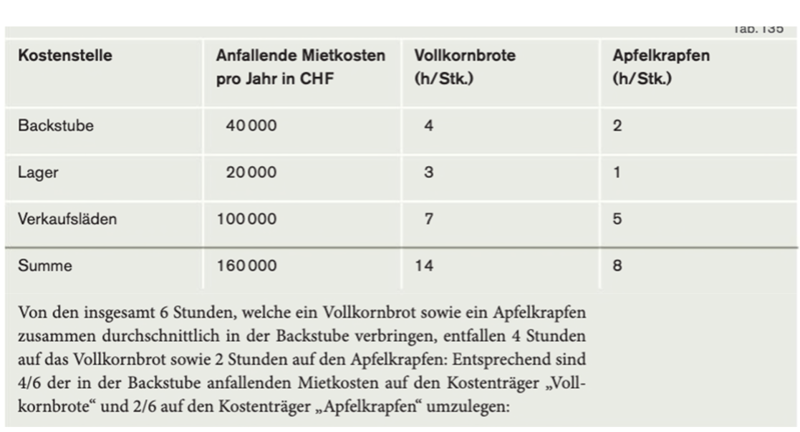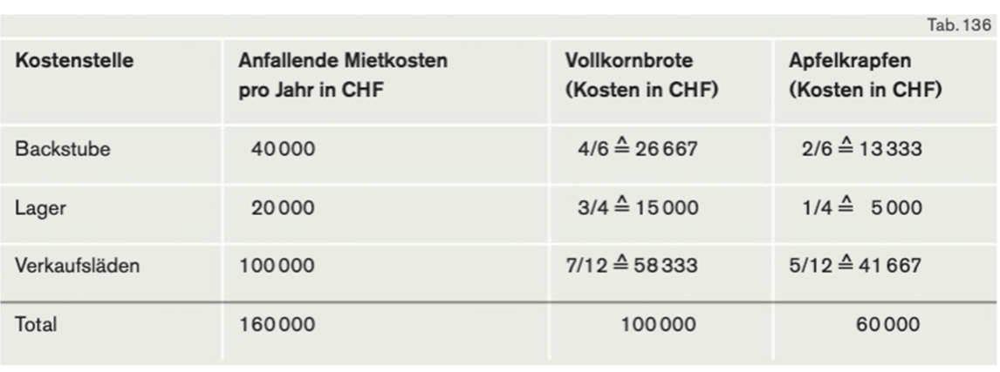

