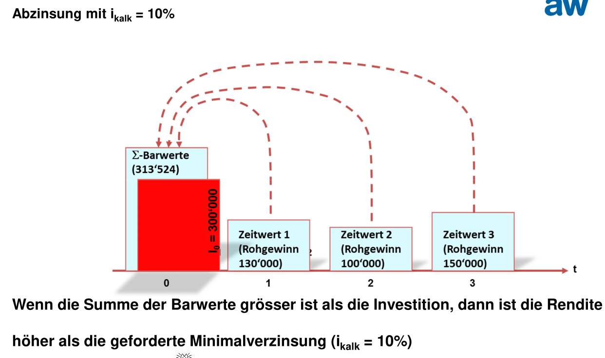
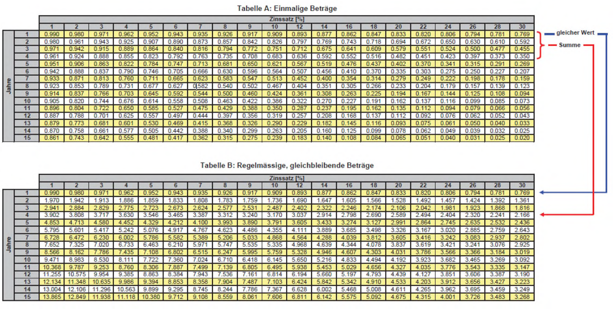
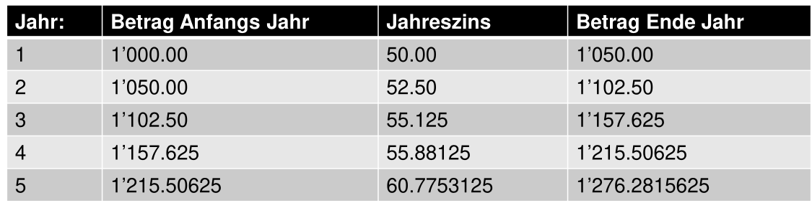

# Investitionsrechnung

Eine Investitions ist einne Zahlungsreihe, die in der Regel mit einner (sicheren) Auszahlung beginnt, auf die zu späteren Zeitpunkten (unsichere) Einnahmen folgen.

Ein **Ertrag** kann, muss aber keinen Geldzufluss darstellen. Beispiel eines Ertrages, der keinen Geldzufluss darstellt: Die Wertzunahme einer Wertschrift wird als Ertrag gebucht. Eine **Auszahlung** stellt immer einen Geldabfluss dar.

Ein **Aufwand** kann, muss aber keinen Geldabfluss darstellen. Beispiel eines Aufwandes, der keinen Geldabfluss darstellt: Die Bildung einer Rückstellung wird als Aufwand gebucht. Eine **Einzahlung** stellt immer einen Geldzufluss dar.

Es gibt drei Kategorien von Investitionen: Sachvermögen, Finanzanlagen und immaterielles Vermögen.

## Investitionsrechnungs-Methoden

Bei den statischen Methoden wird ein durchschnittliches Jahr berechnet, mit welchem den Entscheid der Investition gefällt wird. 

Bei der dynamischen Methode wird geschaut, wann auf dem Zeitstrahl ein Geldfluss existiert. Es gilt das Moto: **Heute verfügbares Geld ist mehr wert als künftiges.** Dies kommt nicht von der Inflation, sondern dass wenn man das Geld hat, kann damit gearbeitet werden.

### Kostenvergleichsmethode

Variable Kosten sind Abhängig von wie viel produziert/gearbeitet wird (z.B. Lohnkosten). Fixkosten sind nicht abhängig von wie viel produziert wird (z.B. Mietkosten).

Kalkulatorische Abschreibungen sind die $\frac{Anschaffungskosten-Liquidationserloes}{Nutzungsdauer}$. Der kalkulatorischen Zins scheint $\frac{(Anschafungskosten + Liquidationserloes) \cdot ZinsSatz}{2}$ zu sein.

### Gewinnvergleichsmethode

Bei der Gewinnvergleichsmethode wird zusätzlich zu den Kosten auch den Erlös benötigt, welcher durch die Maschine generiert wurde. 

In der Gewinnverlgeichsmethode ist der Anschaffungspreis der Anlagen nicht enthalten.

### Rentabilitätsvergleich (ROI)

$$
ROI = \frac{Gewinn + kalk. Zinsen}{avgEingesetztes Kapital}\cdot 100
$$

Das eingesetzte Kapital wird halbiert, da zu Beginn das volle Kapital da ist und am Ende nichts mehr: $avgEingesetztesKapital = \frac{wirliklichEingesetztesKapital + 0}{2}$

Die Rentabilität sagt aus, wie viel des eingesetzten Kapital pro Jahr wieder eingenommen wird.

### Amortisationsrechung

Beide Cashflows müssen dasselbe ergeben. Daher kann gewählt werden, welcher Cashflow benützt wird.

Bei dieser Rechnung ist der Kapitaleinsatz nicht durch $2$ geteilt.

### Durchschnittliche Jährliche Gesamtkosten

Die folgende Formel steht für die durchschnittlichen Kosten, welche pro Jahr anfallen.
$$
avgGesamtkosten = FixKosten + VariableKosten + Abschreibung + KalkulatorischerZins\\
Abschreibung = \frac{Anschaffungskosten-Liquidationserloes}{Nutzungsdauer}\\
KalkulatorischerZins=\frac{(Anschafungskosten + Liquidationserloes) \cdot ZinsSatz}{2}
$$

### Kapitalwertmethode

Rohgewinn ist ein anderes Wort für Cashflow.

Der Liquidationserlös ist der Erlös, welcher beim Verkaufen der Maschine generiert wird.

Da der Liquidationserlös erst in $x$ Jahren ist, muss der Liquidationserlös mit dem Zinses-Zins aus der Tabelle nach 5 Jahren gerechnet werden (aus der **nicht**-summierten Tabelle).

Es gibt zwei Hilfstabellen, welche miteinander verbunden sind. 

Das folgende ist ein zweites Beispiel:

Wenn der Cash Flow (CF) wiederkehrent gleich bleibt, kann die Rentenbarwertfaktor-Tabelle verwendet werden.

Es wird auf den Kapitaleinsatz 5x den summierten Zins aus der Rentenbarwertfaktor-Tabelle mit dem Cash Flow gerechent.

## Auf- und Abzinsung

