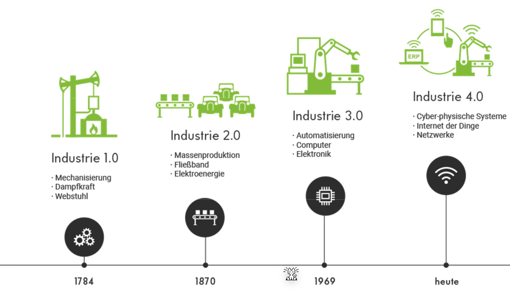
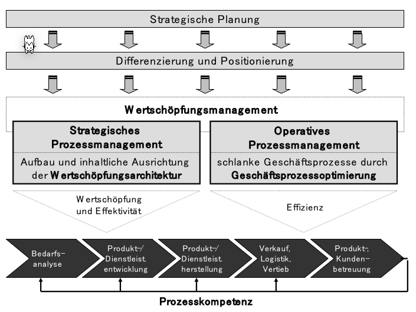
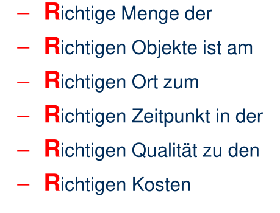
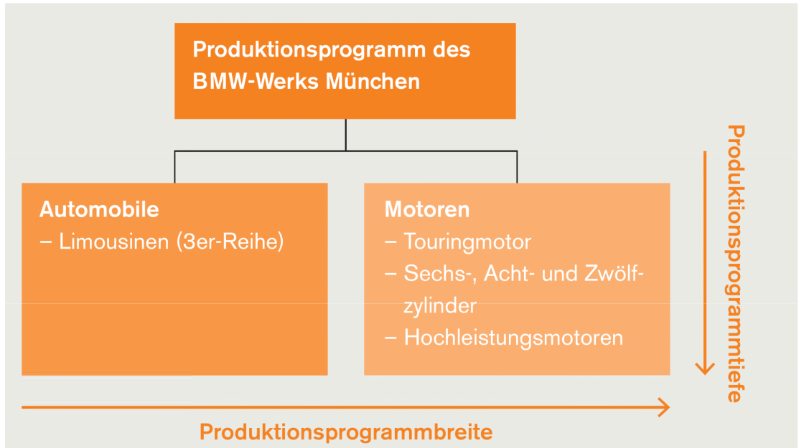
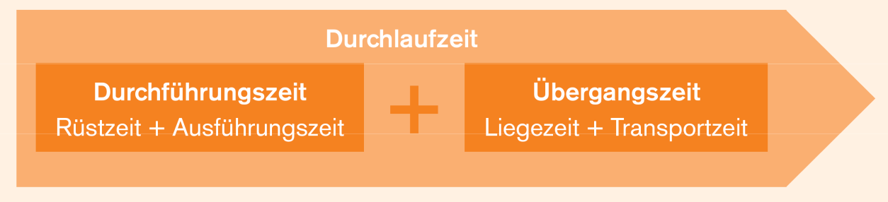
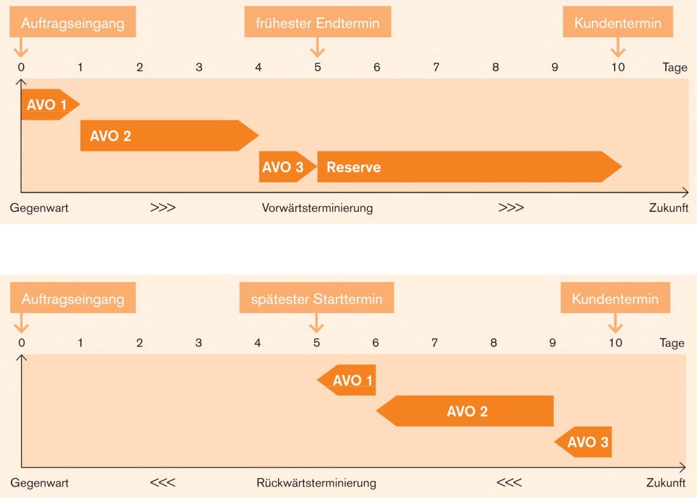

# Leistungserstellung

## Strategisches Prozessmanagement

Viele Unternehmen decken nicht alle Prozesse in der Wertschöpfungskette ab.

Es gibt verschiedene gängige Modelle, wie die Wertschöpfung abgedeckt wird:

## Produktionslogistik

Produktion ist, wenn Sachgüter und Dienstleistungen in andere Sachgüter und Dienstleistungen umgewandelt wird.

Das Ziel der Produktionslogistik ist den Produktionsprozess art- und mengenmässig, räumlich und zeitlich abgestimmt mit den benötigten Produktionsfaktoren zu versorgen.

**Produktionsprogramm**: Bestimmt Art, Menge und Zeitpunkt der zu produzierenden Produkte in einem Unternehmen.
**Produktionsprogrammbreite**: Anzahl der von einem Unternehmen hergestellten Produktarten.
**Programmtiefe**: Anzahl der Artikel und Typen, die innerhalb einer Produktart vom Unternehmen angeboten werden.
**Idealfall**: Die Ressourcen sind optimal ausgelastet, d.h. Mensch und Maschinen sind weder unterbeschäftigt noch überbeansprucht.
**Fertigungstiefe:** Wie viel von den benötigten Teile selbst hergestellt werden und wie viel eingekauft wird.

Im folgenden Beispiel ist die Produktionsprogrammbreite und Programmtiefe aufgezeigt:

Folgende Grafik zeigt die Fertigungstiefe:

Folgende Punkte gilt es zu beachten, wenn es um die Frage geht, ob etwas eingekauft oder selbst hergestellt werden soll.

Um zu überlegen, ob gekauft werden soll oder nicht können auch die folgenden Formeln gleich gesetzt werden: 
$$
VariableKostenProStück_{make} \cdot x + Fixkosten = VariableKosten_{buy}\cdot x
$$
Sobald die variable Kosten pro Stück für das Einkaufen kleiner sind, als was es kosten würde das Produkt herzustellen plus die Fixkosten, lohnt es sich.

### Durchlaufszeit

Die Durchlaufszeit ist die totale Zeit benötigt für das Herstellen eines Produktes.

### Vorwärts- und Rückwärtsterminierung

Vorwärtsterminierung ist, wenn beim Planen vom Auftragseingang direkt beginnt zu arbeiten. Bei der Rückwärtsterminierung wird vom Endtermin geplant. In der Praxis wird meisten die Rückwärtsterminierung mit mit Pufffer gewählt.

Vorteile und Nachteile für Vorwärtsterminierung:

Vorteile und Nachteile für Rückwärtsterminierung:

## Fertigungstypen

## Kennzahlen

$$
Rentabilität=\frac{Ertrag-Aufwand}{Kapitaleinsatz}=\frac{Gewinn}{Kapitaleinsatz}\\
Produktivität=\frac{Ausbringungsmenge}{Faktoreinsatzmenge}\\
Wirtschaftlichkeit = \frac{Ertrag}{Aufwand}\\
Fehlerquote = \frac{FehlerhafteProdukte}{TotalHergestellteProdukte}
$$

Die Ausbringungsmenge ist die während der Produktion produzierten Produkte, während die Faktoreinsatzmenge eingesetzte und verbrauchte Materialien sind (ev. auch Stunden).
