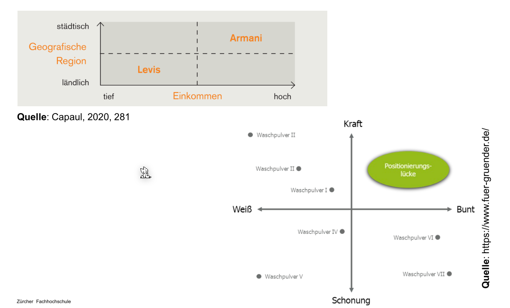
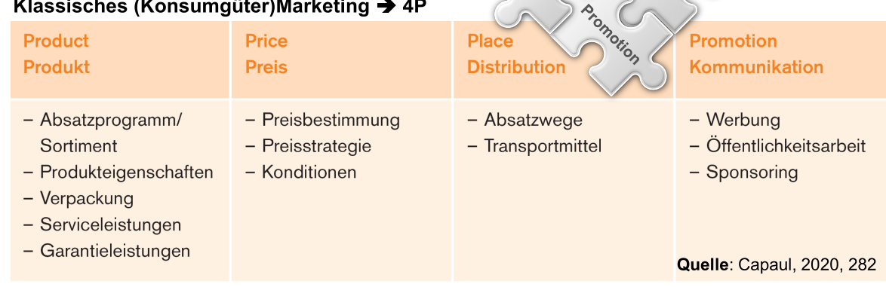
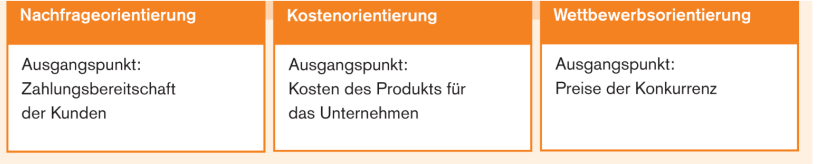
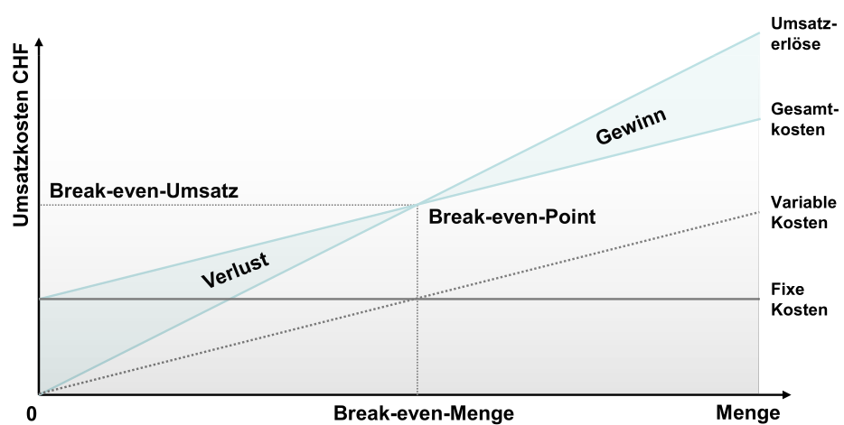
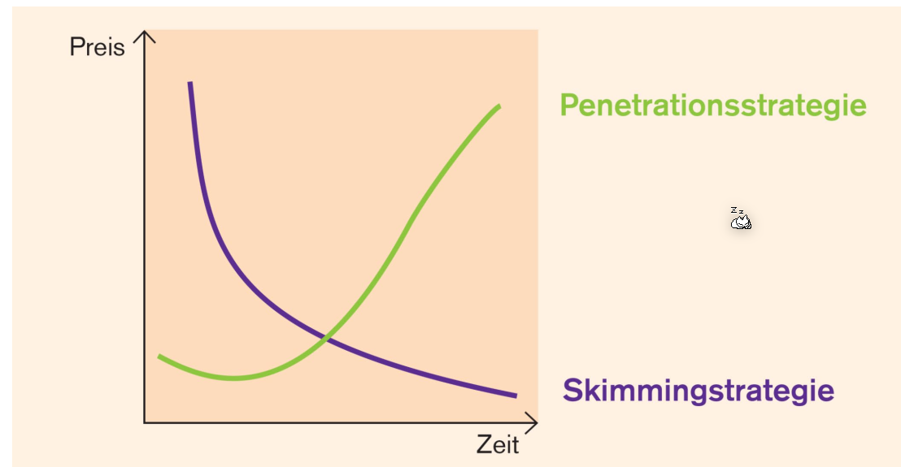

# Marketing

## Marktforschung

Die Daten können von **Primärmarktforschung** stammen, wo bei das Unternehmen selbst Daten erhebt. Eine zweite Möglichkeit ist die **Sekundärmarktforschung**, wobei existierende Ressourcen verwendet werden.

Es kann sich um **qualitative Daten** handeln, wobei das Ziel  meistens ist, mehr über die Motive von Nutzer heraus zu finden. Wenn es **quantitative Daten** sind, ist das Ziel Marktdaten und Marktvolumen zu ermitteln.

## Marktgrösse

Die Marktkapazität ist die höchst mögliche Menge, welche verkauft werden könnte. Diese Zahl wird nie erreicht. Das Machtpotenzial betrifft alle Kunden, welche kaufbereit wäre, das Produkt zu kaufen. Das Marktvolumen ist der totale Absatz des Markt. Der Marktanteil ist die Menge der abgesetzten Produkte des Unternehmens.

Diese Zahlen sind pro Zeit.

## Marktsegmentierung

Die folgenden Illustrationen zeigen, wie diese Merkmale auf einen Diagramm eingezeichnet werden. 

## 4-P-Mix

Diese vier Elemente müssen aufeinander abgestimmt werden: Z.B. ein teureres Produkt, muss die hochwertig sein (Produkteigentschaft), muss in den richtigen Laden verkauft werden und bei den richtigen Personen beworben werden.

## Produkte

### Produktgestalltung

### Verpackung

### Preis Politik

### Preisstrategie

* Nachfrageorientierung: Es wird analysiert, wie viel der Kunde bereit ist zu zahlen
* Kostenorientierung: Es wird berechnet, wie viel die Produktion des Produktes kostet, und wie viel daran verdient werden soll. An Hand von dem wird der Preis festgelegt
* Wettbewerbsorientierung: Der Preis wird anhand der Preise der Konkurrenten bestimmt.

Die mindeste Absatzmenge muss so bestimmt werden, das der Break-event-Point erreicht wird.

Es gibt ebenfalls verschiedene Strategien, wie die Strategie auf verschiedene Kunden-Sektionen, mit unterschiedlichen Zahlungswilligkeit, angepasst werden kann.

Bei der Penetrationsstrategie wird der Preis langsam erhöht, während bei der Skimmingstrategie der Preis über die Zeit sinkt (z.B. bei Medikamente, nach dem das Generika heraus gekommen ist, Samsung Smartphones).

#### Preis Elastizität

Wenn eine Nachfrage:

* Preiselastisch ist, sinkt die Nachfrage mit steigendem Preis
* Preisunelastish ist,  sinkt die Nachfrage kaum bei steigendem Preis
* Inverse Nachfrage