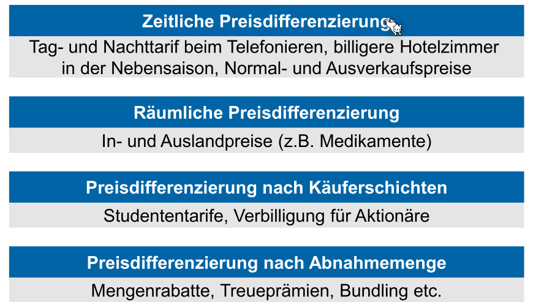
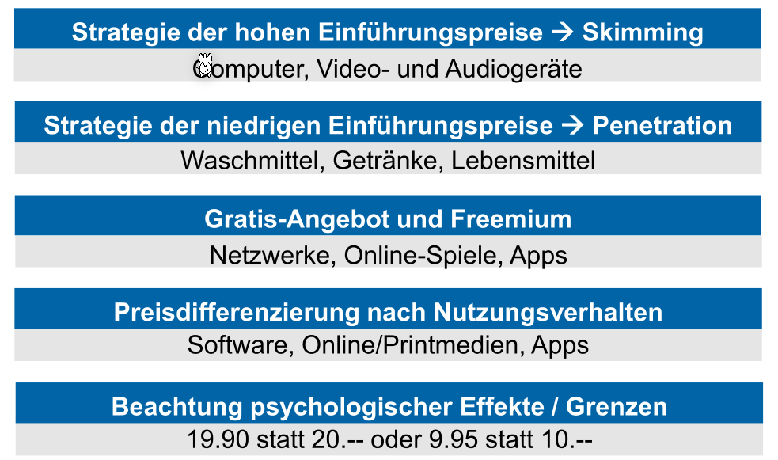
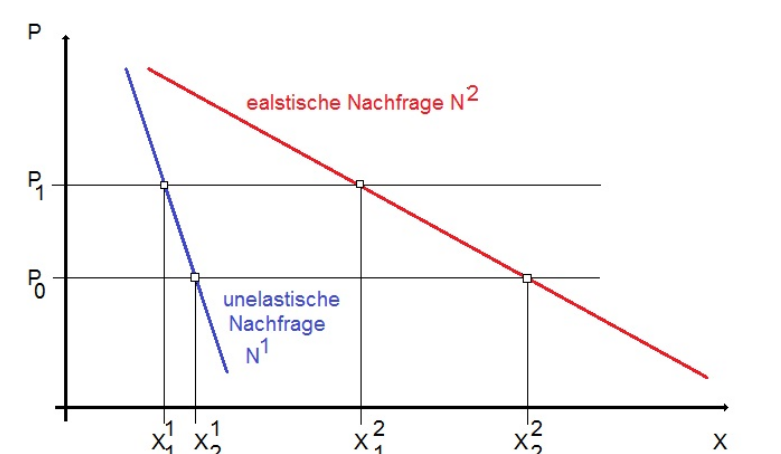

# *4-P-Mix

Diese vier Elemente müssen aufeinander abgestimmt werden: Z.B. ein teureres Produkt, muss die hochwertig sein (Produkteigentschaft), muss in den richtigen Laden verkauft werden und bei den richtigen Personen beworben werden.

## Produkte  (4-P-Mix)

### Produktgestalltung

### Verpackung

## Preis Politik  (4-P-Mix)

### Preisstrategie

* Nachfrageorientierung: Es wird analysiert, wie viel der Kunde bereit ist zu zahlen
* Kostenorientierung: Es wird berechnet, wie viel die Produktion des Produktes kostet, und wie viel daran verdient werden soll. An Hand von dem wird der Preis festgelegt
* Wettbewerbsorientierung: Der Preis wird anhand der Preise der Konkurrenten bestimmt.

Die mindeste Absatzmenge muss so bestimmt werden, das der Break-event-Point erreicht wird.

Es gibt ebenfalls verschiedene Strategien, wie die Strategie auf verschiedene Kunden-Sektionen, mit unterschiedlichen Zahlungswilligkeit, angepasst werden kann.

Bei der Penetrationsstrategie wird der Preis langsam erhöht, während bei der Skimmingstrategie der Preis über die Zeit sinkt (z.B. bei Medikamente, nach dem das Generika heraus gekommen ist, Samsung Smartphones).

### Preis Elastizität

Wenn eine Nachfrage:

* Preiselastisch ist, sinkt die Nachfrage mit steigendem Preis
* Preisunelastish ist,  sinkt die Nachfrage kaum bei steigendem Preis
* Inverse Nachfrage

## Distributionsorgan

Es wird zwischen internen und externen Distributionsorgane unterschieden.

Die folgenden Beispiele sind für externe Distributionsorgane.

Ein Produkt kann entweder via direkten Absatzmarkt direkt zum Konsument vertrieben werden. Ebenfalls ist es auch möglich, dass Produkte indirekt über Einzelhändler vertrieben.

Für folgende Produkte eignet sich, tendenziell, ein direkter Absatzweg:

Hingegen folgende Produkte werden oft mit einem indirekten Absatzweg vertrieben:

## Kommunikationpolitik  (4-P-Mix)

Um Kommunikationspolitik zu betreiben, benötigt ein Unternehmen Instrumente um zu Kommunizieren.

### Marketing ≠ Promotion ≠ Public Relations

Diese Begriffe sind nicht gleich.

### Public Relations (PR)

PR hat mehrere Funktionen. Es wird (grundsätzlich) von PR gesprochen, wenn es kein Preis gibt, anders als beim Marketing.

### Werbung

Werbung muss individualisiert werden für das Produkt und Kategorie der Firma.

Um eine Werbung erfolgreich zu gestalten, kann die AIDA-Formel angewendet werden. Diese sagt aus, welche Bausteine eine Werbung enthalten soll. 

Action kann auch gezeigt werden. Z.B. Coca Cola Werbung zeigen am Ende der Werbung immer jemand das Getränk trinken.

Diese AIDA-Formel reicht aber im Alltag häufig nicht. Es reicht nicht nur eine Ausstrahlung, sondern ein Kunde muss die Werbung immer und immer wieder sehen.

Die Ziele einer Werbung müssen nicht immer die Umsatzsteigerung sein. Es kann z.B. auch sein die generelle Bekanntheit zu steigern.

Um ein Werbekonzept zu erarbeiten, sollten folgende Fragen beantwortet werden:

* **Werbeobjekt**: Wofür (Produkt, Marke etc.) soll die Werbung konzipiert sein?
* **Werbesubjekt**: Welche Zielgruppe soll angesprochen sein?
* **Wirkungsziele**: Welche Werbeziele sollen besonders verfolgt werden?
* **Werbebotschaft**: Welches ist die Werbebotschaft?
  
* **Werbemittel**: Welches Werbemittel soll eingesetzt werden?
* **Werbeperiode**: Wie lange soll geworben werden?
* **Werbebudget**: Wie hoch soll das Werbebudget sein?

Influencers können viele Menschen in einem bestimmten Segment erreichen.

## Beispiel für 4-P-Mix

Diese Uhr wird nur in Uhrengeschäften vertrieben, was für eine Uhr ohne Marke am falschen Ort ist. Der Preis ist relative hoch, da vermutlich die Uhr nicht stabil ist. 

Rolex ist ein Beispiel eines besseren Marketing-Mix.